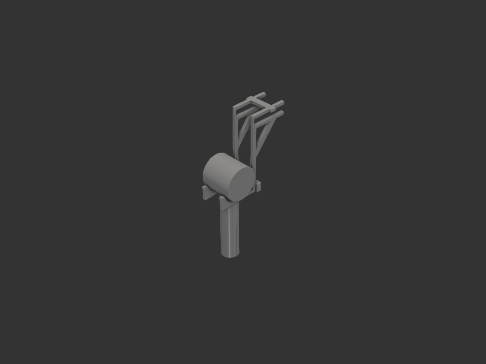

# dyson_dryer_hanger — 상부장 밑판에 거는 다이슨 드라이어 걸이

화장실 상부장 **제일 밑판**의 앞 가장자리를 물고, 그 아래에 다이슨
**Supersonic Travel** 을 거치한다.



## 동작 원리

리브 2장이 밑판 앞 가장자리를 클램프로 물고, 그 사이 간격(41)으로 **핸들(Ø38)이
아래로 빠지며 헤드(Ø71)가 두 리브에 걸린다.**

드라이어는 **앞에서 밀어 넣는다** — 손잡이가 리브 사이로 들어가고 헤드가 립을 넘어
크래들에 앉는다. 뺄 때는 22mm 들어 올려 앞으로 당긴다.
그래서 **연결 부재는 전부 뒤쪽**에 둔다. 앞에 두면 위에서 떨어뜨려 꽂아야 한다.

## 제약과 치수

### 상부장 (실측)

| 항목 | 값 |
|---|---|
| 밑판 두께 | 15 → 슬롯 15.4 (여유 0.4, 빡빡하게) |
| 안쪽 삽입 깊이 | 최대 140, **80 사용** |
| 문 틈 | **2.0** — 밑판 두께 구간만 |

**문 제약이 설계를 지배한다.** 상부장 문이 밑판 앞면 2mm 앞에서 아래로 길게
뻗으므로, 걸이는 y = −1.6 보다 앞으로 나갈 수 없다. 문 하단을 지난 크래들 높이에서만
앞으로 나간다.

### 드라이어 (Supersonic Travel)

출처: [dyson.co.kr](https://www.dyson.co.kr/supersonic-travel-prussian-blue-rich-copper)

| 항목 | 값 |
|---|---|
| 전체 높이 | 222 |
| 헤드 | 폭 71 × 깊이 68 |
| 핸들 | **Ø38 원통** (실측 — 다이슨 미공개) |

**헤드는 90° 돌려** 축이 좌우로 가게 건다. 좌우 겹침 한쪽 13.5mm.

### 걸이

| 항목 | 값 |
|---|---|
| 리브 간격 | 41 (핸들 38 + 여유 1.5) |
| 리브 두께 | 6 |
| 앞판(웹) | **1.6** — 문 틈 2.0 에 0.4 여유, 0.4 노즐 4줄 |
| 스파인 | 8 |
| 위/아래팔 | 6 |
| 내림 | 140 (헤드 최하단 기준) |
| 크래들 | 평평한 바닥 + 앞 60° 립(높이 22) + 뒤 수직벽 |
| 맞물림 공차 | 0.15 (십자) / 0.10 (보 구멍) |

## 연결 방식 — 십자 맞춤과 관통 구멍

도브테일도 접착제도 쓰지 않는다. **하중이 결합을 눌러 앉히는 방향**으로 배치한다.

### A — 선반 위 십자 맞춤

**리브가 위**로 간다. 리브 위팔을 밑면에서 절반(3mm) 파고, 커넥터를 윗면에서 절반 판다.
합쳤을 때 높이가 위팔 두께 6mm 그대로라 **위팔이 선반에서 들리지 않는다.**

리브가 받는 아래 방향 하중이 그대로 맞물림을 눌러준다.
반대로 커넥터를 위에 얹으면 커넥터 자체 무게 몇 g 으로만 버티는 꼴이 된다.

밀어 넣다 커넥터에 걸리므로 **삽입 깊이 스토퍼 역할도 겸한다.**

### B — 하단 뒤쪽 돌기 + 관통 구멍 보

리브 최하단 뒤쪽에 돌기(14mm)를 내고, 구멍 뚫린 보를 **뒤에서 밀어** 끼운다.
위에서 얹는 방식은 들거나 기울이면 빠진다. 끼움만 하면 되므로 보가 두꺼울 필요가 없다.

보가 하단을 묶어주면 옆으로 미는 힘을 두 리브가 나눠 받아 **흔들림이 절반**이 된다
(2N 에 3.0mm → 1.5mm).

## 조립 순서

1. 선반 위에 **커넥터 A** 를 올려두고
2. 리브 2장을 밑판 앞에서 밀어 넣어 위팔 홈이 커넥터에 맞물리게
3. 뒤에서 **보**를 돌기에 밀어 끼움
4. 드라이어를 앞에서 밀어 넣음

## 출력

| 파트 | 크기 | PETG | 수량 |
|---|---|---|---|
| `rib` | 6 × 162.3 × 168.4 | 29.6 g | **2 (완전 동일품)** |
| `connector_a` | 63 × 12 × 6 | 5.2 g | 1 |
| `beam` | 63 × 10 × 18 | 12.8 g | 1 |
| **합계** | | **약 77 g** | |

- **재료 PETG** — 욕실은 습하고 드라이어는 쓰고 나서 따뜻하다. PLA(Tg 60°C)는 부적합
- **전부 서포트 불필요**
- 리브: 프로파일 면을 bed 에. 힘이 전부 면 안쪽 방향이라 압출선이 그대로 받는다
- 커넥터 A: 모델 좌표 그대로. 맞물림 홈이 위로 열려 오버행 없음
- 보: **90° 눕혀** 구멍이 수직이 되게. 그대로 뽑으면 구멍이 가로 터널이 되어 브리지 발생

```bash
uv run python -m models.bathroom.dyson_dryer_hanger.hanger    # 렌더 + 뷰어
uv run python -m models.bathroom.dyson_dryer_hanger.export    # STEP
```

## 설계 판단 기록

### 리브 4장 → 2장

하중이 작다. 드라이어 0.6kg 이 밑판 앞 60mm 에 매달려도 클램프에 걸리는 힘은
리브당 약 6N, 롤 저항은 리브당 약 3N. 4장은 부족하지 않던 것을 더 좋게 만드는 것뿐.

### 앞판을 넓히지 않은 이유

한때 앞판 모멘트를 224 N·mm 로 보고 리브당 18mm 로 넓혔으나 **오류였다.**
선반이 아래팔 뒤끝을 눌러주는 반력(N2)을 빼먹은 값이다. 하중이 걸리면 걸이가 앞으로
기울어 위팔 **앞쪽**이 선반에 눌리므로, 제대로 세면 앞판 모멘트는 −7 N·mm 로 거의
상쇄된다. 리브 두께 6mm 그대로 1.4 MPa.

### 90° 회전의 부수 효과

헤드를 돌리기 전에는 헤드가 간격에 쐐기처럼 박혀 리브를 바깥으로 밀었다(한쪽 2.8N).
돌린 뒤에는 평평한 바닥에 얹히므로 **그 힘이 0** 이다. 커넥터가 인장을 받지 않게 되어
도브테일이 불필요해졌다.

### 스파인 8mm 를 줄이지 않은 이유

강도만 보면 안전율 13 으로 과하지만, **스파인 두께를 정하는 건 강도가 아니라 강성**이다.
5mm 로 줄이면 옆으로 2N 에 크래들이 3.0 → 12.3mm 흔들린다.

## 채택하지 않은 것

| 안 | 이유 |
|---|---|
| 도브테일 이음 | 하중 방향으로 맞물림을 누를 수 있으면 불필요 |
| 원호 크래들 | 평평한 바닥 + 경사 립으로 충분 |
| 커넥터를 앞쪽에 | 손잡이를 위에서 떨어뜨려 꽂아야 해 불편 |
| 보를 위에서 얹기 | 들거나 기울이면 빠진다 |
| 앞판 폭 확장 | 모멘트 계산 오류였음 (위 참고) |
| PLA | Tg 60°C < 추출 직후 잔열 + 습기 |

## 구현 메모

- 폴리곤 꼭짓점은 **띠 둘레 순서**로 돌아야 한다. 대각선 두 점을 연속으로 두면
  자기교차해 형상이 통째로 사라진다 (스트럿에서 겪음)
- 커넥터 홈이 지나는 살은 **홈 폭(공차·테이퍼 포함)보다 두꺼워야** 한다.
  얇으면 홈이 살을 관통해 리브가 두 조각으로 쪼개진다
- 스파인을 문 뒤로 밀 때 **슬롯 높이까지 올리면 밑판이 안 들어간다**.
  아래팔 밑에서 끊고 그 위는 1.6mm 앞판만 남긴다
