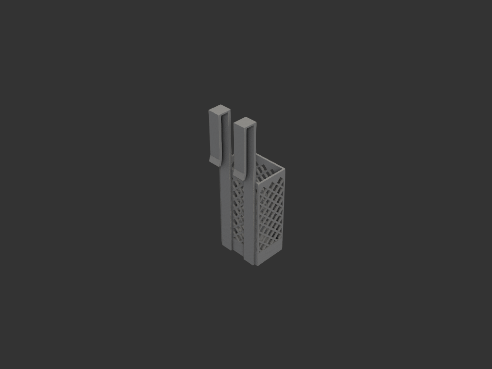
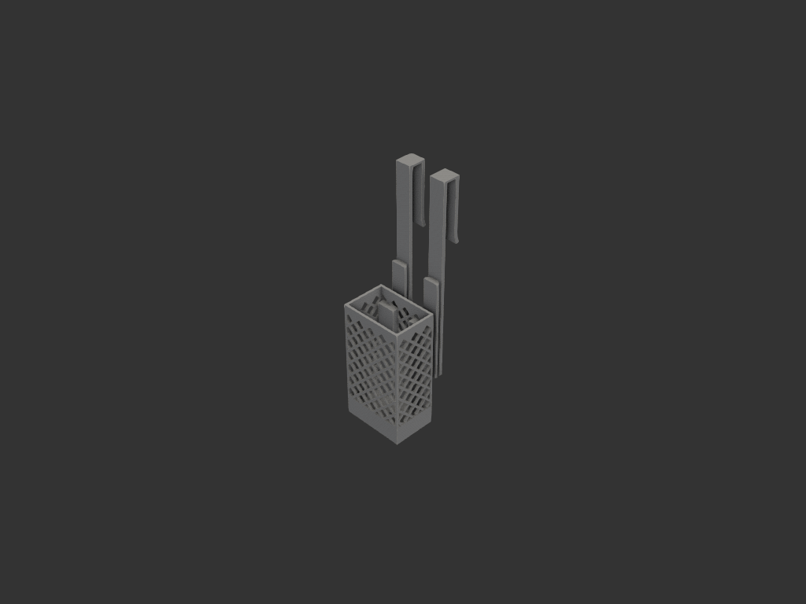
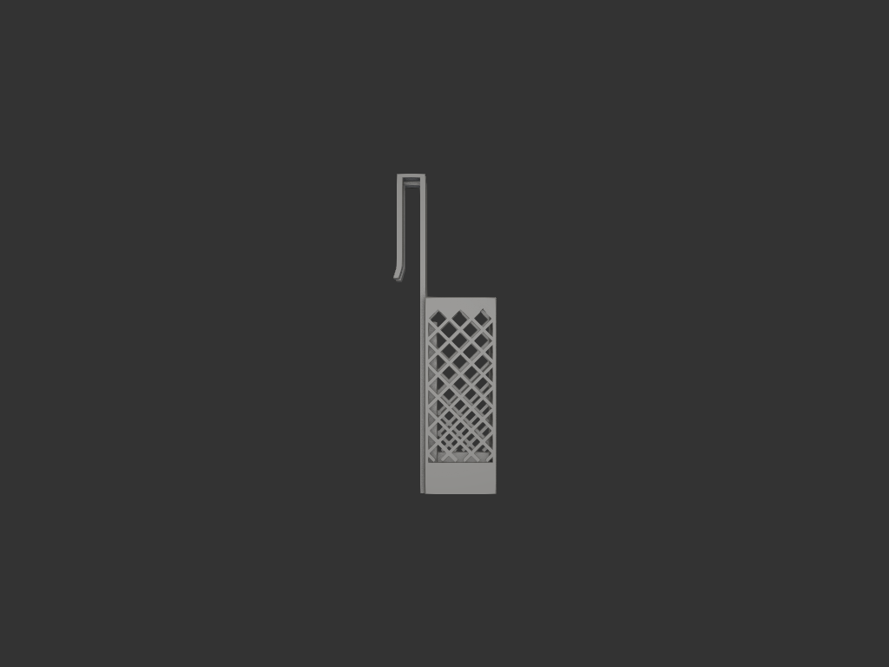
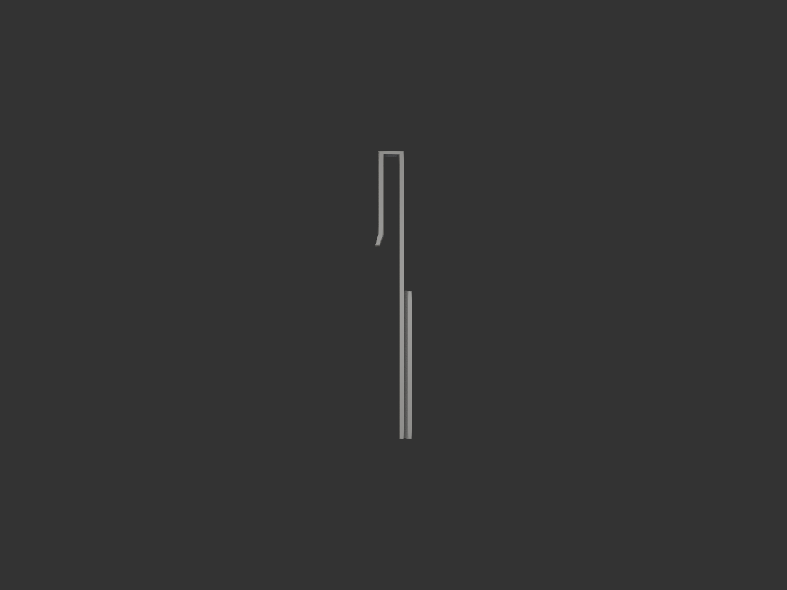
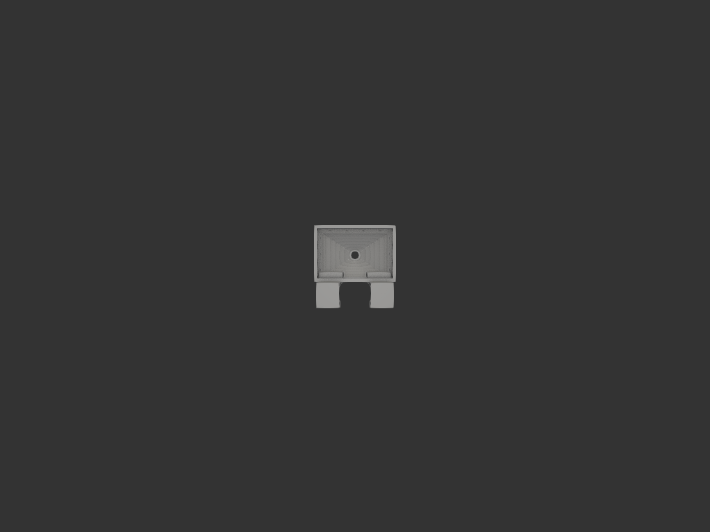

# camping_cutlery_holder

캠핑 박스 옆에 거는 수저통. **통(그물망) + S후크 2개**로 분리된 2피스 구조.
후크를 박스 테두리에 걸고, 통을 위에서 더브테일 레일에 끼워 넣는다.



## 목적/용도
- 캠핑 폴딩박스 바깥에 걸어 수저를 세워 보관
- 설거지 후 젖은 수저를 꽂아도 물이 빠지도록 그물망 + 바닥 깔때기 배수
- 통·후크를 **출력 방향이 다르게** 분리 (통은 세워서, 후크는 뉘여서) → 각 파트가 하중 방향에 맞는 레이어로 튼튼하게 출력

## 구조 (2피스)

### 통 (holder) — 세워서 출력
- 외곽 82.8 × 56.8 × **157.4mm** (내부 78 × 52 × 155)
- 4면 **45° 다이아몬드 그물망** (리브 2.5mm, 서포트리스) — 상단은 톱니로 마감해 오버행 없음
- 하단 25mm 는 솔리드 밴드 (젓가락 빠짐 방지)
- 바닥은 **원뿔 깔때기** → 중앙 Ø10 구멍 하나로 배수 (모서리에 물 안 고임)
- 뒷벽 좌우에 **더브테일 홈**(암) — 후크 레일이 물리는 곳 (벽과 겹쳐 별도 돌출 없음)

### 후크 ×2 (hook) — 옆으로 뉘여서 출력 (동일 부품 2개)
- **더브테일 레일**(수): 통 홈에 물림. 넓은끝 20mm, 목 12mm, 45° 경사, 넓은끝에 seat(출력 bed 접지)
- **보강판**: 레일 옆 바닥까지 이어져 하중을 면으로 분산
- **걸이(클램프)**: 박스 테두리(18mm)를 감쌈. 브릿지 2.5mm(얇게, 상자 위 간섭↓), 안쪽 하강 4mm × 84mm(길게), 끝은 벌림(끼움 안내)
- 후크 상단은 통 상단보다 **100mm 위** → 박스에 걸면 통이 그만큼 아래에 매달림



## 조립
1. 후크 2개를 박스 테두리에 건다 (걸이가 테두리를 감쌈, 벌린 끝이 안내)
2. 통을 박스 바깥에서 위 → 아래로 내려 뒷벽 홈을 후크 레일에 끼운다
3. 통 슬롯 천장(박스 테두리 높이)이 레일 상단에 얹혀 안착

- 통 무게 → 슬롯 천장 → 레일 상단 → 보강판 → 걸이 → 박스 (하중 경로가 박스 테두리 근처라 짧음)
- 통이 박스 바깥에 매달리는 모멘트가 걸이를 박스에 눌러 안정

## 공차 (레일 ↔ 홈)

| 접촉면 | 공차 | 역할 |
|---|---|---|
| 더브테일 경사 (X) | 0.1 | 앞뒤 물림 (주 결합) |
| seat 깊이 (Y) | 0.1 | 삽입 시 바닥 안 닿게 |
| 보강판 ↔ 통 뒷면 | 0.3 | 슬라이드 시 밀착 방지 |

출력 후 더브테일이 뻑뻑하면 `params.py` 의 `DT_CLR` 을 0.15로 올리면 X·Y 양쪽에 반영된다.

## 출력

| 파트 | 방향 | 비고 |
|---|---|---|
| 통 (holder.step) | 세워서 (바닥이 bed) | 그물망 45°·톱니로 서포트리스 |
| 후크 (hook.step) ×2 | 옆으로 뉘여서 | 넓은끝 seat·보강판 평면이 bed. 레이어가 인장 방향 |

- 후크 길이 257mm → 베드(256mm)에 **대각선 배치**
- 재료: PETG 권장 (야외 UV/온도)

## 파일
```
params.py     공유 치수 (한 곳에서 관리)
holder.py     통
hook.py       S후크 1개
assembly.py   조립 확인용 (EXPLODE 로 분해도/결합 전환)
export.py     holder.step / hook.step 개별 출력
```

## 결과

| 결합 (side) | 후크 단품 | 바닥 (깔때기) |
|---|---|---|
|  |  |  |
