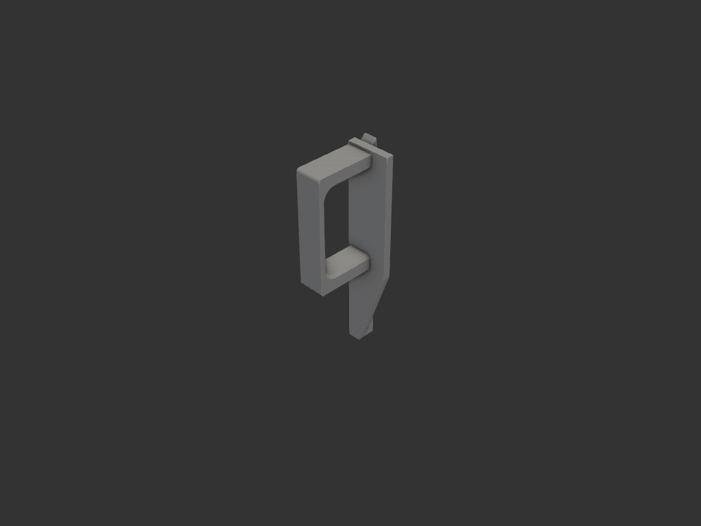
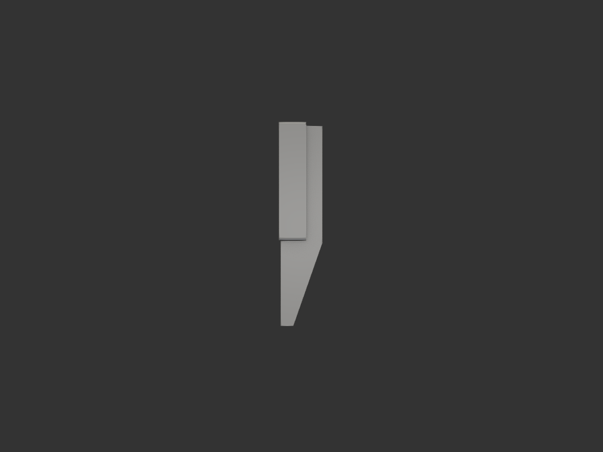
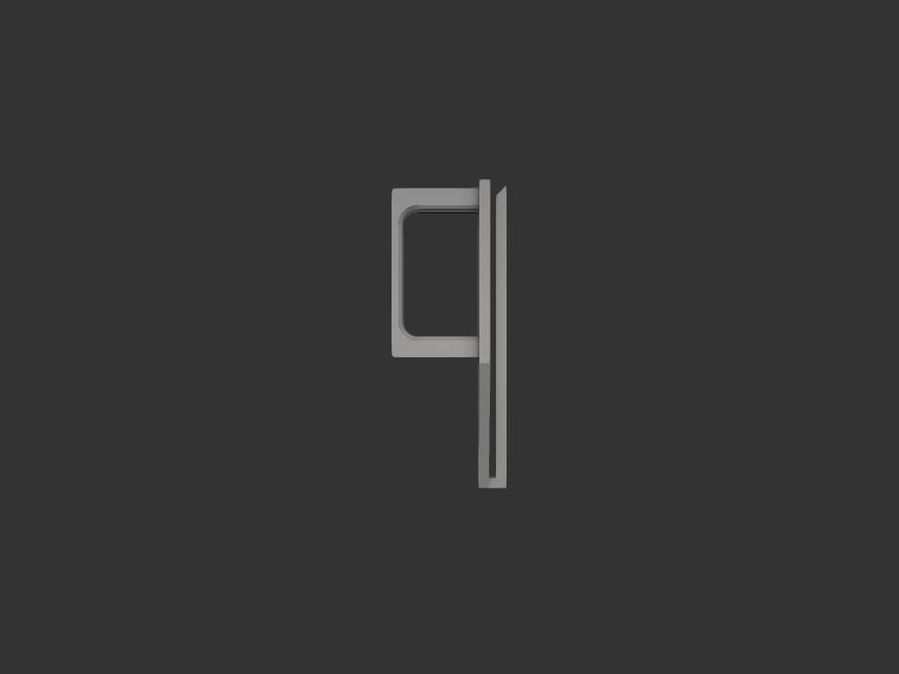

# igt_assembly_jig — IGT 철판 유닛 인양 지그

## 목적/용도

IGT 테이블의 얇은 철판 유닛(두께 2mm, 가운데 폭 8.5mm 슬롯이 길게 뚫림)은
꺼낼 때 잡을 곳이 없다. 이 지그를 슬롯에 비스듬히 걸어 넣어 철판 테두리를
U자 틈에 물리고, 두 다리를 한손에 모아쥐고 들어올린다.

사용자 스케치: `refs/sketch_01.png` (도구), 두 번째 스케치(철판 슬롯 8.5mm).

## 형상/치수

| 항목 | 값 | 비고 |
|---|---|---|
| 전체 | 25 × 11 × 120mm | 측면이 U자 (다리 2 + U바닥) |
| 벽 두께 | 4mm | 다리·U바닥 공통 (강도) |
| 안쪽 틈 | 3mm | 철판 2mm + 여유 1mm |
| 넓은 다리 | 위 70mm 폭 25 (그립) → 아래 50mm 테이퍼로 7.5 | 테이퍼는 한쪽 변만, 반대 변은 두 다리 면일치 |
| 좁은 다리 | 폭 7.5 일정 | 슬롯(8.5, r 고려 평평 7.5)에 맞춤 |
| 유도 챔퍼 | 좁은 다리 위 안쪽 45° | 틈 입구 3→7mm 깔때기 — 철판 테두리 유도 |
| D-핸들 | 창 50H × 틈 30, 바 4×15, 스트럿 8 | 넓은 다리 바깥면 z52~118. 손가락 2~3개 감아쥐는 세로 바. 창 안쪽 1.5 챔퍼 |

## 사용법 / 하중 경로

1. 좁은 다리 쪽을 슬롯에 비스듬히 위쪽으로 걸어 넣기 (챔퍼가 유도)
2. 철판 슬롯 테두리가 3mm 틈 안으로 들어가게 세우기
3. D-핸들 창에 손가락 2~3개를 끼워 바를 감아쥐고 인양
   — 하중: 철판 테두리 → U바닥 윗면 → 다리 → 핸들 스트럿 → 손
   — 핸들은 정렬변(x=0) 쪽에 붙임: 뉘여 출력 시 베드 접지(서포트리스)
4. 끼울 때 찍어누르는 도구는 별도 파트로 예정 (v2에서 분리 결정)

## 재료/공정

- PLA/PETG, 0.4mm 노즐. **정렬된 변(x=0 면)을 bed에 뉘여 출력** —
  서포트 불필요, 레이어가 다리 길이 방향이라 인장 하중에 강함
- 두 다리 접지(4×120 두 줄)라 안정적

## 결과

## 상태

- iter_001: 스케치 기반 최초 형상 — bbox/단면 수치 검증 완료
- iter_002: (피드백) 누름 가이드 요철 추가 — 요철 2줄, 홈 3mm
- iter_003: (출력 테스트) 요철이 그립에 도움 안 됨 → 제거. 누름 도구는
  별도 파트로 분리하기로
- iter_004: 손가락 걸이 2개(옆모서리) 시안 → 방향 폐기
- iter_005~007: D-핸들 확정 — 창 50, 틈 24→30(장갑), 바 10→4(전단 하중),
  창 안쪽 1.5 챔퍼 (손 보호)
