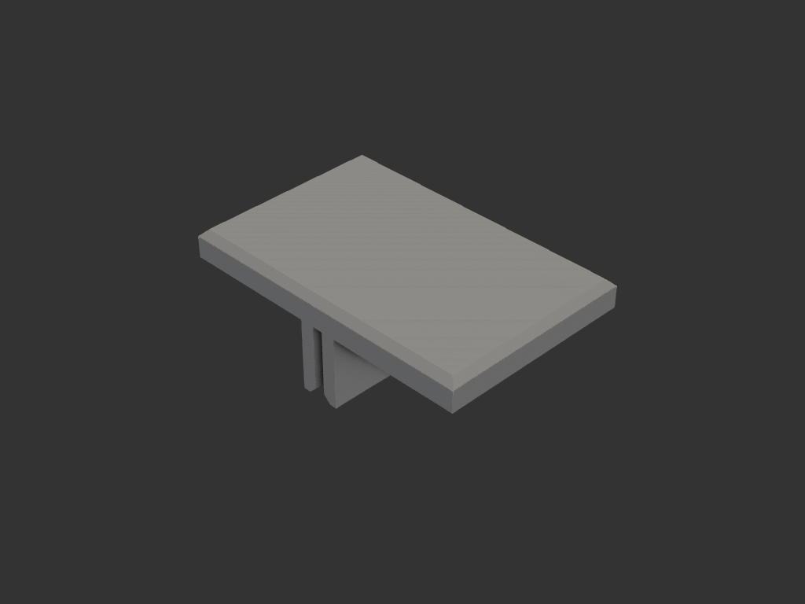
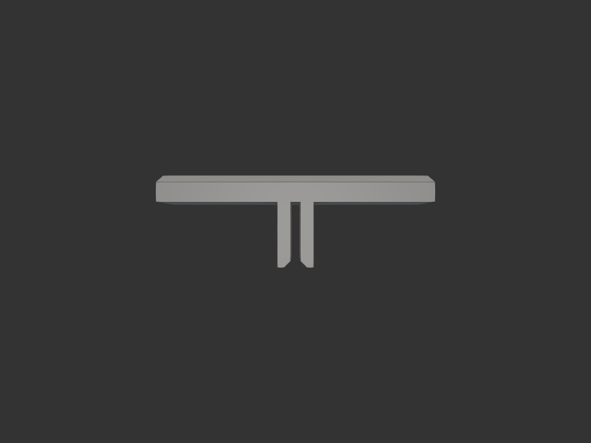
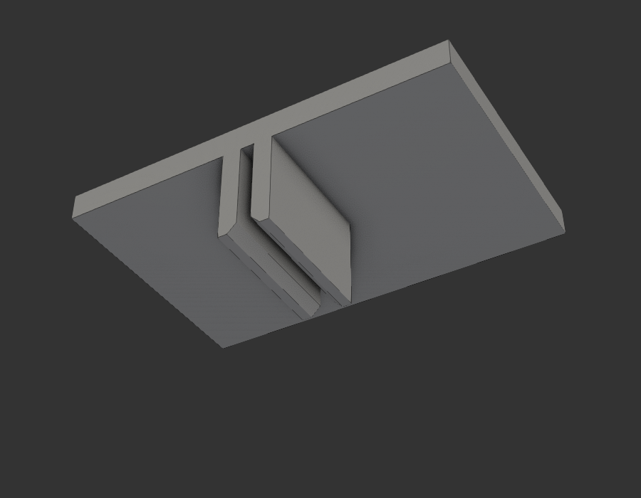

# igt_press_tool — IGT 철판 유닛 누름(안착) 도구

## 목적/용도

길쭉한 IGT 철판 유닛(t2)을 프레임에 길이 방향으로 끼울 때 위에서
찍어눌러 앉히는 전용 도구. igt_assembly_jig v1 에 보조로 달았던 요철
컨셉을 분리 — 전용이 된 만큼 손바닥으로 누르기 좋은 면적을 확보.

슬릿에 철판 슬롯 테두리를 물리면 누르는 동안 미끄러지지 않고,
손바닥 힘이 물림 지점 바로 위로 떨어진다.

사용자 스케치: `refs/sketch_01.png`

## 형상/치수

| 항목 | 값 | 비고 |
|---|---|---|
| 패드 | 85 × 55 × 8mm | 손바닥 면적. 위 테두리 2mm 챔퍼 |
| 요철 | 2줄 × (30L × 20P × 4T) | 긴 변 가장자리에 면일치, 아래로 돌출 |
| 홈 | 3mm (철판 2 + 여유 1) | 슬롯 가장자리 물림 — 미끄러짐 방지 |
| 홈 입구 챔퍼 | 2mm 45° (홈 쪽만) | 3→7mm 벌어져 철판 유도 |
| 전체 | 85 × 55 × 28mm | |

## 사용법

1. 요철 있는 가장자리를 철판 위에 — 한 요철은 슬롯(8.5) 안으로,
   다른 요철은 철판 표면 위에 (슬롯 가장자리가 홈에 물림)
2. 패드에 손바닥을 얹고 찍어누름 — 물림이 미끄러짐을 방지하고
   힘이 요철 바로 위로 전달됨

## 재료/공정

- PLA/PETG, 0.4mm 노즐. **요철 붙은 긴 변을 bed에 뉘여 출력**(세로) —
  요철 접지 + 레이어가 누름 힘 방향과 나란 (igt_assembly_jig 와 동일 전략).
  서포트 불필요. 벽 라인 수 4~5 권장

## 결과

## 상태

- iter_001: 클립형 시안 (가장자리 아래 슬릿) → 방향 폐기
- iter_002: 요철을 힘 방향(아래)으로 — 패드 중앙 배치
- iter_003: (피드백) 요철을 긴 변 가장자리로 이동 — 세로 출력 접지,
  챔퍼는 홈 쪽만 2mm 로 복원
- iter_004: 요철 확대 — 길이 15→30, 돌출 10→20 (2배). 확정
