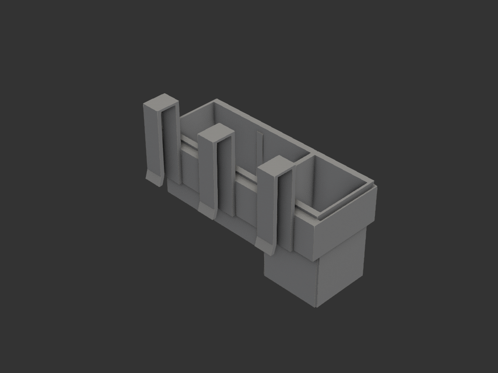
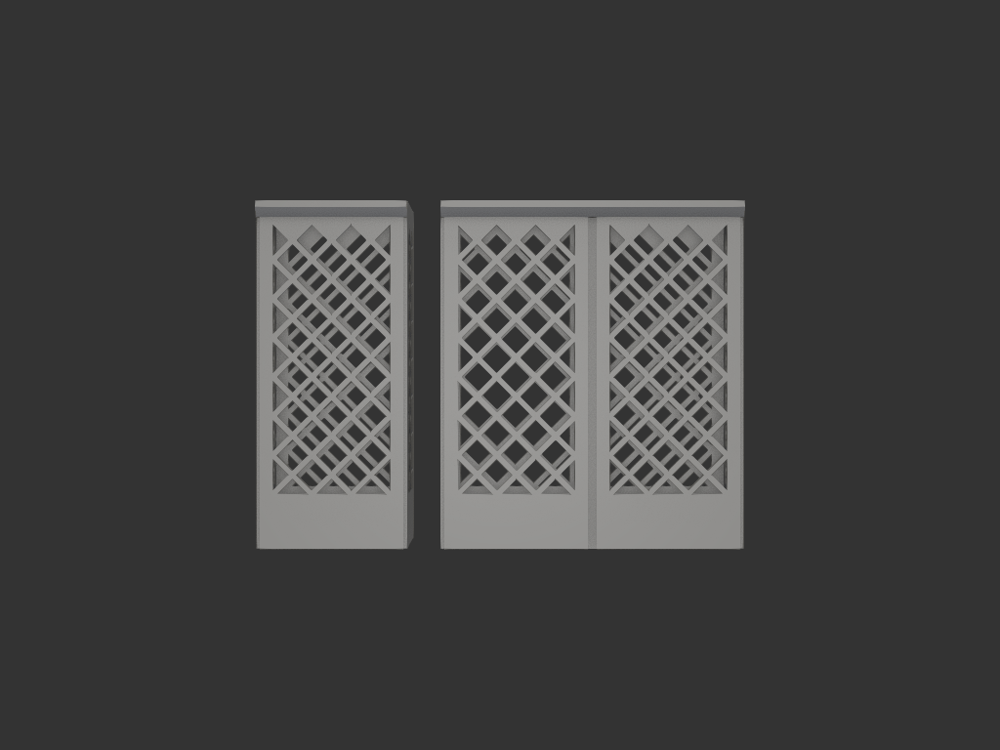
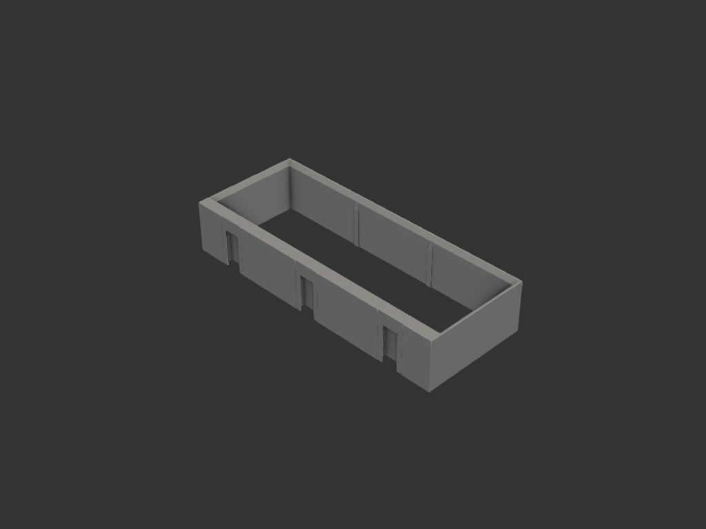

# modular_rack — 캠핑 박스 걸이 모듈형 랙

## 목적/용도

캠핑 박스 테두리에 거는 모듈 시스템. **틀(frame)** 하나를 검증된 더브테일
후크로 박스에 걸고, 내부에 유닛 폭 단위의 **통(bin)** 을 조합해 끼운다.
양념통·수저통 등 용도별 통을 같은 틀에 바꿔 끼우는 구조.
(spice_rack + cutlery_holder 개념 통합 후속)

## 구조

```
박스 테두리 ─ S후크 ×3 ─ 틀(직사각 링, 내부 70×210) ─ 통 1~3유닛 drop-in
```

- **기본 유닛 70×70mm**, 틀 내부 개구 70×210 (3슬롯)
- 통 폭: 1유닛(70) / 2유닛(140) / 3유닛(210) — `build_bin(units, height)`
- 조합 예: 1+1+1, 2+1, 3
- 통 종류: **bin**(민짜 박스, `bin.py`) / **basket**(그물망 벽 + 깔때기
  배수 바닥, `basket.py` — 수저·조리도구용, cutlery_holder 디자인 계승)

## 치수/제약

| 항목 | 값 | 비고 |
|---|---|---|
| 틀 내부 개구 | 210 × 70mm | 3 × 70 유닛 |
| 틀 외곽 | 218 × 86 × H40 | 베드 256 안. 뒷벽 12mm (슬롯 내장) |
| 통 ↔ 개구 공차 | 0.5mm (축당 총합) | 사용자 확정 — drop-in 넉넉히 |
| 통 안착 | 45° 챔퍼 맞물림 | 틀 개구 챔퍼(3) ↔ 플랜지 챔퍼(4.25). self-centering |
| 통 벽/바닥 | 2.0 / 2.4mm | |
| 경계 리브/홈 | 리브 4×1.2, 홈 4.2×1.5, 공차 0.2 | 유닛 경계마다. X 위치 고정 (유격 ±0.1) |
| 더브테일 | 목12/폭20/깊이7.1, 공차 0.1 | cutlery_holder 검증값 재사용 |
| 후크 | 3개(±75, 0), 박스벽 18mm | HOOK_RISE 54 — 후크 상단→바스켓(H160) 바닥 210mm |

## acceptance criteria

- 통이 위에서 툭 들어가 챔퍼면에 안착, 걸리적거림 없이 빠짐
- 틀 무게 경로: 통 → 챔퍼 시트 → 틀 → 슬롯 천장(z30) → 레일 → 후크 → 박스
- 서포트리스: 틀=사용 방향(슬롯 천장 20×7 짧은 브릿지만), 통=세워서
  (플랜지 45° 챔퍼), 후크=뉘여서
- 유닛 경계 리브가 통의 경계 홈에 물려 X 미끄러짐/덜그럭 방지.
  통은 폭과 무관하게 모든 70mm 경계에 홈이 있어 리브와 간섭 없음

## 재료/공정

- PLA/PETG, 0.4mm 노즐. 서포트 불필요
- 틀: 링을 bed에 평평하게 (사용 방향 그대로)
- 통: 세워서. 후크: 옆으로 뉘여서 (YZ 프로파일이 bed)

## 결과





## 상태

- iter_001: 틀 + 후크 3 + 통 데모(2유닛 H80 + 1유닛 H110) 조립 검증
- iter_002: 틀 단독 렌더
- iter_003: 유닛 경계 리브(틀) + 경계 홈(통) 추가 — 간섭 부피 0 확인
- iter_005: 리브 물림 강화 — 공차 0.4→0.2, 돌출 0.8→1.2 (보강살 연동)
- iter_006: 후크 걸이 틈 수정 14.6→18.6 — 보강판(4)이 박스 자리를 잠식하던
  버그. cutlery_holder 후크도 동일 수정 (양쪽 hook.py)
- 유닛 60×4안 검토 후 70×3 유지 확정 (4유닛 틀은 대각선으로도 출력 불가)
- export.py: frame / hook / bin_1u·2u·3u(H80) / basket_1u·2u(H160) 개별 STEP
- iter_007: basket 추가 — 4면 ±45° 그물망(셀 단위, 경계 솔리드 기둥),
  상단 톱니 마감, 유닛당 깔때기+배수 Ø10, 하단 솔리드 밴드 25
- iter_008: (피드백) 그물 가장자리가 벽과 안 붙던 문제 — 개구를 격자
  마디(9mm 배수)에 스냅: 개구 폭 62→54, h_open 126 (18의 배수)
- iter_009: (피드백) iter_008 위상 오류 수정 — 그리드 홀수 강제로 네
  모서리가 마디에 정렬, 톱니 다이아(0,±18)가 모서리 침범 안 함.
  리브를 벽 안 4mm까지 연장해 가장자리 접합 보강
- iter_011: (피드백) 위아래 리브 미도달 근본 원인 수정 — 리브 길이
  공식(hypot+2P)이 세로로 긴 개구에서 ±1.8mm 모자라 위아래 2mm 띠에
  리브가 없었음. 길이 2×hypot 로 확대. 단면 측정으로 상/하/좌/우
  가장자리 밀착 검증 (cutlery_holder 는 개구 비율 덕에 우연히 회피)
