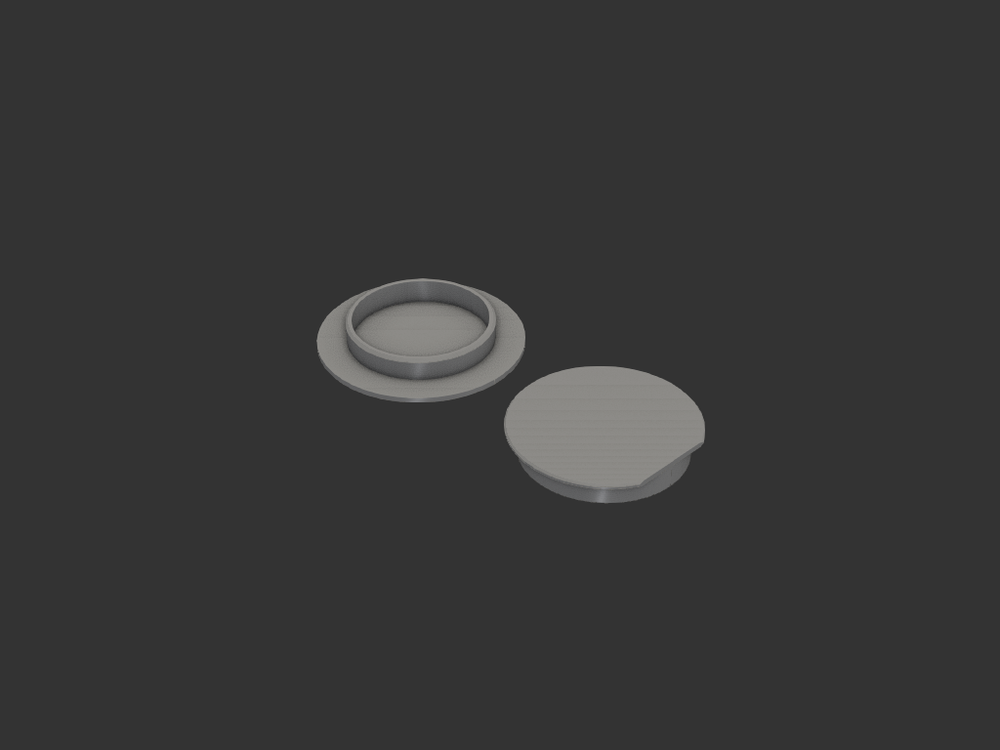
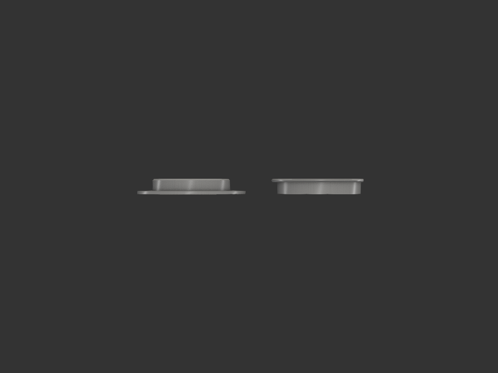
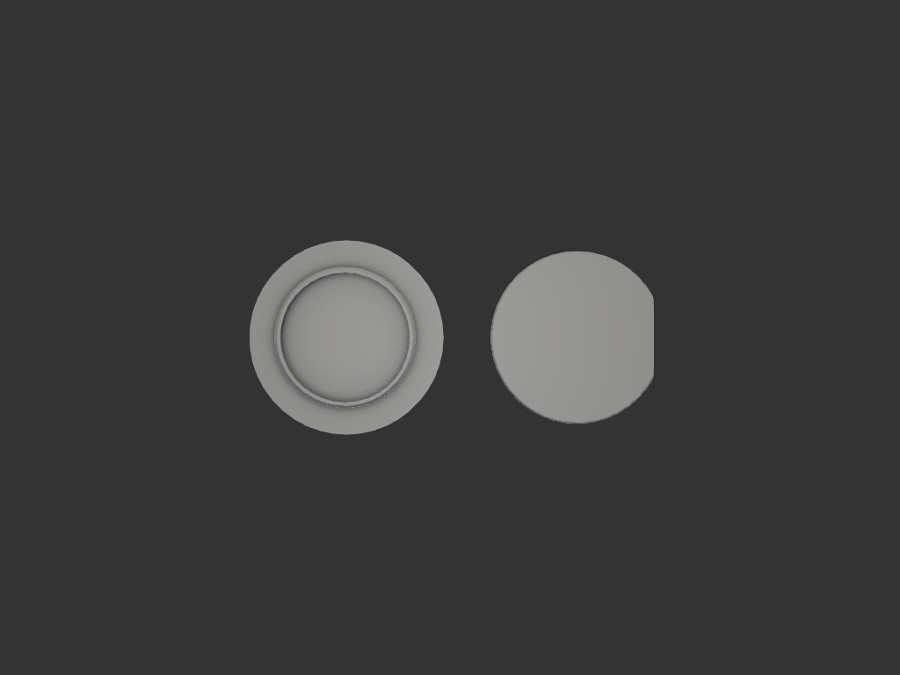
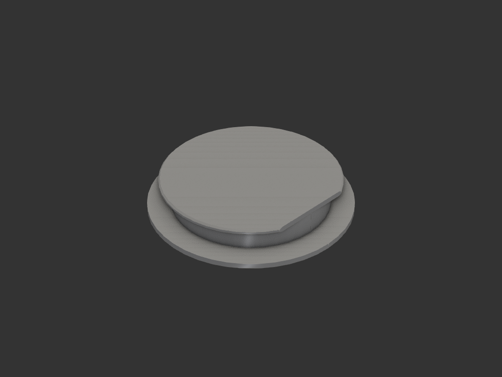
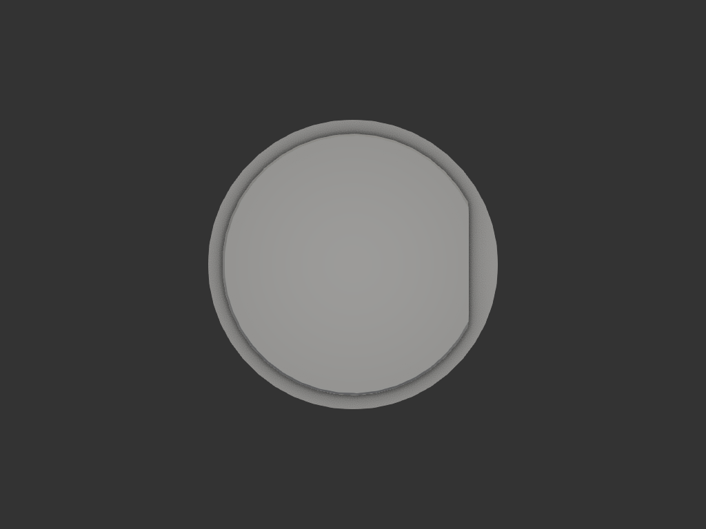

# tarp_magnet_holder

타프(방수포) 고정용 원형 자석을 담는 2분할 케이스. 자석을 bottom 포켓에 넣고 top 캡을 슬라이딩으로 씌운다. 위·아래 디스크(챙) 사이의 슬롯에 실리콘 링을 끼워 타프 면에 고정한다.

## 자석 스펙
- 형태: 원형(디스크) 자석
- 지름: Ø25mm
- 두께: 4.5mm

## 파츠 구성

| 파츠 | 역할 | 전체 높이 | 파일 |
|------|------|-----------|------|
| **bottom** | 자석 포켓 + 베이스 디스크 (위로 열림) | 5.2mm | `bottom.py` |
| **top** | 위에서 씌우는 캡 + 디스크 (아래로 열림) | 5.2mm | `top.py` |

조립: `assembly.py` (좌우 분리 / 결합 뷰 전환 가능)

---

## bottom 파츠

자석을 담는 포켓 실린더 + 바닥을 막는 베이스 디스크. 디스크 안쪽을 0.5mm 파내 자석 아래 바닥을 얇게 했다.

| 항목 | 값 | 비고 |
|------|-----|------|
| 포켓 내경 | Ø25.3mm | 자석 Ø25 + 0.3 헐거운 끼움 |
| 포켓 외경 | Ø27.3mm | 반경 벽 두께 1mm |
| 자석 cavity 높이 | 4.7mm | 자석 4.5 + 위 여유 0.2 |
| 자석 아래 floor | 0.5mm | 디스크 안쪽 0.5mm recess |
| 베이스 디스크 | Ø38 × 1.0mm | 포켓보다 넓은 베이스 |
| 포켓 벽 높이 | 4.2mm | 디스크 위 (cavity 유지 위해 0.5 낮춤) |
| 결합 챔퍼 | 0.5mm | 포켓 벽 상단 **바깥** 모서리 (top 결합 lead-in) |
| **전체 높이** | **5.2mm** | floor 0.5 + cavity 4.7 |

z 단면:
- `z=0..0.5` : 자석 아래 floor (Ø25.3 영역)
- `z=0..1.0` : 베이스 디스크 외곽 Ø38
- `z=0.5..5.2` : 자석 cavity Ø25.3 (높이 4.7)
- `z=1.0..5.2` : 포켓 벽 (외경 Ø27.3 / 내경 Ø25.3)

## top 파츠

bottom 포켓 실린더(외경 Ø27.3) 위로 슬라이딩 결합하는 캡.

| 항목 | 값 | 비고 |
|------|-----|------|
| 스커트 내경 | Ø27.4mm | bottom 외경 27.3 + 0.1 슬라이딩 공차 |
| 스커트 외경 | Ø29.4mm | 반경 벽 두께 1mm |
| 스커트 높이 | 4.2mm | bottom 포켓 벽과 동일 |
| 윗 디스크 | Ø33.4 × 1.0mm | 외경에서 처마 2mm 돌출 |
| 처마 챔퍼 | 0.3mm | 디스크 둘레 위·아래 모서리 (끝단 직벽 0.4) |
| 처마 절단 | x=14.7 | +X 쪽을 스커트 접선에서 직선 절단 (D형) |
| 결합 챔퍼 | 0.5mm | 스커트 하단 **안쪽** 모서리 (bottom 결합 lead-in) |
| **전체 높이** | **5.2mm** | 스커트 4.2 + 디스크 1.0 |

z 단면:
- `z=0..4.2` : 스커트 링 (외경 Ø29.4 / 내경 Ø27.4), 아래로 열림
- `z=4.2..5.2` : 윗 디스크 Ø33.4 (처마 + 챔퍼 + +X 직선 절단)

## 결합 (assembly)

top 을 bottom 위로 +1.0mm 안착:
- bottom: `z=0..5.2`
- top: 스커트 `z=1.0..5.2` (bottom 포켓 벽을 감쌈), 윗 디스크 `z=5.2..6.2`
- **결합 전체 높이: 6.2mm**

디스크 사이 슬롯 (타프/실리콘 링 영역):
- 수직 간격 **4.2mm** (= 몸통 높이) — Ø3.1 실리콘 링 삽입용
- 처마 겹침 반경 **2.0mm** (스커트 외경 Ø29.4 ~ top 디스크 Ø33.4)
- top +X 절단면 쪽은 처마 없음 → 실린더 노출

결합 lead-in: bottom 벽 상단 바깥 + top 스커트 하단 안쪽에 각 0.5mm 챔퍼 → 두 모서리가 마주 보며 깔때기를 이뤄 슬라이딩 결합이 쉬움.

## 공차 표

| 인터페이스 | 공칭 | 공차 | 의도 |
|-----------|------|------|------|
| 자석 ↔ 포켓 내경 | Ø25 → Ø25.3 | +0.3 | 헐거운 삽입 |
| bottom 벽 외경 ↔ top 스커트 내경 | Ø27.3 → Ø27.4 | +0.1 | 슬라이딩 끼움 |
| 자석 아래 floor | — | 0.5mm | 자석을 외부에 가깝게 |
| 자석 위 여유 | cavity 4.7 − 자석 4.5 | 0.2mm | 봉입 여유 |

## acceptance criteria
- bottom: 포켓 내경 Ø25.3, 외경 Ø27.3, floor 0.5mm, cavity 높이 4.7, 디스크 Ø38, 전체 5.2
- top: 스커트 내경 Ø27.4, 외경 Ø29.4, 디스크 Ø33.4, +X 처마가 x=14.7 에서 직선 절단, 전체 5.2
- 결합 시 top 디스크가 bottom 벽 상단에 안착, 스커트가 bottom 벽을 감쌈, 결합 높이 6.2

## 재료/공정 가정
- FDM 3D 프린팅, 벽 두께 1mm
- bottom: 위로 열린 포켓 (오버행 없음)
- top: 디스크 아래로 열린 스커트 — 디스크 면을 바닥에 놓고 출력하면 오버행 없음

## export
- `exports/bottom.step`, `exports/top.step` — 개별 파츠 (출력용, 분리)
- `exports/tarp_magnet_holder.step` — 두 파츠 좌우 분리 배치 (한 파일)

## 이미지

분리 배치:

결합:

