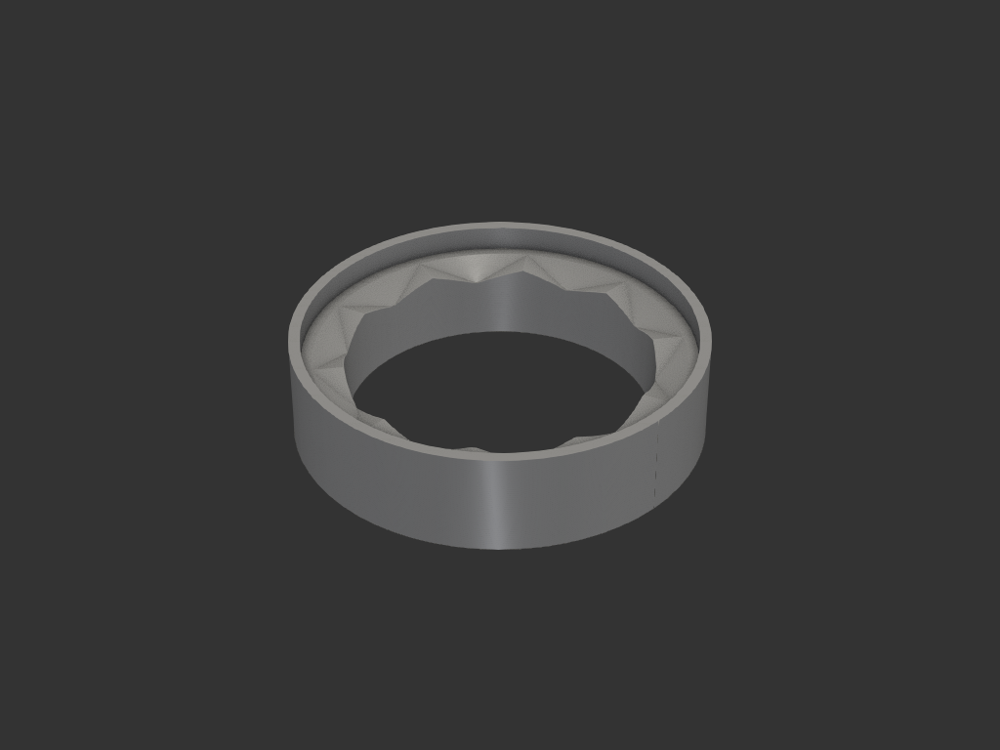
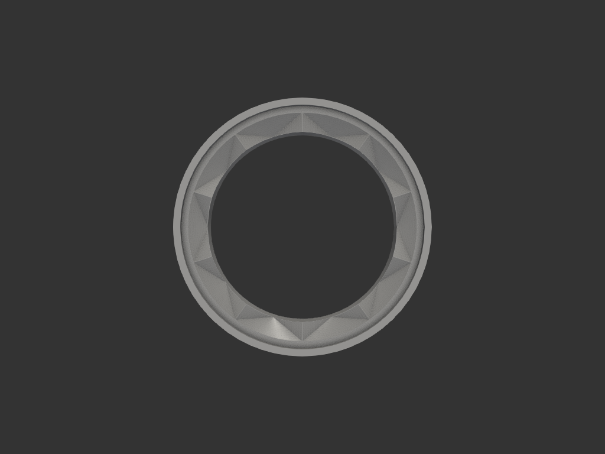

# distributor_stand

커피 디스트리뷰터 거치대. 디스트리뷰터를 올려두는 스탠드.

## 목적/용도
- 디스트리뷰터를 올려두는 거치대
- 상단의 **물결 산**(삼각 골짜기 10개) 위에 디스트리뷰터를 얹고 **돌리면**, 디스트리뷰터에 묻은 커피 가루가 산에 긁혀 떨어짐 (거치 + 가루 제거 겸용)

## 구조
- **내부 실린더** (내경 59.5, 벽 6, 높이 15): 상단에 물결 산
- **물결 산**: 삼각 골짜기 10개, 깊이 3mm
- **중간 실린더** (내경 71.5, 벽 2): 내부와 한 몸
- **외부 실린더** (내경 75.5, 벽 2, 높이 20): 감싸는 벽

## 치수 (mm)

| 항목 | 값 |
|---|---|
| 내부 내경 / 벽 / 높이 | 59.5 / 6 / 15 |
| 물결 골짜기 | 10개, 깊이 3 |
| 중간 내경 / 벽 | 71.5 / 2 |
| 외부 내경 / 벽 / 높이 | 75.5 / 2 / 20 |

## 재료/공정
- FDM, 세워서 출력

## 이력
- `legacy/coffee/distributer.py` 를 자율 워크플로로 이관 + 파라미터 정리, 오타 교정(distributer → distributor)

