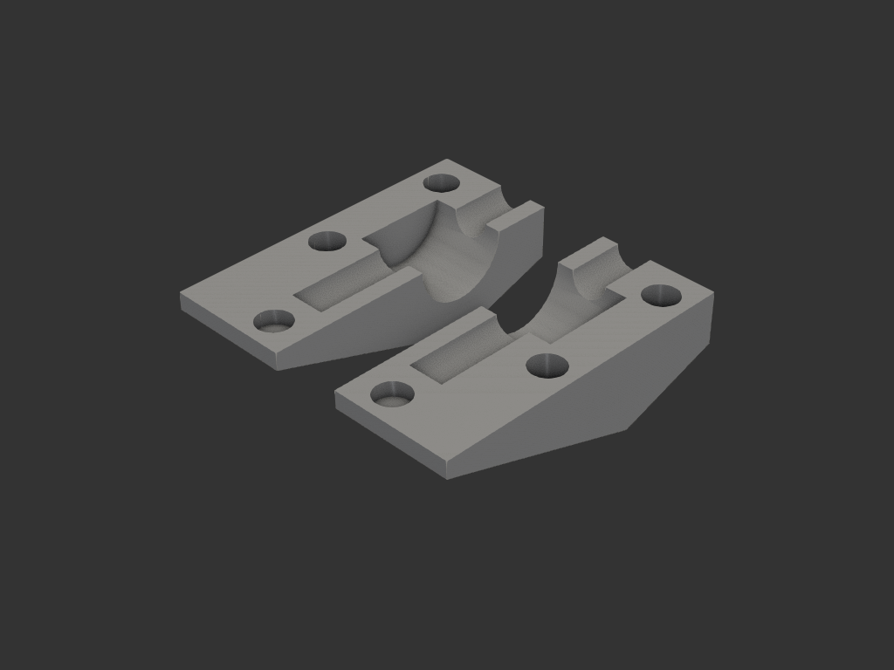
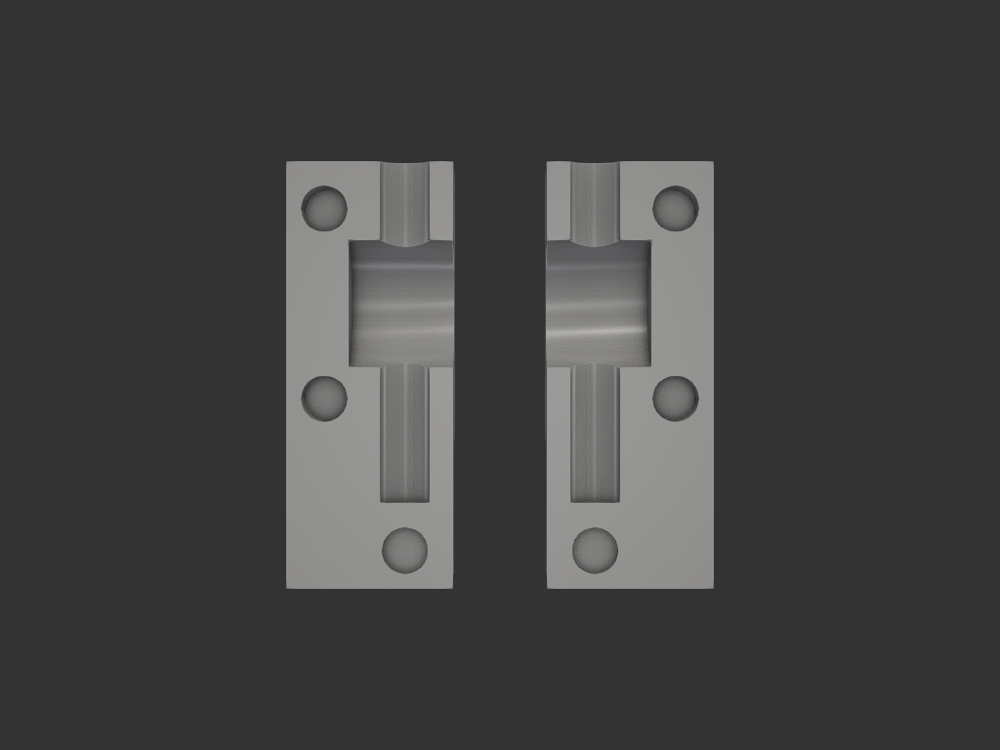

# dutch_knob

더치(콜드브루) 기구의 작은 노브를 감싸 손잡이를 크게 확장하는 클램프.

## 목적/용도
- 더치 기구의 유량 조절 노브가 너무 작아 조작이 불편 → 바깥에서 감싸 크게 확장
- **두 반쪽(클램쉘)** 이 노브를 양쪽에서 감싸고 **자석으로 결합**해 고정

## 구조
- 좌우 대칭 **2피스** (한 파트에 미러로 함께 포함, 둘 다 출력)
- 각 반쪽: 17.5 × 45 × 12.5mm 블록, 앞/뒤 사선
- **노브 홈**: X축 반원 Ø13.5 (원래 노브를 감쌈)
- **축 채널**: Y축 Ø5.3 (노브 축 통과)
- **자석 구멍**: Ø4.98 (Ø5 자석 압입) — 결합면에 배치

## 치수 (mm)

| 항목 | 값 |
|---|---|
| 반쪽 외형 | 17.5 × 45 × 12.5 |
| 노브 홈 | Ø13.5 × 12 |
| 축 채널 | Ø5.3 |
| 자석 구멍 | Ø4.98 (깊이 5.3 / 2.2) |

## 재료/공정
- FDM. Ø5 자석 별도 (결합용)

## 이력
- `legacy/etc/dutch_nobe.py` 이관 + 오타 교정(nobe→knob) + 파라미터 정리

