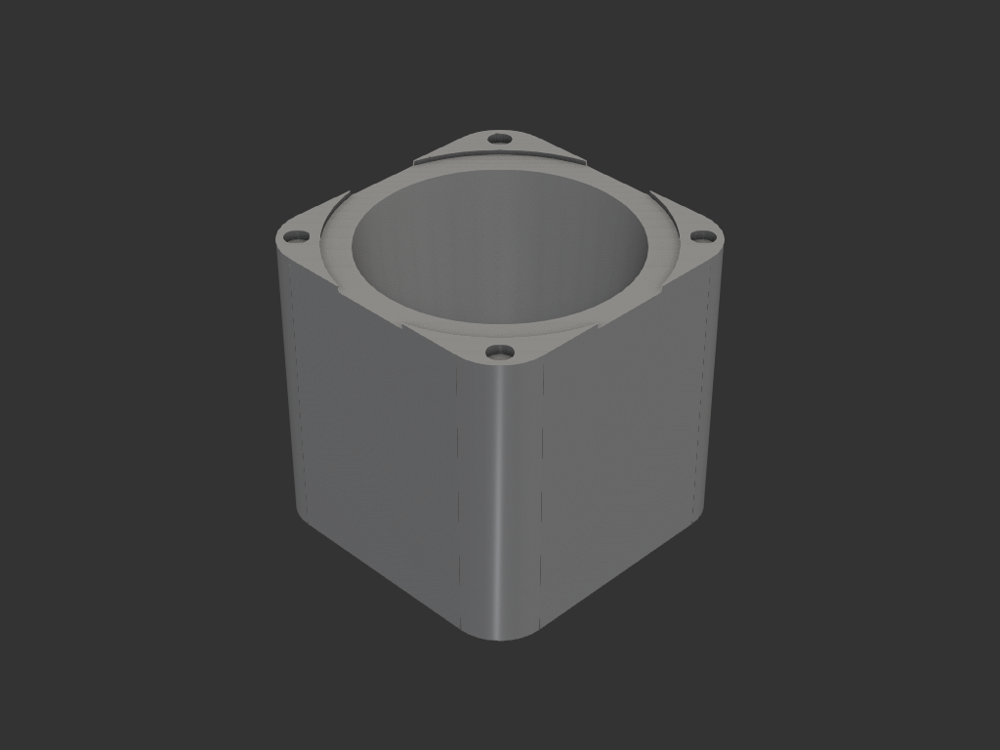
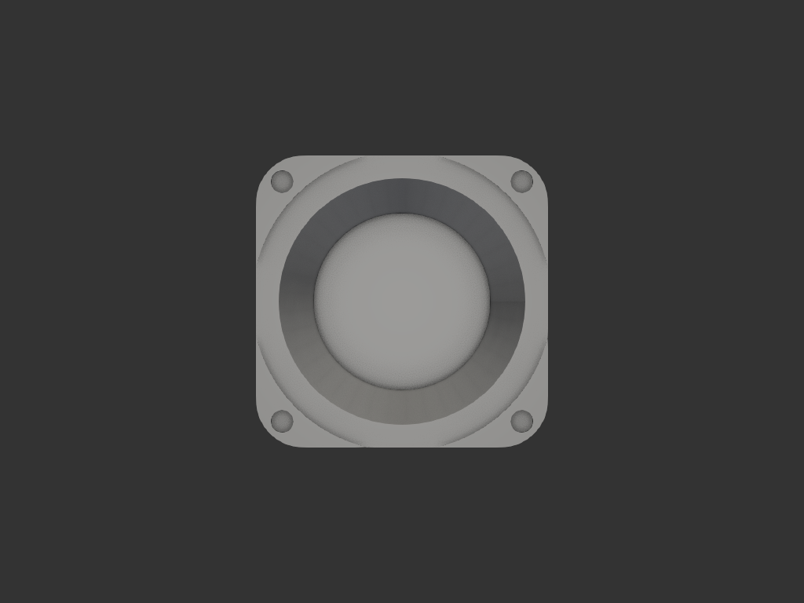

# feimaobuk_a2_cup

feimaobuk A2 그라인더용 컵. 그라인더에 모서리 나사 4개로 장착하고, 내부 역원뿔대로 가루를 모아 배출한다.

## 목적/용도
- feimaobuk A2 그라인더 하단에 장착하는 컵/토출부
- 내부가 **역원뿔대**(위 넓고 아래 좁음)라 가루가 중앙 아래로 모여 배출
- 모서리 나사 구멍 4개로 그라인더 본체에 고정

## 구조
- **외형**: 62 × 62 × 60mm 사각 블록, 수직 모서리 R10 필렛
- **상단 리세스**: Ø64 × 1.1mm (그라인더 접합면 안착)
- **내부 컵**: 역원뿔대 Ø53(입구) → Ø44(배출), 깊이 58mm
- **나사 구멍**: 모서리 안쪽 5.5mm 위치에 Ø4.95 × 2mm 깊이 ×4

## 치수 (mm)

| 항목 | 값 |
|---|---|
| 외형 | 62 × 62 × 60 |
| 모서리 필렛 | R10 |
| 상단 리세스 | Ø64 × 1.1 |
| 내부 원뿔대 | Ø53→Ø44, 깊이 58 |
| 나사 구멍 | Ø4.95 × 2, 오프셋 5.5 |

## 재료/공정
- FDM, 세워서 출력

## 이력
- `legacy/coffee/grinder_cup.py` 를 자율 워크플로로 이관 + 파라미터 그룹화/주석 정리

