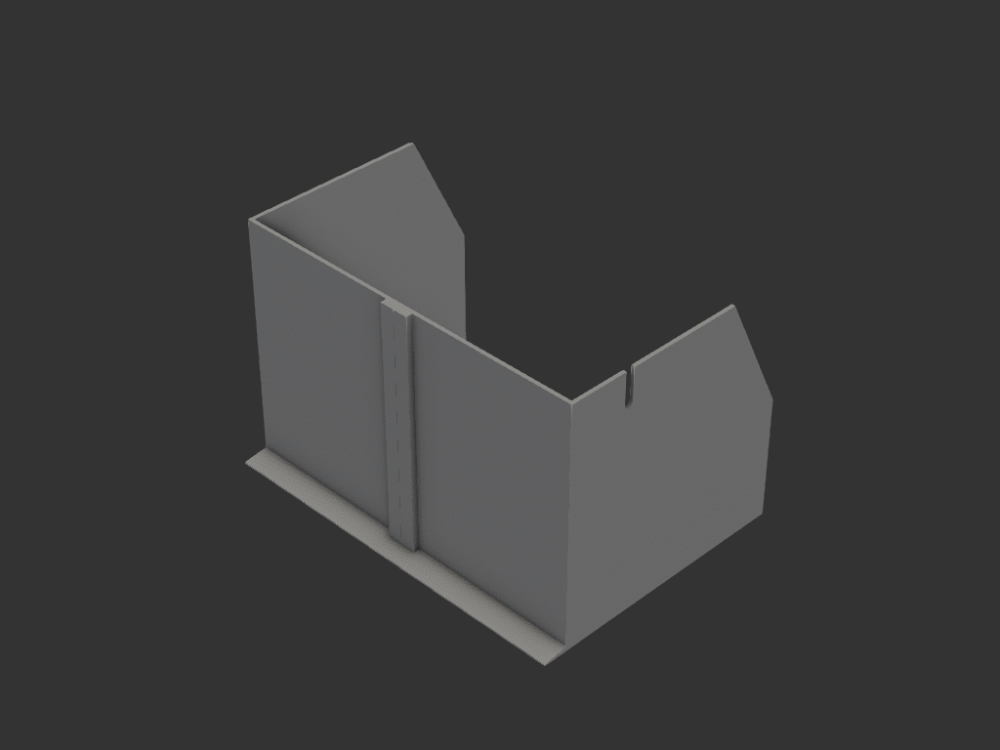

# flair58_splash_guard — 플레어 58 후방 스플래시 가드

Flair 58 로 추출할 때 **주로 포터필터에서** 새는 커피가 주변 벽에 튀어 오염된다.
뒤쪽을 ㄷ 자로 감싸는 벽을 세워 막는다.



## 구성 — ㄱ자 2파트

ㄷ 자를 뒷벽 중앙에서 반으로 쪼개, **옆벽 + 뒷벽 절반을 한 파트로** 만든다.
코너가 일체라 자립 안정성이 높고, 세워서 출력하므로 발판도 일체로 붙는다.

| 파트 | 특징 |
|---|---|
| `left` (x=300 쪽) | **전원선 홈** + 그루브 |
| `right` (x=0 쪽) | 텅 |

미러가 아니라 각각 다른 모델이다 (왼쪽에만 전원선 홈).

> **좌우 주의**: 사용자는 앞(+y)에서 뒤(-y)를 바라본다. 따라서 **x=300 쪽이 사용자
> 기준 왼쪽**이다. iter_002 에서 이걸 반대로 잡았다가 고쳤다.

## 치수

| 항목 | 값 | 근거 |
|---|---|---|
| 벽 높이 | 200 | 누출이 주로 포터필터 → 이 높이면 충분 |
| 벽 두께 | 2.5 | 0.5 압출폭 기준 벽 5줄 — 인필 없이 꽉 참 |
| 안쪽 폭 | 300 | 매트 폭과 일치 |
| 옆벽 길이 | 200 | y=150 까지 높이 200, y=200 에서 100 으로 사다리꼴 |
| 재료 | **PETG** | PLA(Tg 60°C)는 추출 93°C 에 부적합 |
| 전원선 홈 | 폭 8.0 × 깊이 30 | 전선 Ø6.5, 최대 36° 기울기 허용. 뒷벽에서 앞으로 50 |

### 발 — 안팎을 다르게

```
     │ 벽 2.5
     │
 ┌───┤
 │╲  │  혀 1.5 ┐
 │ ╲ │ ┌───────┴╲    ← 끝 5mm 램프
 └──╲┴─┴─────────╲
 -22.5   0   10
 뒤 플랜지      안쪽 혀
 (조리대 위)    (매트 밑)
```

| 항목 | 값 |
|---|---|
| 뒤 플랜지 | 폭 20, **뿌리 4.0 → 끝 1.2 쐐기** |
| 옆 플랜지 | **없음** |
| 안쪽 혀 | 폭 10 × 두께 1.5, 끝 5mm 램프 |

**뒤 플랜지를 쐐기로 한 이유** — 플랜지는 캔틸레버다. 굽힘 모멘트가 뿌리에서 최대,
끝에서 0 이므로 뿌리가 두껍고 끝이 얇은 쐐기가 등응력 형상에 가깝다. 균일 두께는
끝살이 일을 안 하면서 무게만 차지한다. 단면적 80 → 52 mm² (35% 절감)이고
**접지 면적은 그대로다** (경사는 윗면만 깎으므로 바닥에 닿는 넓이는 동일).

**옆 플랜지를 뺀 이유** — 눈에 보여 지저분하다. 없어도 옆으로 58.9° 는 버틴다.

**안쪽 혀를 옆벽에도 남긴 이유** — 옆벽은 뒤쪽 코너에서만 붙어 있고 앞쪽 끝은
자유단이다. 혀가 매트 밑에 깔려 밑동을 전 길이에 걸쳐 잡아주고 단면이 L 자가 되어
휨 강성도 오른다. 빼면 2.7g (1.1%) 아끼는 대신 첫 레이어가 26% 줄고 앞쪽 끝이
휘청인다.

### 중앙 이음 — 역사다리꼴 (도브테일)

| 항목 | 값 |
|---|---|
| 보스 두께 | 8.0 (바깥으로만 두껍게, 안쪽 면은 평평) |
| 텅 | 뿌리 2.5 → 끝 4.0, 길이 10 (4.3°) |
| 그루브 | 입구 3.1 → 안쪽 4.6, 깊이 10.3 |
| 끼움 공차 | 0.3 (한쪽당) |
| 그루브 양옆 살 | 1.7 |

끝(4.0)이 그루브 입구(3.1)보다 넓어 **x 방향으로 빠지지 않는다**.
조립은 **위에서 아래로 수직 슬라이드**.

## 출력

| 항목 | 값 |
|---|---|
| left | 152.5 × 222.5 × 200 · PETG 237 g |
| right | 162.5 × 222.5 × 200 · PETG 256 g |
| 합계 | **492 g · 약 9.0 h** |
| 베드 256 | ✅ 여유 33.5 |
| 서포트 | **불필요** |
| 첫 레이어 접지 | 7,341 mm²/개 |

- **세워서**(사용 자세 그대로) 출력. 모델 좌표 그대로 올리면 된다
- 두 벽이 모두 수직, 발 플랜지는 bed 에 깔림, 옆벽 사다리꼴은 위로 갈수록 짧아질 뿐
- **브림 권장** — 200mm 높이에 접지가 넓지 않다
- 1000층 (0.2 기준)

## 설치

- 조리대 필요: **폭 305 × 깊이 223** (매트 300×450 기준, 뒤로 20 더 나감)
- 안쪽 혀를 매트 밑에 깔고 매트가 눌러 고정
- 넘어지는 기울기: **뒤로 36.5° / 옆으로 58.9°**

## acceptance criteria

- 각 파트 단일 솔리드
- 조립 bbox 305 × 223 × 200
- 텅 끝(4.0) > 그루브 입구(3.1) — x 방향 이탈 불가
- 안쪽 혀가 코너에서 끊기지 않고 1.5 두께 유지 후 완만히 램프
- 전원선 홈이 **x=300 쪽** 벽, z=170~200 에 존재
- 서포트 없이 출력 가능

## 사용법

```bash
uv run python -m models.coffee.flair58_splash_guard.guard    # 렌더 + 뷰어
uv run python -m models.coffee.flair58_splash_guard.export   # STEP
```

## 검토했으나 채택하지 않은 것

| 안 | 이유 |
|---|---|
| ㄷ자 일체 출력 | 베드 256 에 300 이 안 들어감 |
| 눕혀 출력 (15층, 빠름) | ㄱ자는 3차원이라 눕힐 수 없음. 세워야 코너·발 일체가 됨 |
| 별도 H채널 이음 (3파트) | 파트가 어차피 비대칭이라 미러 이점이 없음 |
| 바깥 플랜지 40mm 균일 | 옆은 보기 싫고, 뒤는 쐐기가 등응력에 가까움 |
| 옆벽 안쪽 혀 제거 | 2.7g(1.1%) 아끼고 첫 레이어 26% + 앞쪽 끝 고정을 잃음 |
| PLA | Tg 60°C < 추출 93°C. 뜨거운 수분에 가수분해도 잘 됨 |

## 구현 메모

안쪽 혀의 끝 램프를 **쐐기 2개 빼기로 만들면 코너에서 서로를 파먹어 과절삭된다**
(iter_001 버그). L 자 단면 2장(아래 폭 10 / 위 폭 5)을 `loft` 하면 코너가 자연스럽게
미터로 맞는다.

## 상태

- iter_001: 최초 형상 — 바깥 플랜지 40 균일, 전원선 홈 x=0 쪽
- iter_002: 피드백 3건 반영 — 코너 과절삭 수정(loft), 전원선 홈 좌우 교정,
  이음을 역사다리꼴로
- iter_003: 바깥 플랜지 전체 제거
- iter_004: 뒤쪽만 플랜지 40 복원 (옆은 제거 유지)
- iter_005: 뒤 플랜지 20 + 쐐기(4.0→1.2) — **최종**

### 정량 검증 (iter_005)

| 항목 | 결과 |
|---|---|
| 조립 bbox | 305 × 223 × 200 ✅ |
| 각 파트 단일 솔리드 | 1 / 1 ✅ |
| 넘어지는 기울기 | 뒤 36.5° / 옆 58.9° ✅ |
| 첫 레이어 접지 | 7,341 mm²/개 ✅ |
| 도브테일 | 뿌리 2.59 → 끝 3.94 (입구 3.1 < 끝) ✅ |
| 안쪽 혀 코너 | 대각선으로 5mm 까지 1.50 유지 후 램프 ✅ |
| 전원선 홈 | x=300 쪽, z 170~200, 폭 8.0 ✅ |
| 뒤 플랜지 쐐기 | y=-3 에서 3.94 → y=-22.4 에서 1.23 ✅ |
