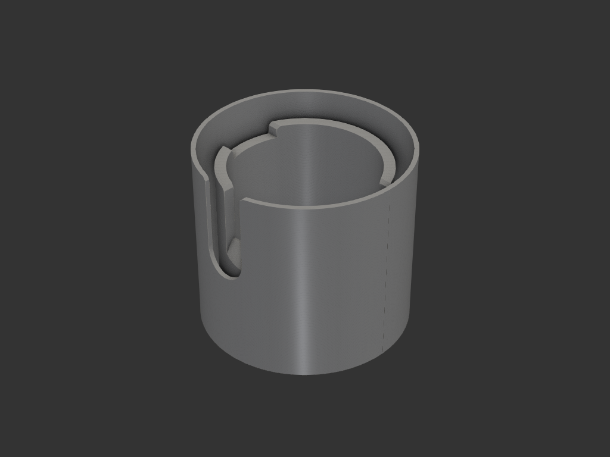
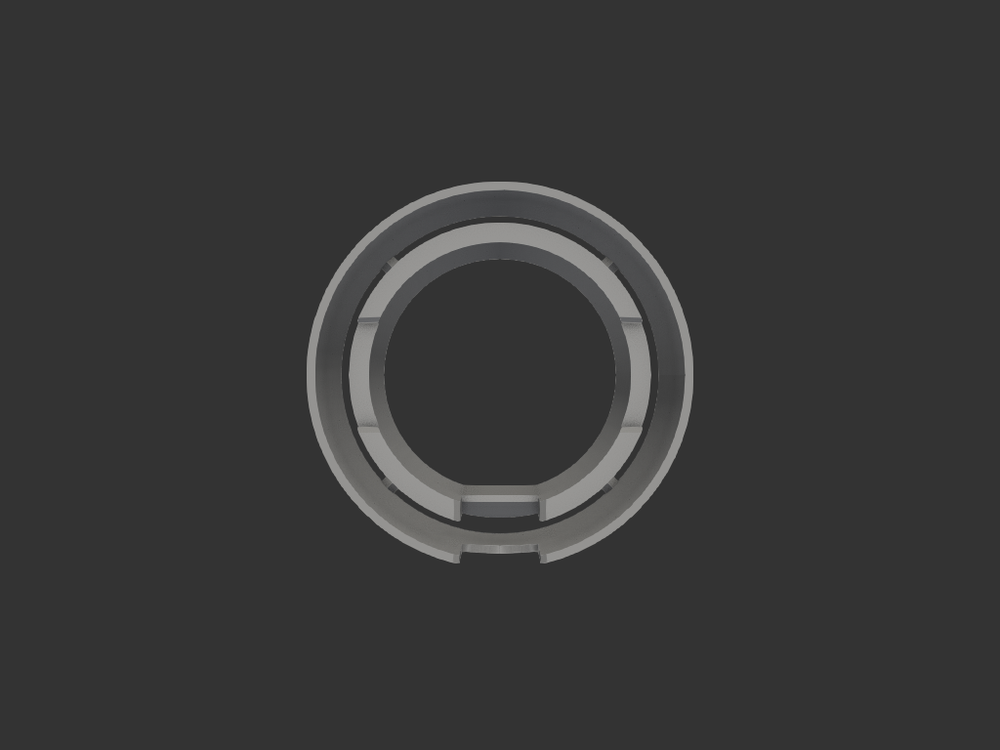
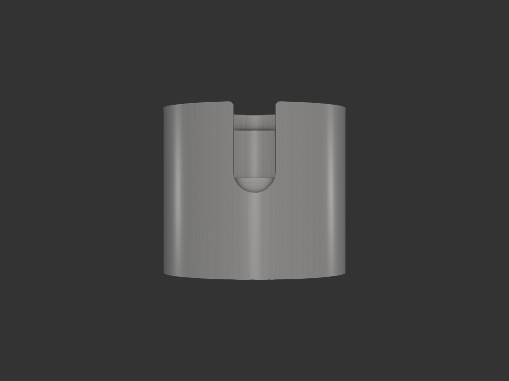

# portafilter_stand

포터필터 거치대 (디스트리뷰팅 + 탬핑 겸용). 포터필터를 끼워 넣고 커피 분배·탬핑을 한다.

## 목적/용도
- 포터필터를 세워 고정하고 디스트리뷰션·탬핑 작업
- 노치로 포터필터를 정렬 (스파우트·귀 자리)
- 외부 껍질이 내부보다 높아, 디스트리뷰팅 시 커피가루가 밖으로 튀는 것을 1차 차단

## 구조
- **내부 실린더** (내경 70.2mm): 포터필터 바스켓 수용
- **외부 껍질** (외경 100mm, 높이 90mm): 감싸는 보호벽 (가루 튐 방지)
- **X자 결속 기둥** ×4 (45°·135°·225°·315°): 내부-외부 실린더 연결
- **노치**:
  - 아래(정남): 스파우트 자리 — 포터필터의 기울어진 부분에 맞춰 **사선 바닥**(내경 28.5 / 외경 37.5mm 깊이)
  - 좌우(정동·정서): 귀 자리 (폭 27.6mm, 깊이 6mm)

## 치수 (mm)

| 항목 | 값 |
|---|---|
| 내부 내경 / 벽 / 높이 | 70.2 / 5 / 80 |
| 외부 외경 / 벽 / 높이 | 100 / 2 / 90 |
| 아래 노치 폭 / 깊이(내·외) | 21.29 / 28.5·37.5 |
| 좌우 노치 폭 / 깊이 | 27.6 / 6 |
| 노치 챔퍼 | 1.5 |

노치 치수(폭·깊이·사선)는 특정 포터필터 실측에 맞춰져 있다.

## 재료/공정
- FDM, 세워서 출력

## 이력
- `legacy/coffee/tamping_base_v5.py` 를 자율 워크플로로 이관 + 파라미터 그룹화/주석 정리
- 매직넘버 `-3` → `ARC_INSET` (외부 노치 반원 관통 여유)로 명명

## 결과

| top | front |
|---|---|
|  |  |
