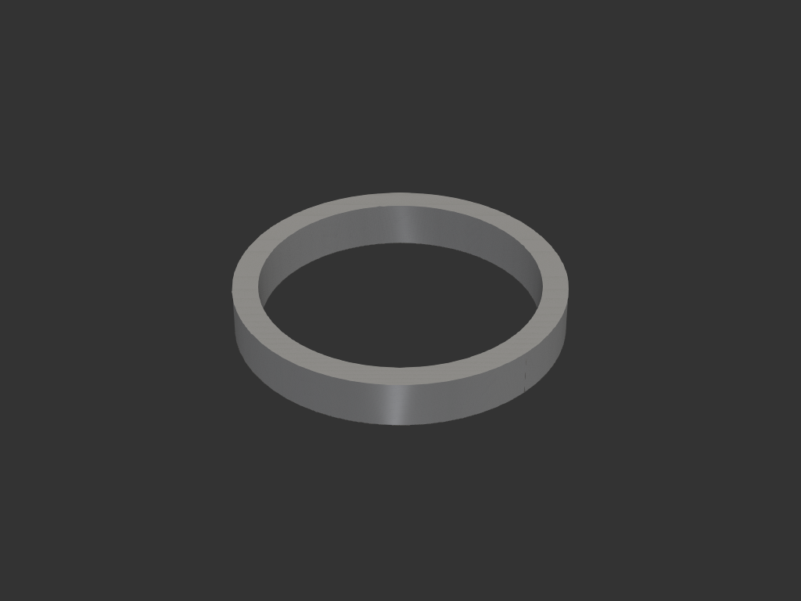

# tamper_stand

커피 탬퍼를 올려두는 거치대. 단순 링 형태.

## 목적/용도
- 커피 탬퍼를 세워/올려 보관하는 거치대
- 탬퍼 베이스가 링 내경에 안착

## 치수 (mm)

| 항목 | 값 |
|---|---|
| 외경 | 70 |
| 내경 | 59.5 |
| 높이 | 10 |
| 벽 두께 | 5.25 |

## 재료/공정
- FDM, 세워서(바닥이 bed) 출력. 서포트 불필요

## 이력
- `legacy/coffee/tamper.py` 를 자율 워크플로로 이관

