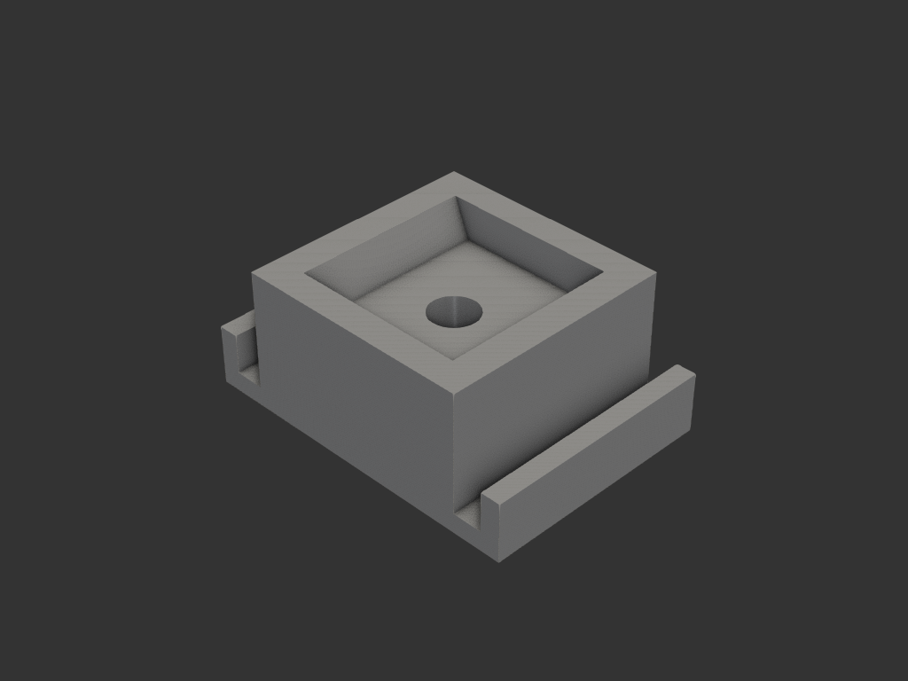
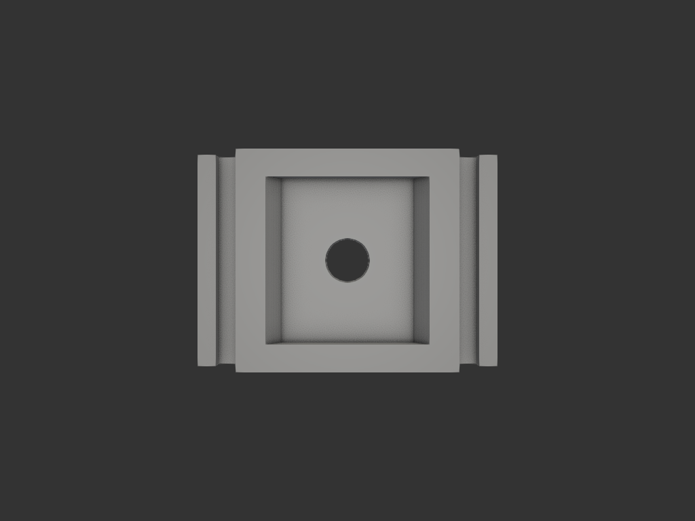
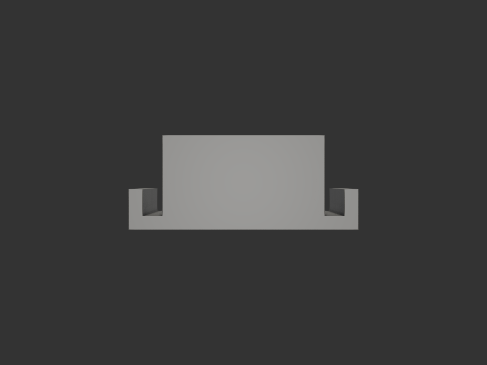

# bracket_base — 천장 홈 브라켓 베이스

## 목적/용도

천장의 긴 홈(폭 34 × 깊이 34 × 길이 2519mm)에 나사로 박는 베이스.
가운데 보스에 금속 브라켓(구매품, 10개 보유)을 끼우고, 브라켓에 다시
프린팅 판재를 끼워 홈을 메꾸는 시스템의 1단계 부품.

- 판재 인터페이스는 **별도 모델링 예정** (여기선 베이스만)
- 폭 공차: 34 그대로 — 출력 테스트 결과 잘 맞음 (확정)

사용자 스케치: `refs/sketch_01.png`, 금속 클립: LED 프로파일용 스프링
클립 (Ø 나사 동봉 제품)

## 치수

| 항목 | 값 |
|---|---|
| 바닥판 | 34(폭) × 24(깊이) × 2 |
| 중앙 보스 | 24 × 24 × 12 (바닥 위) |
| 날개 (양옆) | 두께 2 × 높이 4 |
| 보스 ↔ 날개 틈 | 3mm × 양쪽 |
| 클립 포켓 | 위 17.8 → 아래 14.5 테이퍼(X), Y 18.1, 깊이 4 |
| 나사 구멍 | Ø5 정중앙 관통 (포켓 바닥 → 바닥판) |
| 전체 높이 | 14 |

## 재료/공정

- 바닥판을 bed에 그대로 — 서포트리스 (포켓 테이퍼는 위로 넓어짐)

## 결과

## 상태

- iter_001: 스케치 그대로 최초 형상
- iter_003: 클립 포켓 (17.8→14.5 테이퍼) — 깊이 12 가정
- iter_004: 포켓 깊이 4mm 로 확정
- iter_005: Ø5 나사 구멍 정중앙 관통 — 출력 테스트 fit 확인 완료
