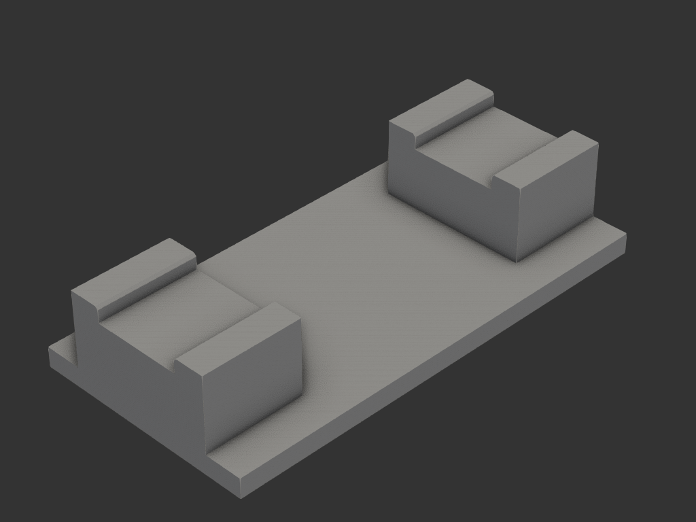
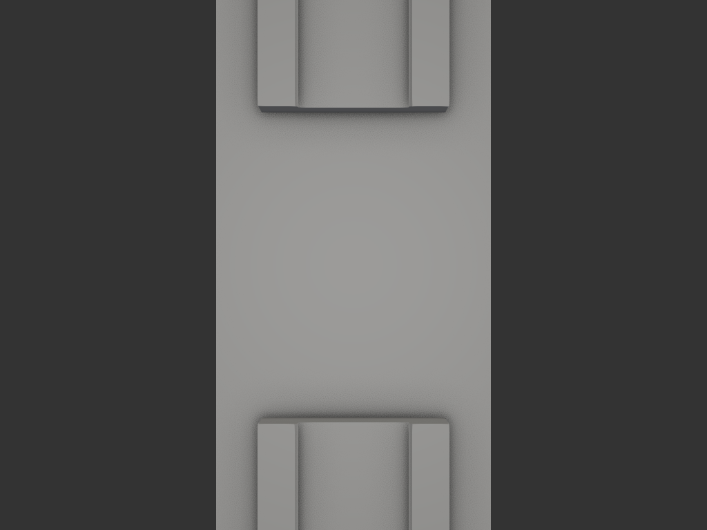

# drilling_base — 나무 판재 드릴링용 바닥 보호 지그

## 목적/용도

`groove_spacer` 설치용 나무 판재(34 × 4.6 × 1259)에 나사 가이드 구멍을 뚫어야 하는데,
작업을 집 안에서 해야 한다. 드릴이 판재를 관통해 **마루 바닥을 상하게 하는 것을 막는 받침**.

```
        [ 나무 판재 34 × 4.6 ]         ← 홈에 얹힘
   ┌───┐                     ┌───┐
   │기둥│      드릴 구간       │기둥│    공기층 24
   │    │      GAP 100        │    │
   ├───┴─────────────────────┴───┤
   │        바닥판 8mm            │    ← 2차 방어선
   └───────────────────────────────┘
                 마루
```

**드릴이 바닥에 닿으려면 판재 4.6 + 공기층 24 + 바닥판 8 = 36.6mm 를 파야 한다.**
1차 방어선은 공기층(기둥 높이)이고, 바닥판은 그게 실패했을 때의 2차 방어선이다.

## 치수

### 홈 / 기둥

| 항목 | 값 | 근거 |
|---|---|---|
| 홈 폭 | 35.0 | 판재 34 + **공차 1.0** (좌우 0.5씩) — 1259mm 판재를 끌어가며 여러 지점을 뚫으므로 헐거운 쪽이 편함 |
| 홈 깊이 | 6.0 | 판재 4.6 이 잠기고 위로 1.4 남음 — 좌우 이탈 방지 |
| 기둥 사이 간격 | 100.0 | 드릴 작업 구간 |
| 공기층 | 24.0 | 판재 아랫면 ↔ 바닥판 윗면 (기둥 높이 − 홈 깊이) |
| 기둥 폭 × 깊이 | 60 × 40 | 홈 35 + 벽 12.5 × 2 |
| 기둥 높이 | 30.0 | 사용자 확정 |

### 바닥판

| 항목 | 값 |
|---|---|
| 폭 × 길이 | 90 × 180 |
| 두께 | 8.0 |
| 전체 크기 | 90 × 180 × 38 (베드 256 여유) |

홈은 Y 전체를 관통한다 — 판재를 위에서 떨어뜨려 넣거나 길이 방향으로 밀어 넣을 수 있다.
홈 상단 모서리에 챔퍼 1.0 (진입 유도).

## acceptance criteria

- 바운딩 박스 = 90 × 180 × 38
- 홈 폭 35.0, 홈 바닥 z=32.0, 기둥 상면 z=38.0 → 판재 상면 z=36.6, 위로 벽 1.4 남음
- 기둥 사이 순간격 100.0
- 단일 솔리드, 서포트 없이 출력 가능

## 재료/공정

- 바닥판을 bed 에 놓고 출력 — 모든 살이 수직, 홈은 위로 열려 서포트리스
- 형상 부피 256.7 cm³ (솔리드 환산 PLA 318g). **실제 필라멘트는 인필에 따라 훨씬 적다**
  — 인필 15% 기준 대략 110~120g
- 이 중 기둥 2개가 약 127 cm³ (60 × 40 × 30 속찬 블록 × 2). 더 줄이려면 위로 열린
  경량화 포켓을 팔 수 있으나, 홈 바닥 아래에 35mm 브리지가 생긴다
- **인필과 보호력의 트레이드오프**: 바닥판이 방어선이므로 인필을 너무 낮추면 의미가 준다.
  바닥판 구역만 슬라이서 모디파이어로 인필을 올리거나(40~50%), 전체 20~25% 권장

## 사용 시 주의

- **미끄럼** — PLA 지그는 가벼워서(약 90g) 마루 위에서 드릴 토크에 돌아간다.
  미끄럼 방지 매트 위에 놓거나 한 손으로 눌러 고정할 것
- 판재가 1259mm 로 길어 지그 밖으로 크게 튀어나온다. 반대쪽 끝이 들리지 않게
  받쳐가며 작업할 것
- 바닥판은 어디까지나 2차 방어선이다. 확실히 하려면 지그 아래에 두꺼운 종이나
  자투리 합판을 한 장 더 깔 것

## 결과



바닥판 위에 기둥 2개. 기둥 상면의 홈(폭 35)에 판재가 앉고, 사이 100mm 구간에서 드릴링한다.



위에서 본 배치 — 기둥 사이 100mm 가 바닥판 전폭(90)으로 열려 있다.


홈 단면. 판재 4.6 이 잠기고 위로 1.4 남으며, 상단 모서리에 진입 유도 챔퍼 1.0.

## 상태

- iter_001: 최초 형상 — 바닥판 90 × 180 × 8 + 기둥 2개(홈 35 × 깊이 6), 기둥 높이 18
- iter_002: 기둥 높이 18 → 26 (공기층 20)
- iter_003: 기둥 높이 30 으로 확정 (공기층 24) — **최종**

### 정량 검증 (iter_003)

| 항목 | 결과 |
|---|---|
| 바운딩 박스 | 90.0 × 180.0 × 38.0 ✅ |
| 단일 솔리드 | 1 solid ✅ |
| 기둥 높이 | 30.0 = 공기층 24.0 + 홈 깊이 6.0 ✅ |
| 드릴 여유 | 4.6 + 24.0 + 8.0 = 36.6mm ✅ |
| 홈 바닥 z=32.0 / 기둥 상면 z=38.0 | 판재 상면 z=36.6, 위로 벽 1.4 ✅ |
| 기둥 사이 순간격 | 100.0 ✅ |
| 홈 폭 / 유격 | 35.0 / 1.0 (좌우 0.50) ✅ |
| 베드 256 적합 | ✅ |
