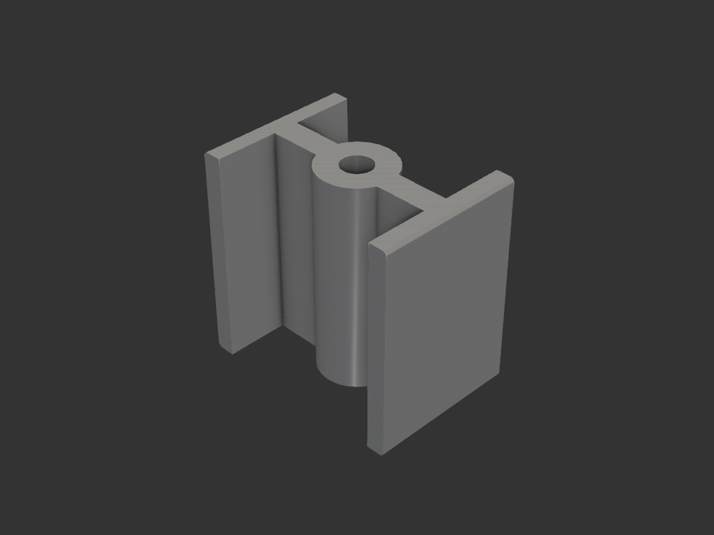
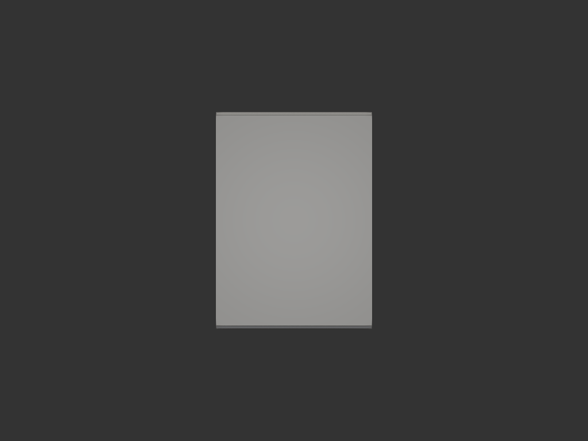

# groove_spacer — 천장 홈 메움용 스페이서 블록

## 목적/용도

천장의 긴 홈(폭 34 × 깊이 38 × 길이 2519mm)을 **4.6mm 나무판**으로 덮어 메꾼다.
나무판만으로는 홈 깊이를 채울 수 없으므로, 홈 안쪽에 이 스페이서 블록을 일정
간격으로 나사 고정하고 그 아래에 나무판을 대어 천장 면과 맞춘다.

```
   ┌─ 천장 홈 바닥 ─┐
   │  [스페이서 33.4]  │   ← 이 모델
   │  [ 나무판 4.6 ]   │
   └───── 천장 면 ─────┘   33.4 + 4.6 = 38 (홈 깊이와 일치)
```

**고정 방식**: 나사 1개가 나무판 → 스페이서 → 천장을 한 번에 관통.
카운터싱크는 나무판 쪽에 별도로 가공하므로 이 모델에는 없다.

**나무판**: 1259mm × 2장 준비 (합 2518, 홈 길이 2519 대비 1mm 여유).

기존 `house_fix/bracket_base` + 금속 클립 + 패널 방식은 폐기하고 이 방식으로 전환
(`bracket_panel` 은 삭제, `bracket_base` 는 기록으로 남김).

## 치수

### 외형 (홈에 맞물리는 값 — 변경 금지)

| 항목 | 값 | 근거 |
|---|---|---|
| 폭 (X, 홈 폭 방향) | 34.0 | 홈 폭 그대로, 공차 0 — `bracket_base` 출력 테스트에서 fit 확인됨 |
| 깊이 (Y, 홈 길이 방향) | 24.0 | `bracket_base` 와 동일 |
| 높이 (Z) | 33.4 | 홈 깊이 38 − 나무판 두께 4.6 |
| 나사 구멍 | Ø5.0 정중앙 관통 | `bracket_base` 와 동일 |
| 챔퍼 | 0.5 | 바깥 면(X=0, X=34)의 위아래 모서리 — 진입 유도 + 코끼리발 방지 |

### 내부 절감 구조 — H 단면 전 높이 압출 (상하 대칭)

| 항목 | 값 | 역할 |
|---|---|---|
| 양 측벽 | 3 × 24 × 33.4 (X=0, X=34) | **폭 34 를 정의**하는 면. 홈 벽에 닿아 자세 유지 |
| 중앙 보스 | Ø12 × 33.4 | 나사 축 주변 압축 살 (구멍 주위 살 3.5) |
| 리브 | 두께 4, 보스 ↔ 양 측벽 | 측벽 좌굴 방지 |

- 나무판 접촉면을 **꽉 채우지 않는다** — 판은 양 측벽 끝면(폭 34 의 양 끝)과
  중앙 보스·리브에 얹히므로 흔들리지 않는다. 면을 메우는 살은 낭비
- Y 방향(홈 길이 방향)은 홈이 구속하지 않으므로 벽을 두지 않음
- **상하 동일** — 뒤집어 끼워도 무관, 조립 시 방향 신경 쓸 필요 없음

하중 경로: 나사 장력 → 나무판 → 측벽/리브/보스 끝면 → 천장.

## acceptance criteria

- 바운딩 박스 = 34.0 × 24.0 × 33.4 (±0.01)
- Ø5 구멍이 X/Y 정중앙(17.0, 12.0)에서 Z 전체를 관통
- 단일 솔리드 (분리된 조각 없음)
- 나무판 접촉면이 X=0 과 X=34 양 끝에 걸쳐 있을 것 (폭 34 전체를 가로질러 지지)
- 상하 단면이 동일할 것 (뒤집어도 같은 형상)
- 서포트 없이 출력 가능 — 모든 살이 수직, 빈 공간은 위로 열림

## 재료/공정

- 34 × 24 면을 bed 에 놓고 출력 — 모든 살이 수직, 서포트리스
- 관통 구멍은 수직이라 브리지 불필요
- 개당 10.09 cm³ ≈ PLA 12.5g (밀도 1.24 기준). 12개 기준 약 150g
- **브림 권장** — 첫 레이어 접지 면적이 278mm² 로 좁은데 높이가 33.4 라
  가늘고 긴 형상이다. 브림 없이 출력하면 측벽이 떨어질 수 있음

## 설치 — 배치 간격

나무판 1259mm × 2장, **판당 6개 / 총 12개** 권장.

| 위치 (판 끝에서) | 30 · 270 · 510 · 750 · 990 · 1230 |
|---|---|
| 간격 | 240mm |
| 양 끝 여백 | 30 / 29mm |

- 두 판이 만나는 이음부는 각 판이 자기 블록(끝에서 30mm)을 따로 갖는다 —
  이음선 위에 블록 하나를 공유하면 나사가 판 끝단에 걸려 쪼개질 수 있음
- **간격 기준은 처짐이 아니다**: 4.6mm 합판 자중 처짐은 500mm 간격에서도 약 0.39mm
  (E≈7GPa, δ=5wL⁴/384EI) 로 무시할 수준. 240mm 는 판재의 휨·비틀림을 나사로
  펴 잡고 시공 중 판이 출렁이지 않게 하는 실무 기준값
- 판재가 눈에 띄게 휘었거나 컵핑이 있으면 판당 8개(약 176mm 간격)로 늘릴 것

## 슬라이서 설정 — 벽 두께 권장

이 모델은 살 두께가 3.0 / 3.5 / 4.0 세 종류뿐이다. **압출폭을 0.5mm 로 맞추면
세 값이 모두 정수로 나누어떨어져** 갭필 없이 깔끔하게 채워진다.

| 항목 | 권장값 | 이유 |
|---|---|---|
| 노즐 | 0.4 | 표준 |
| **압출폭 (line width)** | **0.5** | 측벽 3.0÷0.5=6, 보스살 3.5÷0.5=7, 리브 4.0÷0.5=8 — 전부 정수 |
| **벽 개수 (walls/perimeters)** | **4 이상** | 4줄 × 0.5 = 2.0mm/면 → 모든 살이 **인필 없이 벽으로만** 채워짐 |
| 인필 | 0~10% | 위 설정이면 채울 내부가 없다. 인필을 올려도 강도가 늘지 않음 |
| 상/하 솔리드 레이어 | 4 | 지압면(천장·나무판 접촉)이라 확실히 |
| 레이어 높이 | 0.2 | 167층 |
| 브림 | **켬** | 접지 278mm² 에 높이 33.4 — 없으면 측벽이 떨어질 수 있음 |
| 코끼리발 보정 | 0.2 | 폭 34 공차 0 이라 첫 레이어 퍼짐이 곧 불량 |

- **벽을 늘려도 재료는 거의 안 는다** — 살이 이미 얇아서 인필이 벽으로 바뀔 뿐이다.
  벽 2줄이든 4줄이든 부피는 사실상 동일하고, 벽 쪽이 훨씬 강하다
- 압축 하중은 나사 축을 따라 Z 방향이고, 벽은 그 방향으로 연속된 압출선이라
  좌굴 저항이 인필보다 유리하다
- **첫 1개는 테스트 출력** 후 홈에 넣어볼 것. 폭 34 는 공차 0 이라 프린터가
  X/Y 로 +0.1 만 나와도 안 들어간다. 안 맞으면 슬라이서의 수평 확장(horizontal
  expansion)을 −0.1 씩 조정 (모델 치수는 건드리지 말 것)

## 결과



H 단면을 전 높이로 압출한 상하 대칭 형상. 양 측벽이 폭 34 를 정의한다.


위에서 본 H 단면 — 측벽 2 + 중앙 리브 + 보스, 정중앙 Ø5 관통.



바깥 면(24 × 33.4). 위아래 모서리에 챔퍼 0.5 가 대칭으로 들어가 있다.

## 상태

- iter_001: 스펙 그대로 최초 형상 — 속찬 34 × 24 × 33.4 사각기둥 + Ø5 관통 (26.60 cm³)
- iter_002: 챔퍼 0.5 추가 + 재료 절감 구조 (하단 플랜지 + 측벽 + 보스 + 리브) (12.05 cm³)
- iter_003: 하단 플랜지 제거 — 접촉면은 폭 34 만 확보하면 되고 채울 필요 없음.
  H 단면을 전 높이로 압출한 상하 대칭 형상 (10.09 cm³) — **최종**

### 정량 검증 (iter_003)

| 항목 | 결과 |
|---|---|
| 바운딩 박스 | 34.0 × 24.0 × 33.4 ✅ |
| 단일 솔리드 | 1 solid / 23 faces ✅ |
| 부피 | 10087.0 mm³ — 속찬 형상 26598.6 대비 **62.1% 절감** ✅ |
| 상하 대칭 | z=0 / z=33.4 단면 면적 일치 (278.4 mm²) ✅ |
| 나무판 접촉 면적 | 278.4 mm², X=0~34 전폭에 걸침 ✅ |
| 천장 지압 면적 | 278.4 mm² — PLA 압축강도 50MPa 기준 약 14kN 내력 ✅ |
