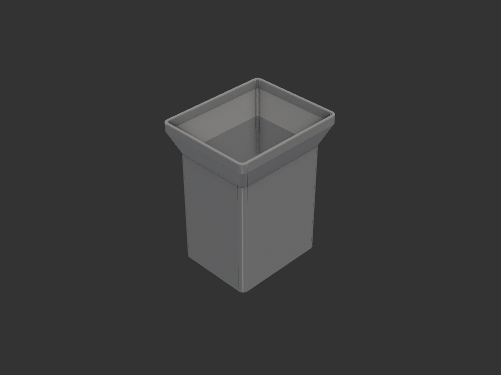
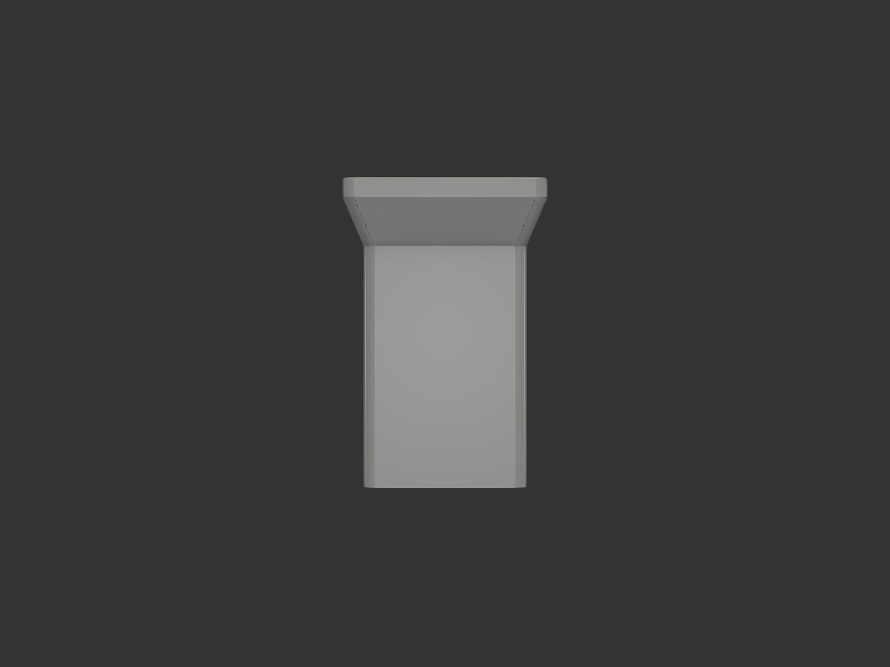
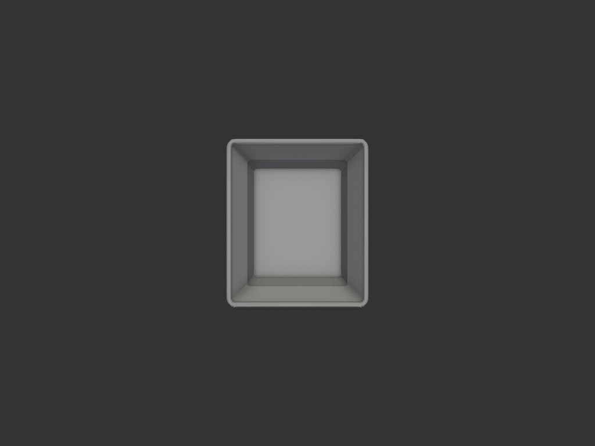
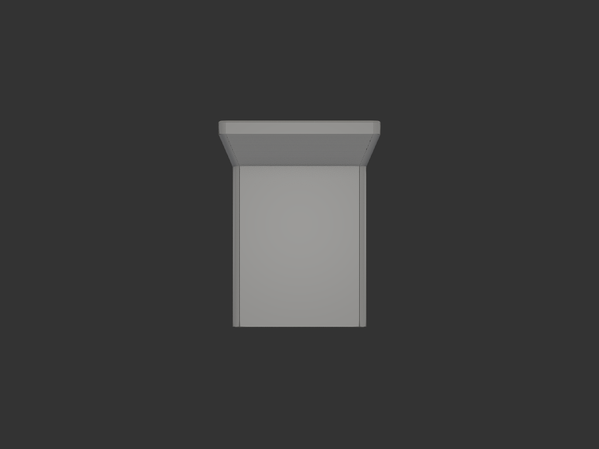

# juice_pack_holder — 아이용 음료수팩 홀더

## 목적/용도
아이가 사각 기둥형 음료수팩을 쥘 때 손에 힘이 들어가면 음료가 빨대로 뿜어져
나온다. 음료수팩을 단단한 사각 통에 넣고 통을 쥐게 해서 팩 찌그러짐을 막는다.

## 대상 음료수팩
- 단면: 38mm × 48mm (사각 기둥형)
- 높이: 약 120mm

## 치수/제약
| 항목 | 값 | 비고 |
|------|-----|------|
| 내부 단면 | 39 × 49 mm | 팩 단면 + 여유 1mm |
| 내부 깊이 | 60 mm | 팩 높이의 약 절반까지 감쌈 |
| 측벽 두께 | 1.5 mm | |
| 바닥 두께 | 2.0 mm | 안정성 |
| 본체 외부 단면 | 42 × 52 mm | |
| 본체 높이 | 62 mm | 바닥 2 + 내부 60 |
| 깔때기 확장량 | 사방 5 mm | 위로 갈수록 벌어짐 |
| 깔때기 높이 | 12 mm | 수직 기준 약 23° 경사 |
| 윗단 림 높이 | 5 mm | 깔때기 위 수직 연장 |
| 윗단 외부 단면 | 52 × 62 mm | |
| 전체 높이 | 79 mm | |
| 세로 코너 | R3 (외) / R1.5 (내) | 전 구간 일관 |
| 입구 가장자리 | R0.5 | |

## 깔때기 목적
- 팩을 끼울 때 자연스럽게 입구로 유도
- 옆으로 흘러내린 음료를 안쪽으로 모음
- 밖에서 잡을 때 손에 안정적으로 거치

## 림(윗단 수직 기둥) 목적
- 깔때기의 날카로운 경사 끝 대신 평평한 수직 입구를 만들어 라운딩 마감

## acceptance criteria
- 내부 공간이 39 × 49 mm (±0.1), 깊이 60 mm
- 바닥은 막혀 있고 위쪽은 열린 통 형태
- 입구 위로 사방 5mm 벌어진 깔때기 (높이 12mm) + 수직 림 (높이 5mm)
- 세로 코너 전 구간 둥글게, 입구 가장자리 라운딩
- 측벽 1.5mm / 바닥 2.0mm 유지

## 재료/공정 가정
- 3D 프린팅 (FDM 가정). 바닥부터 적층 → 깔때기 경사 약 23°(<45°)로 서포트 불필요
- 벽 1.5mm는 0.4 노즐 기준 3~4 perimeter, 음료팩 지지에 충분

## 진행 기록
- iter_001: 기본 통 형상 (벽 2.5 / 바닥 2.5 / 외곽 R4)
- iter_002: 벽 1.5 / 바닥 2.0 로 경량화 + 위쪽 사각 깔때기 추가 (사방 +5, 높이 12)
- iter_003: 깔때기 위 수직 림(높이 5) 추가 + 세로 코너 전 구간 라운딩(R3/R1.5) + 입구 가장자리 R0.5 — **최종**

## 결과 (iter_003)
| iso | front |
|-----|-------|
|  |  |

| top | side |
|-----|------|
|  |  |
