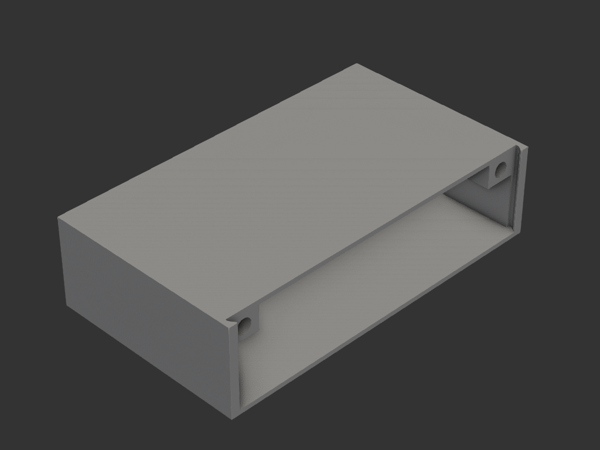
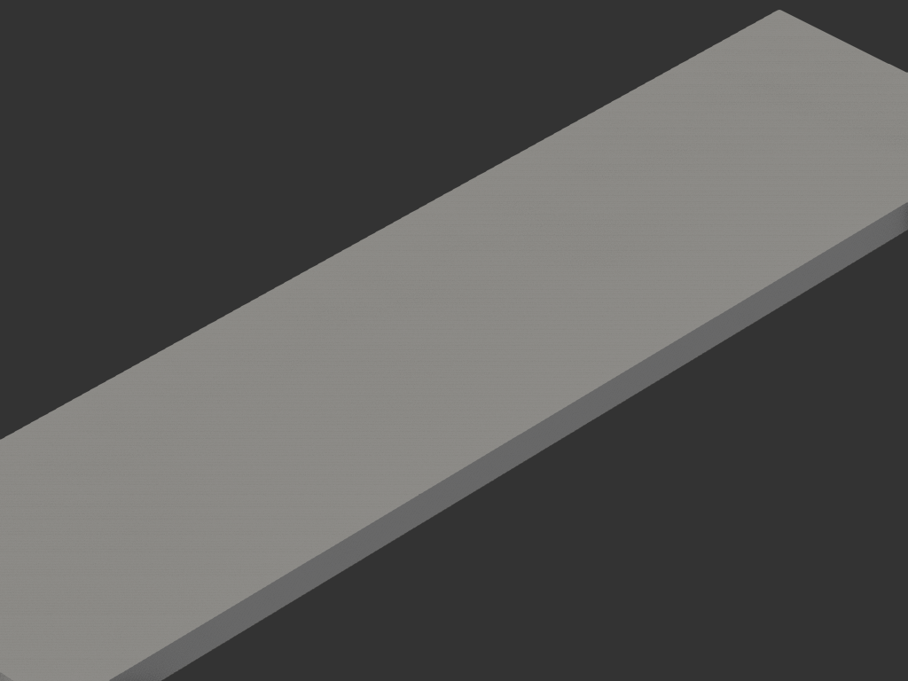

# mouse_case

무선 마우스를 가방에 넣어 보관하는 케이스. 마우스가 노출되지 않게 감싸 파손을 막는다.
**본체(case) + 커버(cover)** 2피스, 자석으로 닫힘 유지.



## 목적/용도
- 무선 마우스를 가방에서 노출·파손 없이 보관
- 오른쪽 개구로 마우스를 넣고 커버로 막음
- **자석**으로 커버 닫힘 상태 유지 (핀·나사 없음)

## 부품

### case (본체)
- 외형 65 × 112.7 × 29mm, 내부 63.5 × 107.5 × 26mm
- 오른쪽만 열린 상자 (마우스 삽입)
- 앞/뒤 안쪽 기둥에 **자석 구멍 2개** (+X 방향, Ø4.97 × 5.2, Y±48.75)
- 개구 가장자리 사다리꼴 기둥 (커버 가이드)

### cover (커버)
- 27.5 × 109.7 × 3mm 얇은 판
- 앞/뒤 위 모서리 비대칭 챔퍼
- 아랫면에 **자석 구멍 2개** (Ø4.97 × 2.1, Y±48.75)

## 결합
커버를 case 오른쪽 개구에 끼우면, case 자석(2)과 cover 자석(2)이 마주 붙어 닫힘을 유지한다.
자석은 Ø5 원형 (구멍 Ø4.97, 압입).

## 재료/공정
- FDM, PETG/PLA. 자석 4개 별도 (Ø5)

## 파일
```
case.py    본체
cover.py   커버
```

## 이력
- `legacy/etc/mousecase_v4.py` + `mousehead_cover.py` 를 자율 워크플로로 이관 (build 함수화)


