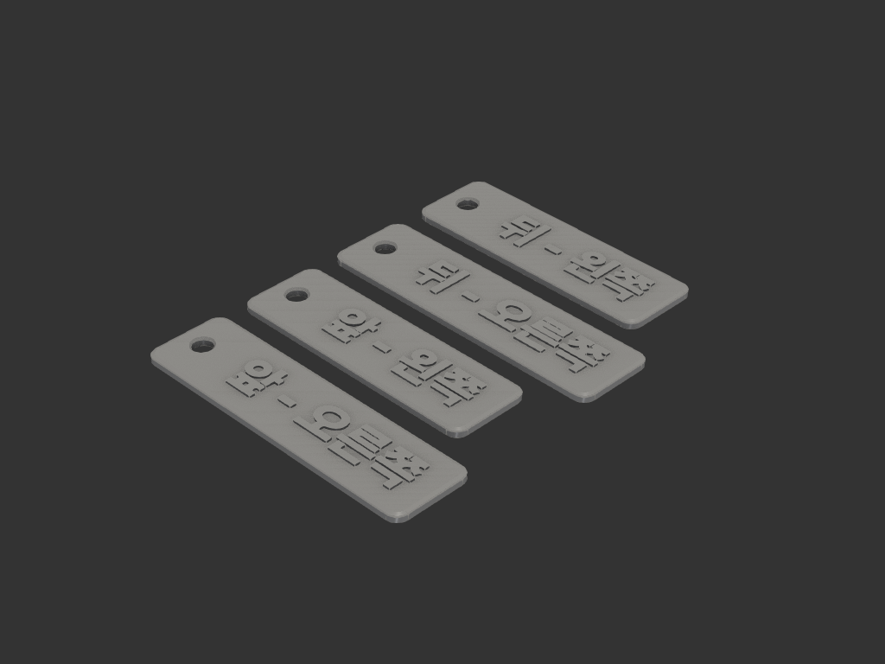
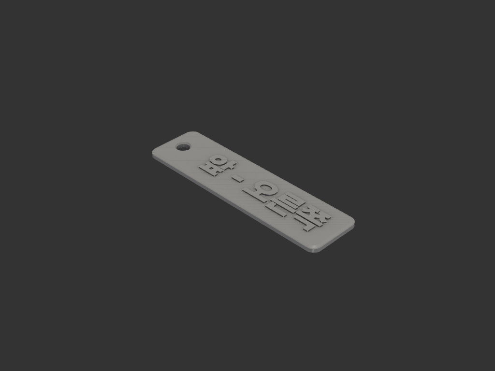
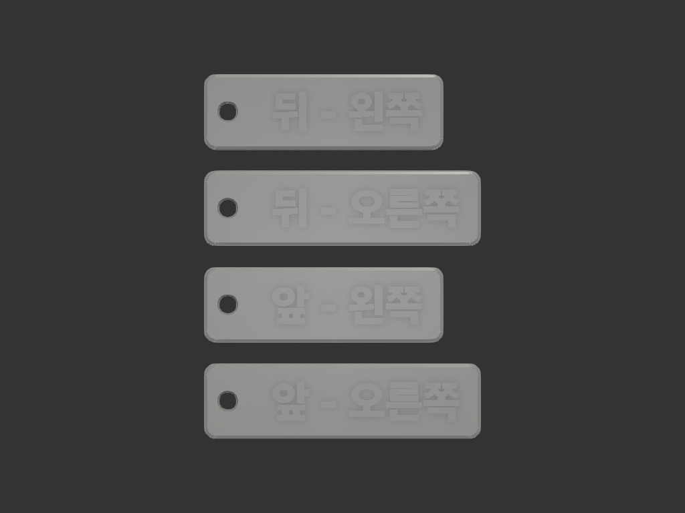

# name_tag — 양각 글자 네임택

얇은 판 + 한쪽 끝 고리 구멍 + 윗면 양각 글자. **글자만 다른 색으로 출력**하는 것이 핵심.

판 크기는 **글자에 맞춰 자동 계산**된다 — `TEXT` 만 바꾸면 판이 따라 커진다.
고정 크기가 필요하면 `build_tag(text, plate_w=..., plate_h=...)` 로 덮어쓴다.



## 구성 파일

| 파일 | 역할 |
|---|---|
| `model.py` | 택 한 장 (`build_plate` / `build_text` / `build_tag`) |
| `layout.py` | 여러 택을 한 판에 배치. 기본값은 네 방향 세트 |
| `export.py` | 낱개 STEP export (글자별 합본 / 판만 / 글자만) |

```bash
uv run python -m models.name_tag.model                      # 낱개 렌더 + 뷰어
uv run python -m models.name_tag.layout                     # 네 방향 세트 + set_4way.step
uv run python -m models.name_tag.export "앞 - 오른쪽" "뒤 - 왼쪽"   # 낱개 STEP
```

## 치수

| 항목 | 값 | 비고 |
|---|---|---|
| 판 두께 | 2.4 | 레이어 정수배 (0.2×12) |
| 양각 높이 | 0.6 | 0.2×3층 |
| 전체 높이 | 3.0 | 15층 |
| 고리 구멍 | Ø5.0 | 두꺼운 고리/카라비너 |
| 구멍 ↔ 판 끝 살 | 4.0 | |
| 모서리 라운드 | R3.0 | |
| 외곽선 챔퍼 | 0.5 | 상하 양쪽 |
| 구멍 챔퍼 | 0.5 | 상하 양쪽 |
| 글자 좌우 / 상하 여백 | 6.0 / 5.0 | |
| 폰트 크기 | 12.0 | |

챔퍼를 넣어도 **고리가 물리는 유효 지름은 Ø5.0 그대로**다. 입구만 Ø6.0 으로 벌어지고
중간 1.4mm 구간이 Ø5.0 스트레이트다 (단면 실측 확인).



### 판 크기 자동 계산

```
가로 = (구멍 Ø5 + 살 4×2) + 글자폭 + 좌우여백 6×2
세로 = max(글자높이 + 상하여백 5×2, 구멍 Ø5 + 살 4×2)
```

## 네 방향 세트



| 택 | 판 크기 |
|---|---|
| `앞 - 오른쪽` | 76.7 × 20.8 |
| `앞 - 왼쪽` | 66.4 × 20.8 |
| `뒤 - 오른쪽` | 76.7 × 20.8 |
| `뒤 - 왼쪽` | 66.4 × 20.8 |

- 전체 배치 **76.7 × 101.3 × 3.0**, PLA 약 18g, 택 사이 간격 6mm
- 글자 길이가 달라 판 가로는 제각각이지만 **왼쪽 정렬**해서 고리 구멍이 한 줄로 맞는다

## 색 분리 — 글자만 다른 색으로

판 윗면이 **z=2.4 의 완전한 평면**이고 그 위는 전부 글자다. 네 장을 한 판에 올려도
윗면 높이가 모두 같으므로 **색 변경 한 번으로 네 개 택의 글자가 동시에** 바뀐다.

### 두께가 레이어 높이의 정수배여야 한다

| 판 두께 | 0.2 레이어 | 0.15 레이어 |
|---|---|---|
| **2.4 (채택)** | 12층 ✅ | 16층 ✅ |
| 2.5 | 12.5층 ❌ | 16.67층 ❌ |

2.5 로 두면 색 경계가 레이어 중간에 걸려 교체 지점이 어긋난다.
**`PLATE_T` / `EMBOSS_H` 를 바꿀 땐 이 조건을 유지할 것.**

| 레이어 높이 | 판 | 색 변경 위치 | 글자 | 총 |
|---|---|---|---|---|
| 0.2 | 12층 | **13번째 층부터** | 3층 | 15층 |
| 0.15 | 16층 | **17번째 층부터** | 4층 | 20층 |

> 첫 레이어 높이가 0.2 가 아닌 프로파일을 쓰면 층 번호가 밀린다. 슬라이서에서
> z=2.4 에 해당하는 층을 직접 확인할 것.

### Bambu Studio 절차 (P 시리즈 공통)

`exports/set_4way.step` 한 장만 올리면 된다.

1. **Import** — STEP 을 열면 "단일 오브젝트로 불러올지" 묻는다. 어느 쪽이든 좌표는
   유지되므로 배치가 흐트러지지 않는다. **자동 정렬(arrange)은 누르지 말 것** —
   왼쪽 정렬이 깨진다
2. **레이어 높이 0.2 로 설정** (2.4 가 정수배가 되는 값)
3. **Slice** 후 **Preview** 탭으로 이동
4. 오른쪽 **세로 레이어 슬라이더**를 z=2.4 위 첫 층(0.2 기준 **13번째 층**)으로 올린다.
   슬라이더 옆 숫자로 층 번호와 z 높이를 확인할 수 있다
5. 슬라이더의 **`+` 버튼**(또는 우클릭) → AMS 가 있으면 **필라멘트 변경**해서 글자 색
   슬롯을 고르고, 없으면 **Add Pause** 를 넣는다
6. 다시 Slice → 프리뷰에서 z=2.4 위가 다른 색으로 보이는지 확인

**AMS 없이 수동 교체**할 경우, 5번에서 Pause 를 넣으면 그 층에서 프린터가 멈춘다.
필라멘트를 빼고 다른 색을 물린 뒤 재개하면 된다. 노즐에 남은 이전 색이 첫 줄에
섞여 나오므로, 재개 직후 압출되는 부분을 살짝 닦아내면 깔끔하다.

**AMS 로 교체**할 경우 퍼지(flush) 폐기물이 생긴다. 교체가 딱 한 번뿐이라 양은
많지 않지만, 어두운 색 → 밝은 색 순서면 퍼지량이 커진다. 밝은 판 + 어두운 글자
조합이 폐기물이 적다.

### 파트별 지정은 권하지 않는다

`export.py` 가 `<글자>_plate.step` / `<글자>_text.step` 을 따로 뽑기는 한다. 다만
**한글은 자모가 공간적으로 떨어져 있어 글자가 여러 솔리드로 쪼개진다**
(`앞 - 오른쪽` → 10개, 네 장이면 30개 이상). 슬라이서에서 그 조각들에 일일이
필라멘트를 지정해야 하므로 위의 레이어 색 변경보다 훨씬 번거롭다.

> build123d 의 `Mesher` 로 3MF 에 색을 박아 내보내는 것도 시도했으나,
> 색상(`basematerials`)을 아예 쓰지 않고 글자도 개별 오브젝트로 쪼개 담아 무용했다.

## 폰트

**Pretendard Black** — 획이 굵어 양각이 가장 잘 살아난다. 굵기는 `font_style` 이 아니라
**패밀리 이름으로 고른다** (`model.py` 의 `FONTS`).

`홍길동` font_size 12 기준 획 면적(mm²):

| 폰트 | 획 면적 | 비고 |
|---|---|---|
| **Pretendard Black** | **186.4** | 채택 |
| Pretendard ExtraBold | 169.7 | |
| NanumSquare ExtraBold | 163.3 | |
| Pretendard Bold | 152.7 | |
| **Pretendard Variable** | **99.7** | ⚠️ 쓰지 말 것 |

### ⚠️ Pretendard Variable 은 이 파이프라인에서 쓸 수 없다

OCC 폰트 엔진이 가변 축(weight axis)을 읽지 못해 **기본 인스턴스(Regular)만** 나온다.
`FontStyle.BOLD` 를 줘도 결과가 REGULAR 와 **완전히 동일**(둘 다 99.7)하고,
fontconfig 에도 `Pretendard Variable|Regular` 하나만 등록된다.
후보 중 가장 얇아 양각에 최악이다. **정적 웨이트 파일(.otf)을 쓸 것.**

### 설치

폰트 원본은 `models/_assets/fonts/` 에 있다. 새 환경에서는 fontconfig 에 등록해야 한다:

```bash
cp models/_assets/fonts/Pretendard*.otf models/_assets/fonts/Nanum*.ttf ~/.local/share/fonts/
fc-cache -f ~/.local/share/fonts
```

> `Text(font_path=...)` 로는 OCC 가 폰트를 못 찾는다 (한글 fallback 실패).
> 반드시 fontconfig 등록이 필요하다.

## acceptance criteria

- 판 z = 0 ~ 2.4, 글자 z = 2.4 ~ 3.0 (두 바디가 정확히 맞닿음)
- 판 윗면이 단일 평면 — 글자 외에 z>2.4 에 아무것도 없을 것
- 고리 구멍의 유효 통과 지름 Ø5.0 (챔퍼 후에도 유지)
- 글자가 구멍부를 뺀 나머지 영역의 정중앙에 배치
- 세트 배치 시 네 판이 왼쪽 정렬 (구멍 X 좌표 동일)
- 서포트 없이 출력 가능

## 재료/공정

- 판을 bed 에, 글자가 위로 — 오버행 없음, 서포트리스
- 양각 벽이 수직이라 브리지 없음
- 하단 챔퍼 0.5 가 코끼리발을 흡수한다

## 구현 메모

`Edge.center()` 는 원의 **중심이 아니라 호 위의 점**을 반환한다. 구멍 중심 (6.5, 10.41)
을 기대하고 위치로 판별하면 (4.00, 10.41) 이 나와 실패한다. 챔퍼 대상에서 구멍과
코너 라운드를 가를 때는 **반지름**으로 구분한다 (구멍 R2.5 vs 코너 R3.0).

## 상태

- iter_001: 최초 형상 (NanumGothic Bold, 판 두께 2.5)
- iter_002: 폰트를 나눔스퀘어 ExtraBold 로 교체
- iter_003: 판 두께 2.5 → 2.4 — 레이어 높이 정수배로 맞춰 색 경계 정렬
- iter_004: 폰트를 Pretendard Black 으로 교체 (획 면적 163 → 186)
- iter_005~006: `앞 오른쪽` / `앞 - 오른쪽` 테스트
- iter_007: `layout.py` — 네 방향 세트 한 판 배치
- iter_008: 외곽선·고리 구멍 챔퍼 0.5 (상하 양쪽)
- iter_009: 챔퍼 반영한 네 방향 세트 — **최종**

### 정량 검증 (iter_009)

| 항목 | 결과 |
|---|---|
| 세트 배치 | 76.7 × 101.3 × 3.0, 베드 256 여유 ✅ |
| 바디 | 8개 (판 4 + 글자 4) ✅ |
| 부피 | 14.2 cm³ → PLA 약 18g ✅ |
| 판 / 글자 z | 0~2.4 / 2.4~3.0 (맞닿음) ✅ |
| 구멍 유효 지름 | Ø5.00 (z 0.5~1.9 구간 스트레이트) ✅ |
| 왼쪽 정렬 | 네 판 모두 x 시작 = 0.0 ✅ |
