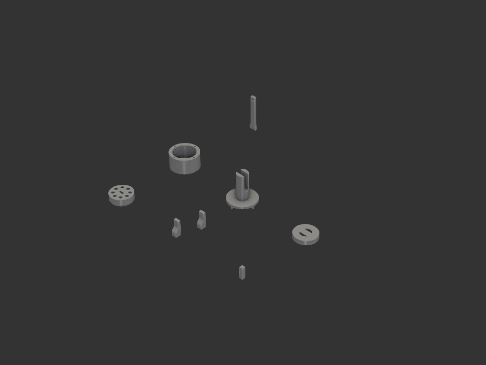
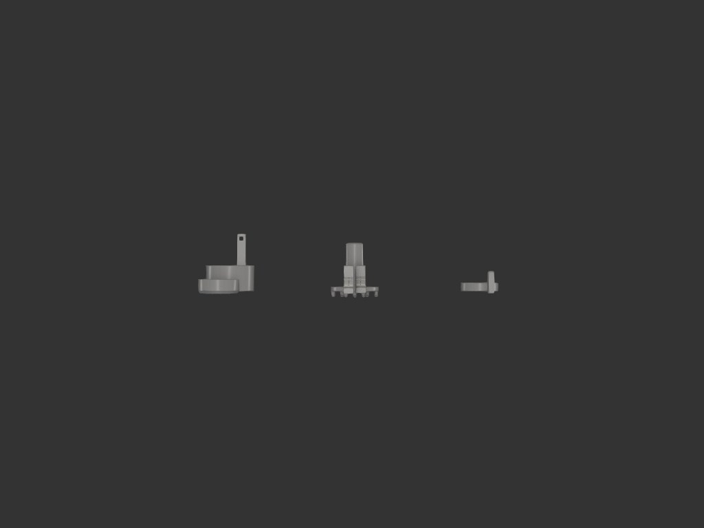
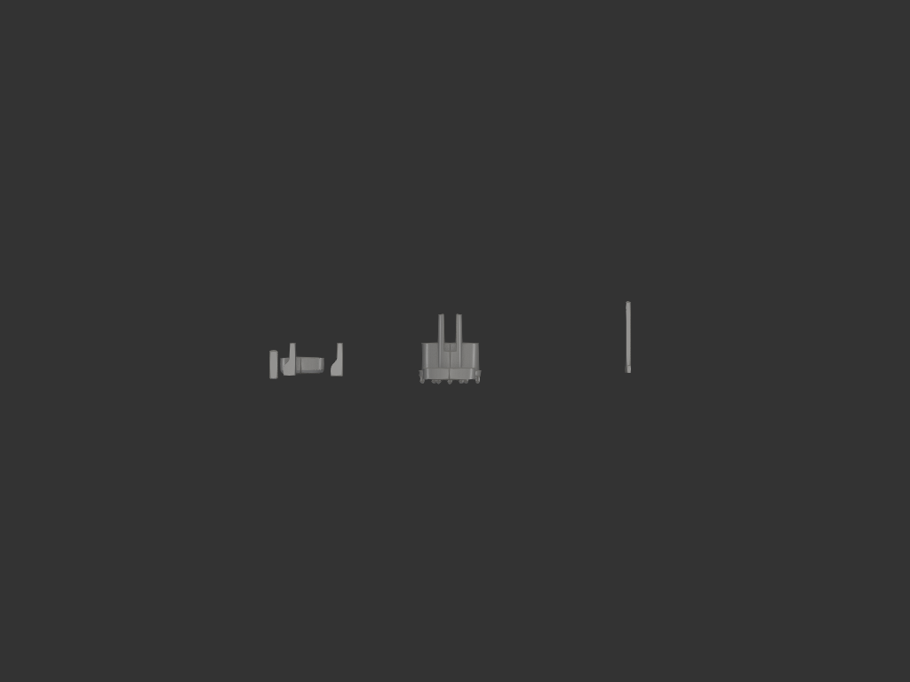
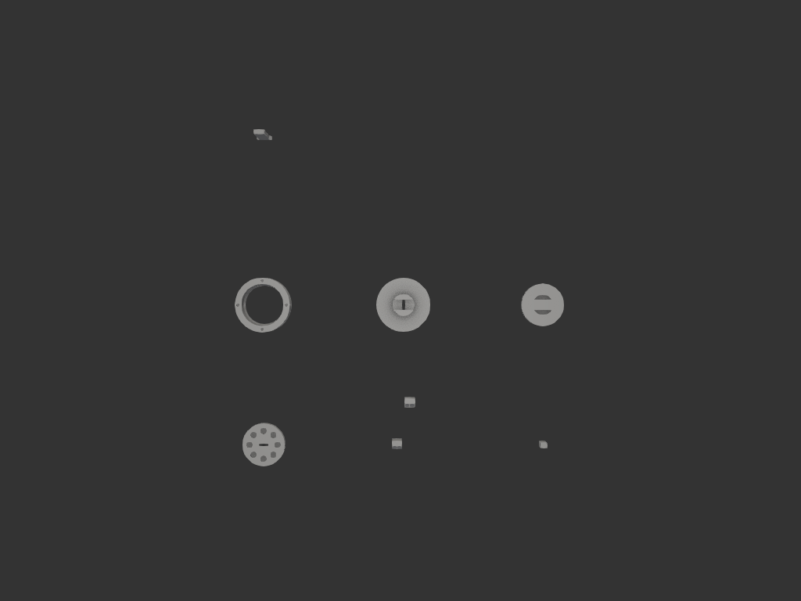

# puck_screen_holder

레거시 `models/coffee/puck_screen_holder/` 에서 가져와 vibe_models 워크플로 + 디자인 정리.
**7 부품 일체 model.py** + 통합 빌드 (build123d, finalize_iteration).



## 개요

- **출처**: `models/coffee/puck_screen_holder/` 레거시
- **재구성**: 모든 부품을 단일 `model.py` 의 `build_<name>()` 함수로 통합
- **부품**: 7개 (handle 은 좌/우 2개 출력, 함수 1개)
- **디자인 정리**: outer_shell/cover 제거, body 뒤집기 + cone 자기정렬, spring pin 및 bolt pin cover 에 통합, 공차 재설계

## 부품 구성

| 부품 | 크기 | 설명 |
|---|---|---|
| **body** | Ø30 × 10 | 자석 파츠. 아래(z=0): 자석 hole 8 (puck-facing). 위(z=10): ring hole 8 (cover spring pin 끼움). 아래 **cone 자기정렬** (Ø27.6→Ø30, z=0..2.1) — inner_shell cone 스토퍼 매칭 |
| **handle** (좌/우) | 7 × 7 × 20 | 손잡이. 옆모습 곡선 (PILLAR + GRIP + Spline) |
| **handle_pin** | 4 × 4 × 16 | handle 구멍에 끼우는 사각 핀 |
| **inner_shell** | Ø38.4 wall × 20 (실린더) | body 감싸는 원통 벽. **chamber 안 cone 스토퍼** (z=0..2.1, Ø28→Ø30.4) + 벽 위 4 hole (Ø2.8 × 5mm, cover bolt pin 끼움) |
| **inner_shell_cover** | Ø38.4 disc + Ø15 기둥 × 38 | inner_shell wall fit. 가운데 기둥 + 슬롯(23mm) + pillar 통과 hole. 아래로: **spring pin 8개** (R=10, body ring hole 끼움) + **bolt pin 4개** (R=17.2, shell wall hole 빡빡 fit) |
| **inner_shell_cover_top** | Ø30 × 6 | cover 기둥 위 캡. round hole Ø15.1 + 사각 7.1×7.1, **깊이 5mm 빡빡 press fit** |
| **pillar** | 10 × 2.5 × 48 | 사각 기둥 (아래 단 5 + 위 단 43). 위 끝에서 4mm 아래 4×4 handle_pin hole |

## 조립 메커니즘

```
                         handle_pin (사각 핀)
                              ↓
                         ┌─ handle ─┐
                         │ (좌/우)  │
                         └─────────┘
                              ↓
                    cover top (디스크 노브)
                       빡빡 press fit
                              ↓
                    inner_shell_cover 기둥 위 끝
                              │
                              │ ← pillar (사각 기둥, 슬롯 통과)
                              │
                    inner_shell_cover ─── bolt pin ×4 ─── inner_shell wall hole (빡빡 fit)
                              │       └── spring pin ×8 ─── body ring hole
                              ↓
                    body (자석 파츠) ─── 아래 cone ─── inner_shell cone 스토퍼 (자기 정렬)
                              ↓
                         자석 8개 (puck 잡음)
```

### 결합 종류

1. **body ↔ inner_shell**: 아래 cone 면 (양쪽 0.2mm clearance, 자기 정렬)
2. **cover ↔ body**: spring pin 8개 (R=10, Ø3) → body ring hole (Ø5, 깊이 4mm) — 자유 슬립
3. **cover ↔ inner_shell**: bolt pin 4개 (R=17.2, Ø2.7) → shell wall hole (Ø2.8, 깊이 5mm) — **양쪽 0.05 빡빡 press fit**
4. **cover top ↔ cover 기둥**: round hole Ø15.1 (pillar Ø15) + 사각 7.1 (slot 7.4 안) — **양쪽 0.05 빡빡**
5. **pillar ↔ cover/body**: 사각 stem 통과 (회전 방지)
6. **handle ↔ pillar**: pillar 위 끝에 handle hole (사각) 끼움
7. **handle_pin ↔ handle**: handle 의 hole (4.2×4.2) 에 4×4 핀 끼움

## 공차 요약

| 결합 | 명목 / clearance | fit 타입 |
|---|---|---|
| body cone ↔ shell cone | 0.2 양쪽 | 자기 정렬 |
| cover spring pin (Ø3) ↔ body ring (Ø5) | 1mm 양쪽 | 자유 슬립 |
| **cover bolt pin (Ø2.7) ↔ shell wall hole (Ø2.8)** | **0.05 양쪽** | **빡빡 press fit** |
| **cover top hole (Ø15.1) ↔ pillar (Ø15)** | **0.05 양쪽** | **빡빡 press fit** |
| cover top 사각 (7.1) ↔ pillar slot (7.4) | 0.15 양쪽 | 슬라이드 |

## 파일 구조

```
puck_screen_holder/
├── README.md                     # 이 문서
├── model.py                      # 7 부품 통합 + assembly
├── exports/
│   └── puck_screen_holder.step   # multi-solid STEP (8 solid: handle 좌/우 분리)
├── images/
│   ├── final_iso.png
│   ├── final_front.png
│   ├── final_side.png
│   └── final_top.png
└── intermediate/                 # iter 별 STEP + PNG
```

## 빌드

```bash
uv run python -m vibe_models.puck_screen_holder.model
```

→ `exports/puck_screen_holder.step` + 4 방향 PNG + ocp_vscode viewer 자동 표시.

## 시각화

부품들이 **그리드 layout** 으로 펼쳐져 시각화됨 (X/Y 100mm 간격). 부품별 확인 + 슬라이서에서 분리 출력 용.

## 최종 모습

### iso


### front


### side


### top


## 변경 이력

레거시 → vibe_models 정리 과정:
- outer_shell, outer_shell_cover 제거 (사용 안 함)
- spring_pins (별도 12개) 제거 → inner_shell_cover 의 ring_hole 위치에 8개 통합 (둥근 머리 아래)
- inner_shell 의 디스크 제거 → 실린더만 유지 (Ø38.4 × 20)
- inner_shell_cover 처마 제거 (Ø50.4 → Ø38.4, shell wall 에 fit)
- body 뒤집기: 자석 hole 아래(puck-facing), ring hole 위
- body 아래 단차 → cone (45° 자기정렬, inner_shell cone 매칭)
- inner_shell 단차 → cone 자기정렬 스토퍼
- cover bolt hole → bolt pin 4개 (shell wall hole 빡빡 fit)
- cover top 두께 3→6, hole depth 2→5, 공차 0.1→0.05 빡빡
- cover pillar 35→38, slot 20→23 (top 두께 매칭)
- pillar 46→48 (중간 +2)
