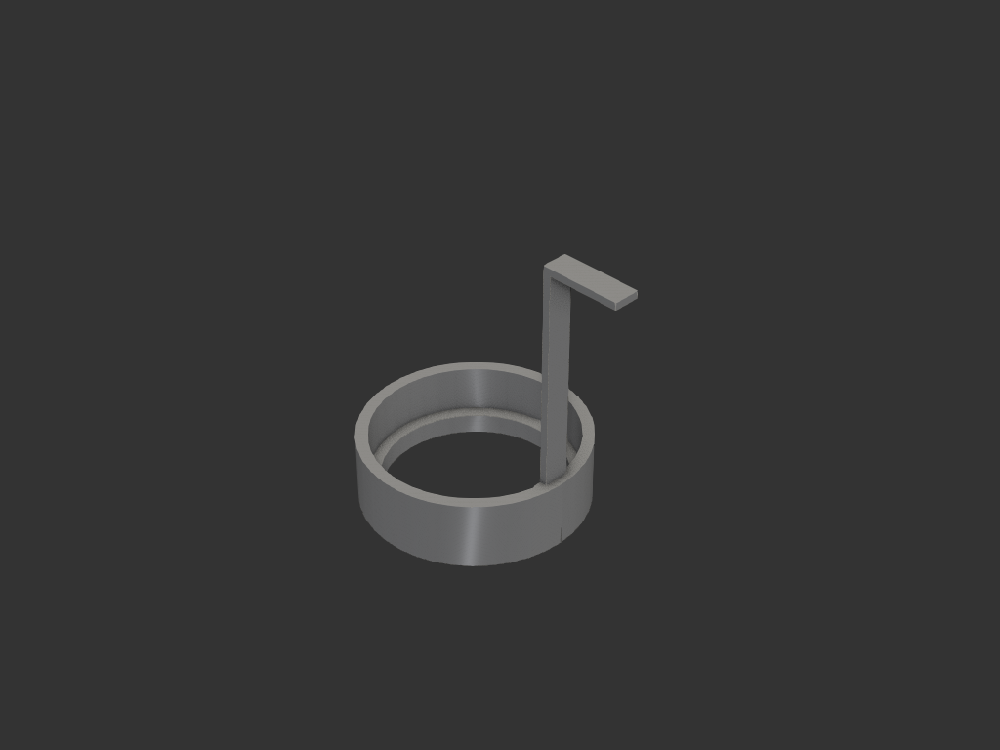
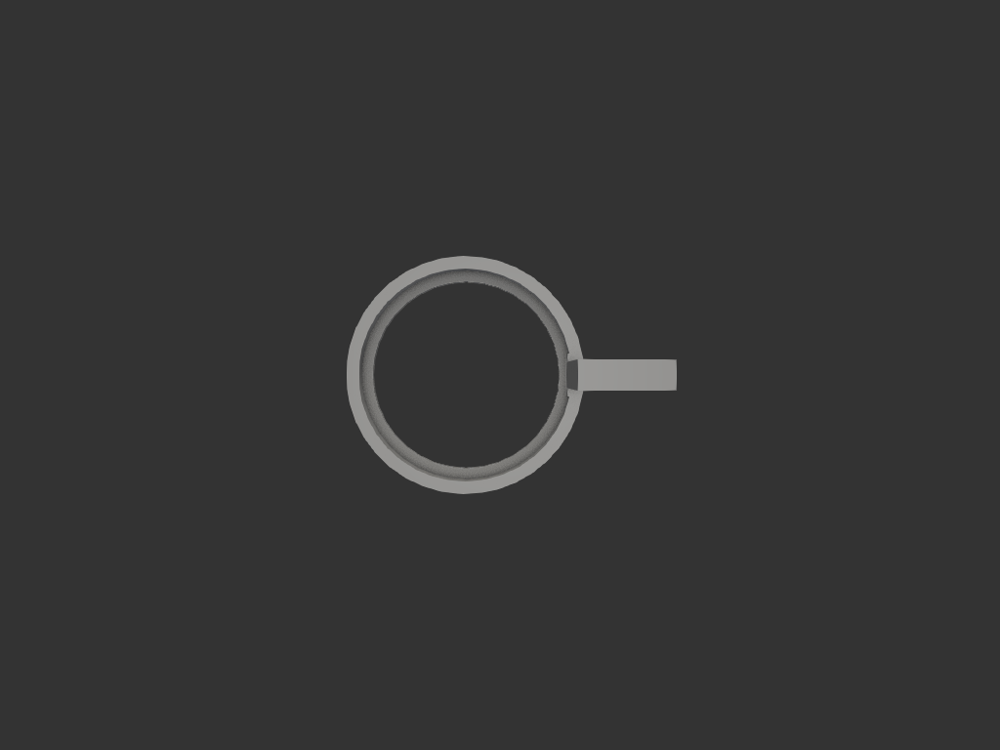
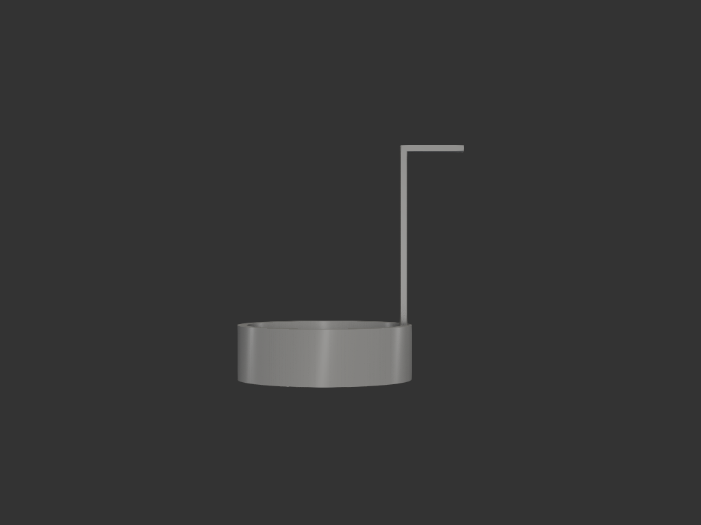
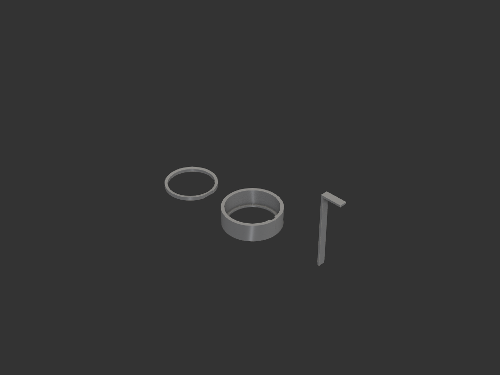
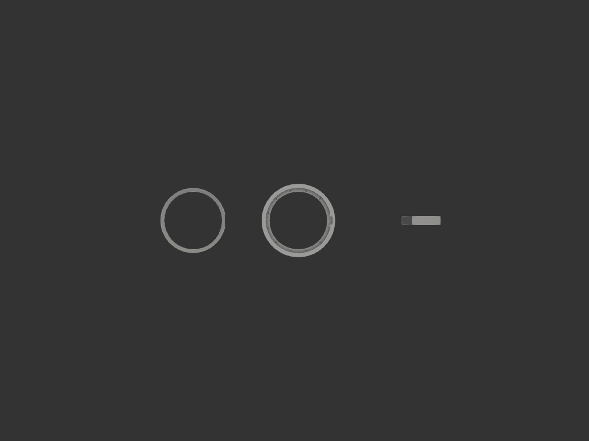
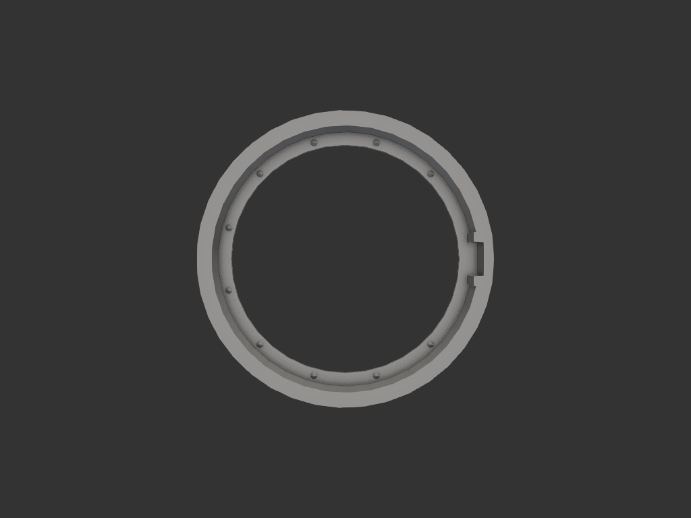
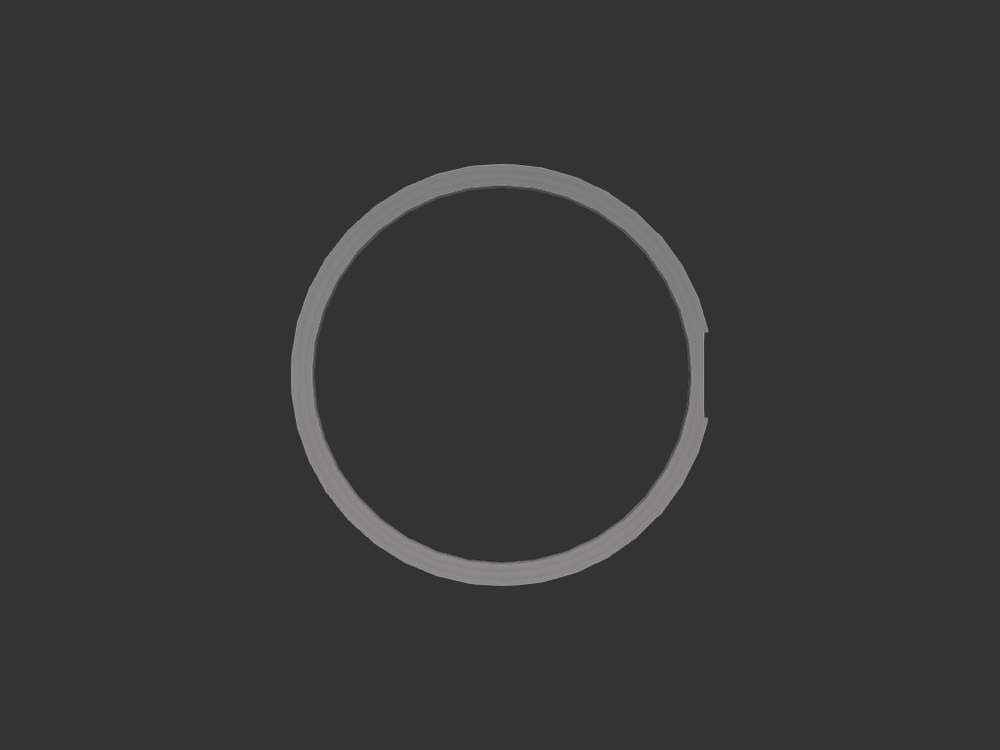

# shrimp_scoop

브라인 슈림프 부화기에서 갓 부화한 새끼 새우(나우플리)를 퍼올리는 소형 망 국자. 볼 + 망 + 망 클램프 링 + 분리형 핸들 3파츠 구조 (망은 별도 천 재단).

## 목적/용도
- brine shrimp 부화기에서 새끼 새우 채집
- 망으로 물은 빠지고 새우만 걸림
- 매우 작은 사이즈 (볼 Ø30.7), 수직 ㄱ자 핸들

## 파츠 구성

| 파츠 | 역할 | 파일 |
|------|------|------|
| **bowl** | 컵 본체 (망 안착 ledge + 핸들 socket boss + 클램프 cone) | `bowl.py` |
| **ring** | 망 위 클램프 (슬로프 + boss notch + 클램프 cone 음각) | `ring.py` |
| **handle** | ㄱ자 분리형 손잡이 | `handle.py` |
| (mesh) | 별도 재단한 망 천 (모델 외) | — |

망은 별도 천을 재단해 ring 으로 bowl floor 에 누름 안착. 12개 cone (bowl 수, ring 암) 이 망을 사이에 두고 맞물려 그립.

---

## bowl 스펙

Ø30.7 × 9.5mm 의 작은 컵 + 핸들 boss + 망 클램프 cone.

| 항목 | 값 | 비고 |
|------|-----|------|
| 외경 | Ø30.7 | 변경 없음 |
| 높이 | 9.5mm | 외측 |
| 벽 두께 | **1.5mm** | 안쪽으로 두꺼워짐 (was 1mm, 슬라이스 견고) |
| cavity 내경 | Ø27.7 | OD − 2×1.5 |
| floor | 두께 1mm, Ø25 mesh 노출 hole | z=0..1.0 |
| ring 안착 영역 | z=1.0~3.0 (cavity 내, **2.0mm**) | floor ledge 위 (was 1.5mm) |
| 핸들 boss (포켓) | x=**13.30**~13.95, y=±2.775, z=0~9.5 | floor 까지 일체, 안쪽 돌출 최소화 |
| 핸들 socket (구멍) | 1.05 × 3.55, 깊이 **8.5mm** (z=1.0~9.5) | 외벽 1.0 잔여, ring 영역 관통 |
| 클램프 cone (수) | **10개** Ø0.8 × 0.6mm | floor 위로 솟음, boss 양옆(15°/345°) 제외 |

## ring 스펙

bowl cavity 에 안착되는 망 클램프. 위쪽 슬로프 + boss 통과 notch + cone 음각.

| 항목 | 값 | 비고 |
|------|-----|------|
| 외경 | **Ø27.65** | cavity 27.7 − 0.05 빡빡 안착 (was Ø28.65) |
| 내경 | Ø25 | mesh 노출 Ø와 일치 |
| 높이 | **2.0mm** | 큰 cone 수용 (was 1.5) |
| 내경 lip | **1.7mm** 직벽 + 위쪽 cone 슬로프 | 슬로프 **~12.8°** (매우 완만, ring 수직 두께 ↑) |
| boss notch | +X, x≥**13.25**, y=±2.825, 전체 z 관통 | boss 통과 클리어런스 (was x≥12.8) |
| **boss 쪽 radial 벽** | **0.75mm** (mesh 12.5 → notch 13.25) | was 0.30mm — 슬라이스 견고 |
| 클램프 cone (암) | **10개** Ø0.85 × 0.65mm 음각 | bowl 수와 매칭, boss 양옆 제외 |

## handle 스펙

ㄱ자 분리형 손잡이 — 적층 방지 위해 평평 출력, 사용 시 수직.

| 항목 | 값 | 비고 |
|------|-----|------|
| 단면 (column) | 1mm(radial) × 3.5mm(tangential) | 얇고 넓적 |
| 수직 column 높이 | 40mm | 소켓 삽입 **8.5** + 노출 31.5 (ring 영역 관통) |
| 수평 grip 길이 | 10mm | +X 외측 가로 슬랩 |
| grip 두께 (z) | 1mm | top-flush, column 단면 그대로 꺾임 |
| 결합 공차 | 0.05 | press fit |

ㄱ자: column 위에서 +X 로 같은 단면이 꺾여 외측으로 뻗음. grip 위·아래 면이 column 윗면과 flush.

## 공차 / 클램프 cone

위치 = `i * 30° + 15°` (i=0..11) → 15°/45°/75°/.../345°. **i=0(15°)·i=11(345°) 제외** → 45°/75°/.../315° **10개** (boss 양옆 0.225mm 간격 → 슬라이스 간섭 우려로 제거).

| 인터페이스 | 공칭 차이 | 비고 |
|-----------|----------|------|
| ring OD ↔ cavity ID | Ø27.65 vs 27.7 (0.05) | 빡빡 안착 |
| handle ↔ socket | 1×3.5 vs 1.05×3.55 (0.05 각 축) | press fit |
| boss ↔ ring notch | 0.05 (각 측) | 삽입 클리어런스 |
| bowl cone ↔ ring recess | Ø0.8×0.6 vs Ø0.85×0.65 (0.05) | 망 두께 수용 + 클램프 |

## 출력 가이드 / 슬라이스 고려사항
- 출력 피드백 반영 보강:
  - **socket 외벽**: 0.4mm → 1.0mm (슬라이스 후 살아남게)
  - **클램프 cone**: Ø0.5×0.5 → Ø0.8×0.6 (사라지지 않게)
  - **wall 안쪽으로 두꺼워짐**: 외경 Ø30.7 유지 (제약)
  - **ring 내경 lip 1.0mm + 슬로프 37°** (was lip 0.3, 슬로프 52°)
  - **cone 10개로 감소**: boss 양옆 0.225mm 간격 cone 2개 제거 (간섭 방지)
  - **boss 안쪽 돌출 제거** (BOSS_INNER_X 12.85→13.30): ring 의 boss 쪽 radial 벽 0.30→0.75mm
    - trade-off: socket 안쪽 면이 cavity 에 노출 (handle 가장 안쪽이 보임 — 기능엔 영향 없음)
  - **ring 슬로프 완만화** (LIP_H 1.0→1.7, 슬로프 37°→12.8°): boss 쪽 벽 수직 두께 1~1.5mm → 1.7~1.87mm — 슬라이스 안정
  - **socket 깊이 확장** (SOCKET_BOTTOM_Z 3.0→1.0): handle column 이 ring 영역(z=1~3) 관통해 floor 까지 박힘, 삽입 깊이 6.5→8.5mm — bowl + ring 사이를 관통하는 구조
- FDM 3D 프린팅 (노즐 ~0.4mm 가정)
- bowl: 위로 열린 컵 (오버행 없음)
- ring: 슬로프 + cone 음각 (오버행 없음)
- handle: ㄱ자 strip 을 평평 출력 → 적층면이 spine 직각, 측방 부러짐 방지

## acceptance criteria
- bowl: Ø30.7 × 9.5, wall 1.5, socket 외벽 1.0, ring 안착 z=1~3
- ring: Ø27.65 OD, Ø25 ID, 2.0 H, 위쪽 cone 슬로프, +X notch, 12개 cone 음각
- handle: 1×3.5 단면 ㄱ자, 수직 40 + 수평 10
- 결합 시: ring 이 boss 측면을 감싸며 cavity 안착, handle 이 socket 에 빡빡 삽입, 12개 cone 이 망을 사이에 두고 맞물림

## export
- `exports/bowl.step`, `exports/ring.step`, `exports/handle.step` — 개별 파츠
- `exports/shrimp_scoop.step` — 세 파츠 좌우 분리 배치 (한 파일)

## 이미지

결합 (안착) 뷰:

분리 배치 (출력용):

볼 단독 (10개 클램프 cone 확인):

링 단독 (boss 옆 직선 벽 + notch 확인):

