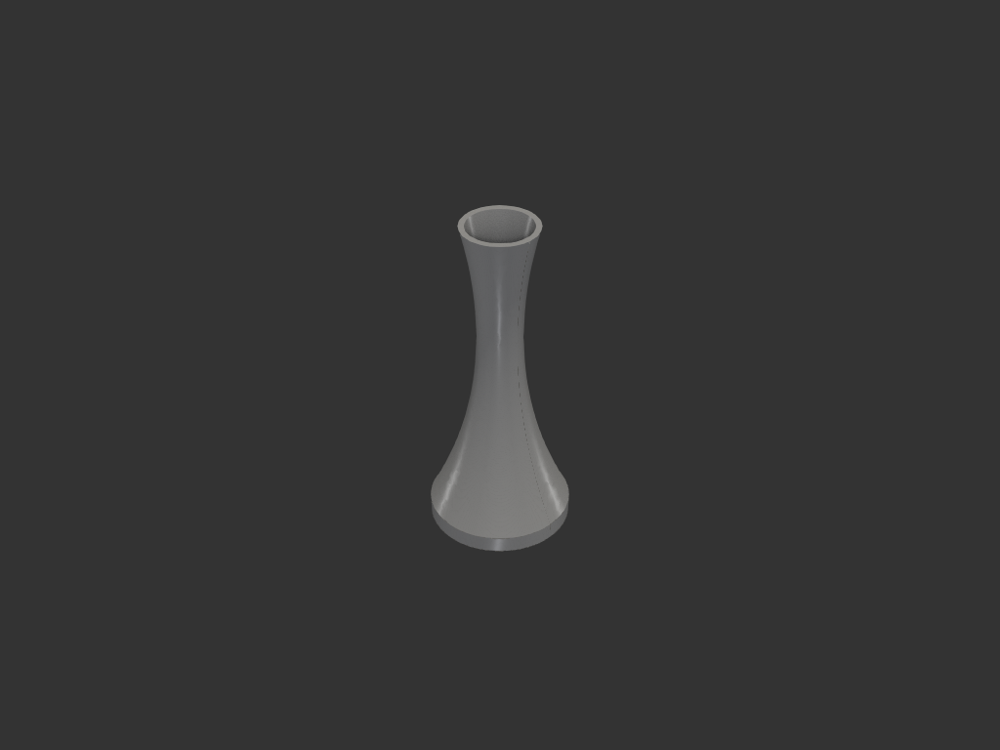
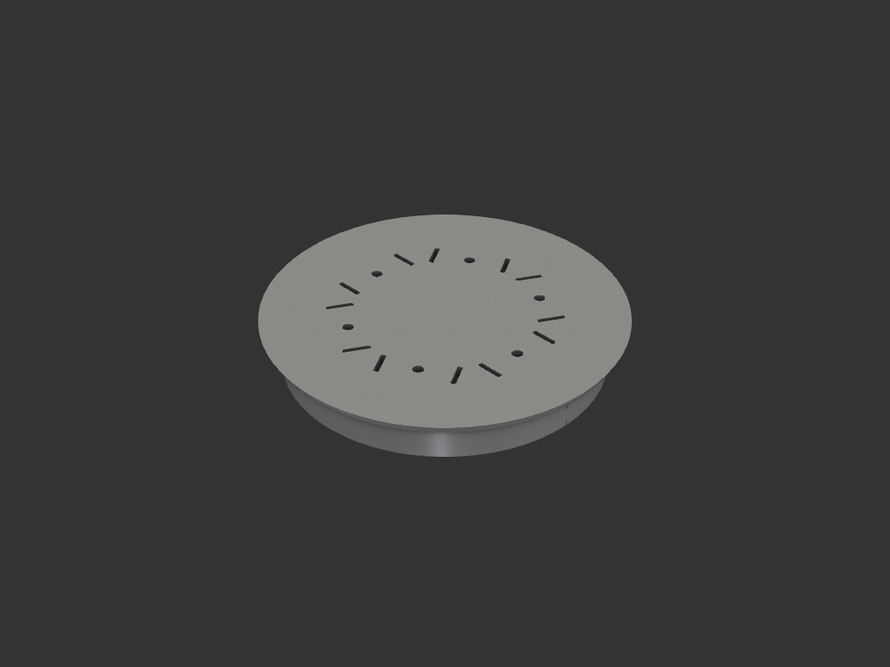

# bubble ⚠️ WIP

> **미완성 / 실패작** — 출력은 됐으나 실제로는 제대로 동작하지 않았다.
> 기록/보존 목적으로 옮겨둔 것이며, 재설계가 필요하다.

비눗방울 장난감 세트. 나팔 튜브에 바람을 넣어 방울을 만드는 구조를 의도했으나
동작하지 않음.

## 부품 (4개)

| 부품 | 파일 | 설명 |
|---|---|---|
| tube | `bubble_tube.py` | 나팔/꽃병 형태 (200mm, 허리 잘록) |
| inner | `bubble_inner.py` | tube 내벽에 맞는 플러그 (뒤집힌 형태) |
| head | `bubble_head.py` | 원판 + tip 끼우는 슬롯 6쌍 |
| tip | `bubble_tip.py` | head 위에 6개 끼우는 실린더 (다리로 슬롯 결합) |

## 상태
- 출력 성공, **기능 실패** (제대로 방울이 안 만들어짐)
- 원인 미규명 — 추후 재설계 대상

## 이력
- `legacy/toy/bubble_*.py` 이관 (WIP 표시, 로직 그대로)
