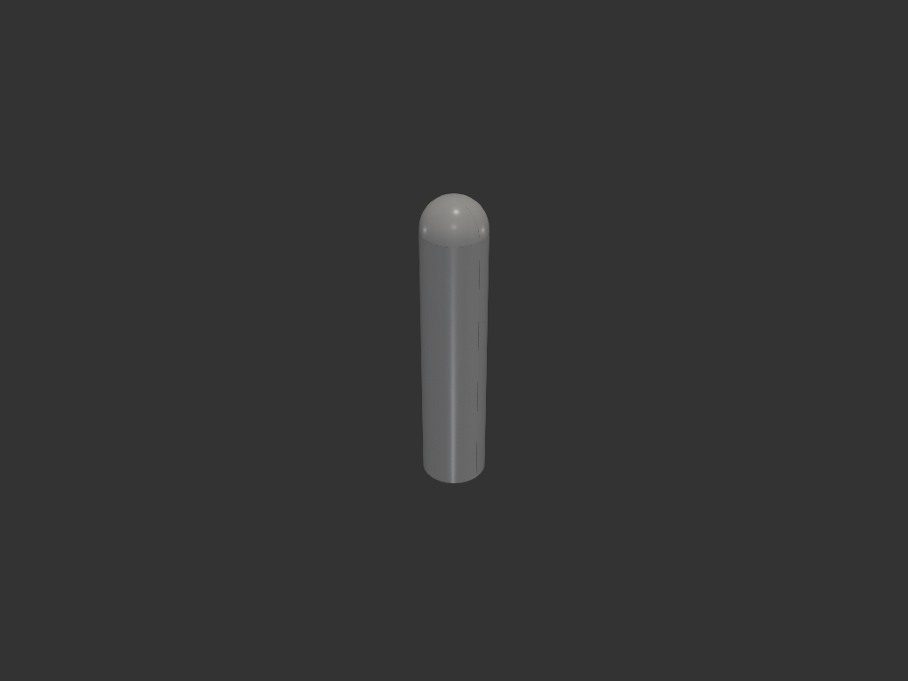
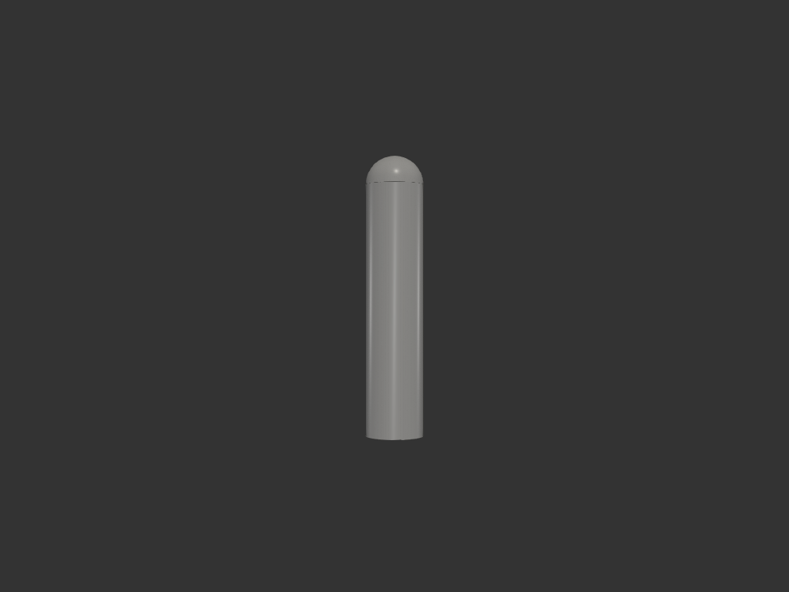
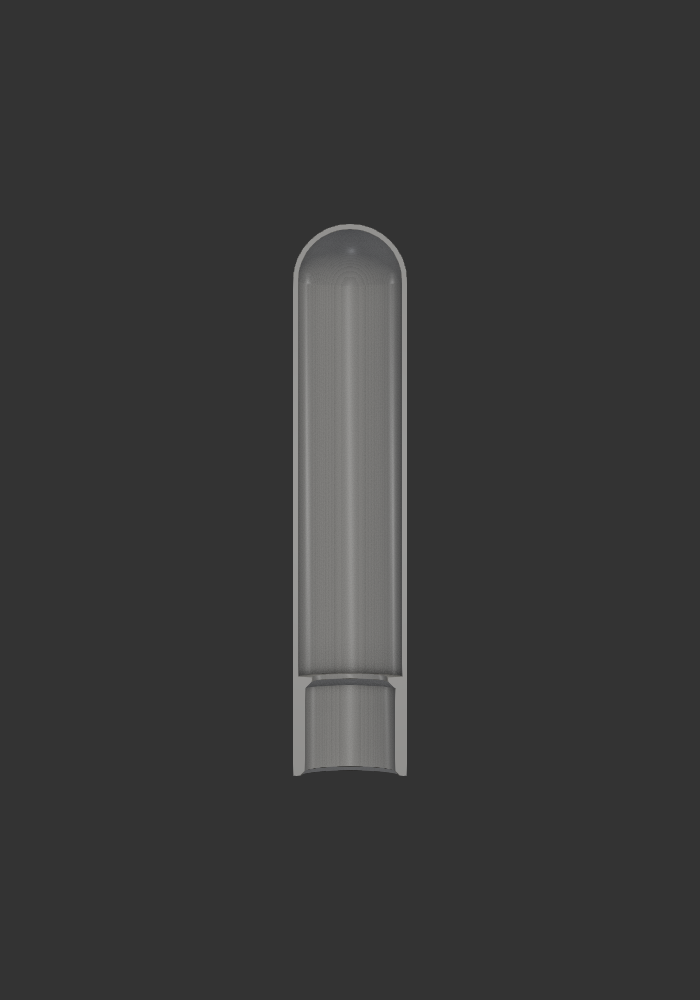

# light_baton — 미니 경광봉 (손전등 캡)

## 목적/용도

미니 손전등 헤드에 끼우는 장난감 경광봉. 유색(불투명) PLA도 벽이 얇으면
빛이 투과하는 성질을 이용해, 얇은 벽 봉 안쪽에서 손전등 빛이 비쳐
경광봉처럼 보이게 한다.

## 치수/제약

| 항목 | 값 | 비고 |
|---|---|---|
| 손전등 헤드 외경 | 15.4mm | 실측. 단차 없음 |
| 소켓 내경 | 15.6mm | 공차 0.2 — 출력 실측으로 확정 (0.3 헐거움 → 0.2) |
| 소켓 깊이 / 벽 | 15mm / 2mm | 마찰 고정 부위 |
| 걸림턱 | Ø13 구멍, 45° 경사 | 헤드가 걸려 멈춤. 빛은 구멍으로 통과 |
| 봉 벽 두께 | 0.8mm | 라인 2줄 — 유색 PLA 투광 두께 |
| 외경 | 19.7mm | 소켓·봉 공통 (소켓 외경에서 봉이 그대로 이어짐) |
| 전체 높이 | 95mm | 소켓 15 + 투광부 80 (상단 돔 포함) |

## acceptance criteria

- 손전등이 아래에서 들어가 걸림턱에 닿아 멈추고, 마찰로 유지
- 봉 구간 벽 0.8mm 균일 (슬라이서에서 라인 2줄로 나옴)
- 서포트리스 세워 출력: 걸림턱 45°, 상단 돔 쉘 마감
- 입구 0.8mm 챔퍼 (끼움 lead-in)

## 재료/공정

- 유색 PLA, 0.4mm 노즐. 세워서(소켓이 bed) 출력, 서포트 불필요
- 빛이 어두우면: 슬라이서 vase mode 로 벽 ~0.5mm 재출력 비교
- 밝은 색(빨강/주황/노랑)이 투광에 유리, 어두운 색은 부적합

## 결과

## 이력

- iter_001: 최초 형상 — 외형/단면 검증. 출력 결과 소켓 공차 0.3은 살짝 헐거움
- iter_002: FIT_CLR 0.3 → 0.15
- iter_003: FIT_CLR 0.2 확정 (내경 15.6) — 완료
