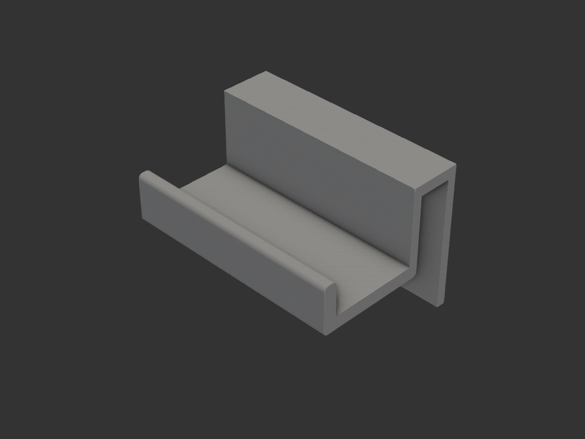
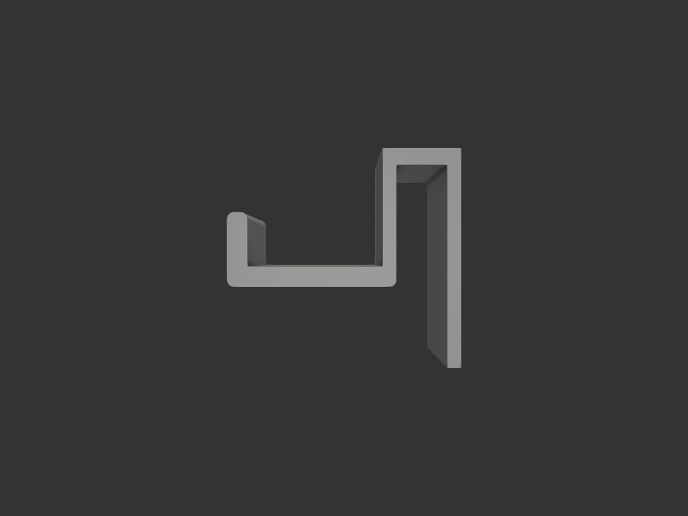
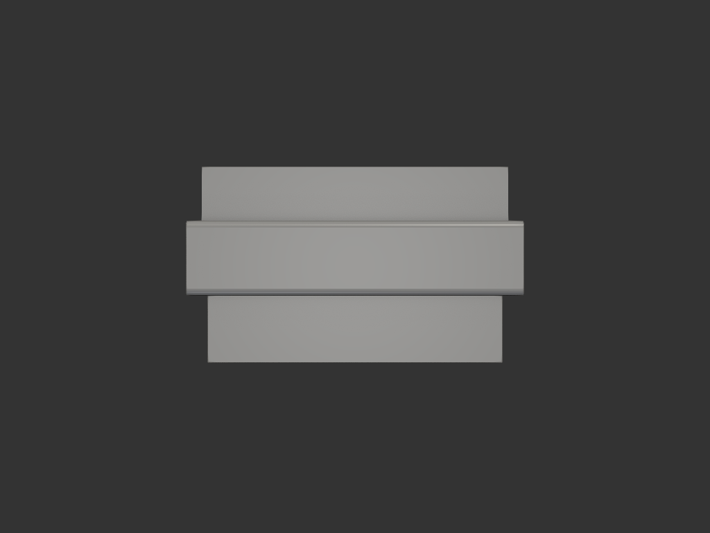

# 서랍손잡이 — 나사 없이 끼우는 클립형 손잡이

손잡이가 없는 서랍 칸에 **고정장치 없이** 손잡이를 단다.
앞판 윗 모서리에 ㄷ 자로 끼우고, 거기서 아래로 내려와 앞으로 뻗은 뒤 **위로** 꺾여
손가락 공간을 만든다.

| 옆(단면) | 앞 |
|---|---|
|  |  |

## 왜 나사 없이도 버티는가

당기는 힘은 **앞으로** 작용하는데, 안쪽 다리가 앞판 뒤에 걸려 있어 그 방향으로는
빠질 수가 없다. 빠지려면 **위로 들어 올려야** 하고, 여는 동작은 오히려 아래로 눌러
앉히는 방향이다. 마찰이 아니라 **형상**이 잡아준다.

## 알려진 조건

| 항목 | 값 |
|---|---|
| 앞판 두께 | 15 (균일) |
| 앞 모서리 위 여유 | 충분 — 두께 제약 없음 |
| 좌우 폭 | 100 |
| 앞으로 튀어나옴 | 50 |
| 형상 | 곡선 불필요, 각진 형태 |

## 치수

| 항목 | 값 | 근거 |
|---|---|---|
| 좌우 폭 | 100 | 사용자 지정 |
| 슬롯 높이 | **15.1** (여유 0.1) | 앞판 15. 슬라이드가 아니라 끼워서 고정되는 자리 |
| 클립 살 두께 | 4 | |
| 브리지 두께 | 5 | 윗 모서리를 덮는 부분 |
| 안쪽 다리 내림 | 60 | 앞판 뒤에 걸리는 길이 |
| 바깥 다리 내림 | 30 | 회전 방지 + U 의 뒤쪽 벽 |
| 팔 두께 | 6 | 앞으로 뻗는 부분 |
| 립 두께 / **솟음** | 6 / 16 | 손가락이 **앞으로 미는** 곳 |
| 전체 내림 | 36 | 바깥다리 30 + 팔 6 |
| 손가락 공간 | 44(깊이) × 16(높이) | 위로 열림 |

## acceptance criteria

- 슬롯 안쪽 간격 15.1, 앞판이 들어갈 것
- 안쪽 다리가 앞판 뒤로 60 내려와 걸릴 것
- 손가락 공간이 **위로** 열려 있을 것 — 손가락이 팔을 아래로 누르며 앞으로 당기게 되어
  누르는 힘이 클립을 앉혀 준다
- 서포트 없이 출력 가능

## 재료/공정

- **옆으로 눕혀 출력** — 단면(옆모습)을 bed 에 놓고 좌우 폭 100 을 위로 쌓는다.
  모든 면이 수직이라 서포트가 필요 없고, 당기는 힘이 단면 안쪽 방향이라
  압출선이 그대로 받는다
- 재료는 PLA 로 충분 (실내, 상온, 정적 하중)

## 결과 (iter_004)

| 항목 | 값 |
|---|---|
| bbox | 100 × 69.0 × 65.0 mm |
| 부피 | 86.8 cm³ (PLA 약 108 g) |
| 솔리드 | 1 개 |
| 출력물 | `exports/서랍손잡이.step` |

검증 — STEP 에서 직접 점검:

- 슬롯 벽이 y=−0.05 / 15.05 에 있다 → 슬롯 **15.1mm** ✓
- 안쪽 다리 60mm 전 깊이(z=−5/−20/−40/−58)에서 슬롯이 뚫려 있다 ✓
- 손가락 공간이 위로 열려 있다 (z=−28/−20/−12 비어 있음) ✓
- 팔과 립이 채워져 있다 ✓

한쪽 여유 0.05 라 손으로 밀어 끼우기엔 뻑뻑하다. 안 들어가면 앞판 모서리를 사포로
살짝 다듬거나, 다음 판에서 FIT 을 0.15 로 올린다.

## 왜 안쪽 다리를 60mm 까지 내리는가

`refs/손잡이_모양_제안_*.png` 에서 "안쪽을 최대한 길게" 방향을 검토했다. 다만 그
스케치는 손잡이 주머니가 **아래로** 열린 형태였고, 그건 쓸 수 없다. 이 클립이 빠지는
경로는 위로 올라가는 것 하나뿐인데, 아래로 열린 주머니는 손가락이 팔 밑면을 위로
밀게 해서 **쓰는 동작이 곧 빠지는 동작**이 된다. 그때 버티는 건 클립이 기울며
앞판을 무는 마찰뿐이고, 자기잠김 조건은

    L ≤ 2·μ·a = 15mm   (μ=0.3, 손가락 위치 앞판 앞 25mm)

즉 **다리가 길수록 덜 기울고, 덜 기울면 덜 물고, 덜 물면 마찰이 줄어** 오히려
나빠진다. 게다가 이 조건엔 힘의 크기가 들어가지 않아 다리 길이로는 넘을 수 없다.

그래서 주머니는 위로 열어둔 채(손가락 힘이 아래로 작용 → 들림 모드 자체가 없음)
긴 다리만 가져왔다. 긴 다리가 주는 것:

- 빠지려면 60mm 를 들어 올려야 한다 → 사고로 툭 벗겨지지 않는다
- 앞으로 당길 때 앞판을 무는 힘이 27N → 8N 으로 줄어 앞판에 자국이 안 남는다

강도는 애초에 쟁점이 아니었다. 폭 100mm 라 20N 으로 당겨도 최대 응력 1.5MPa,
PLA 항복(~50MPa)의 3% 다.
