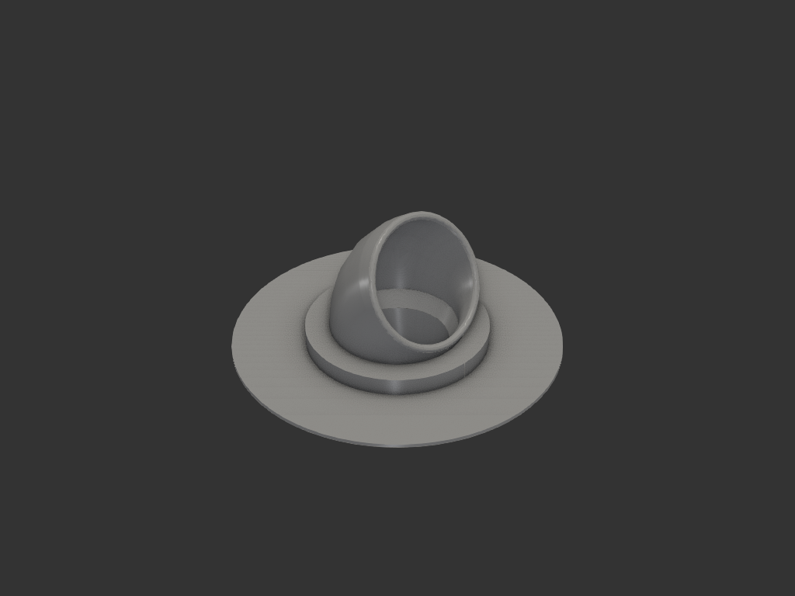
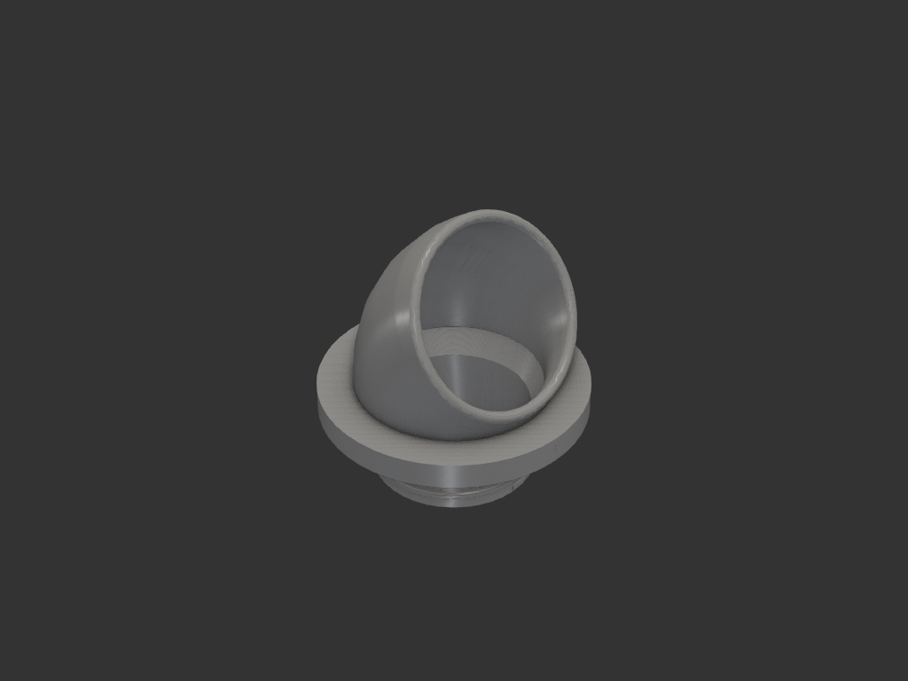
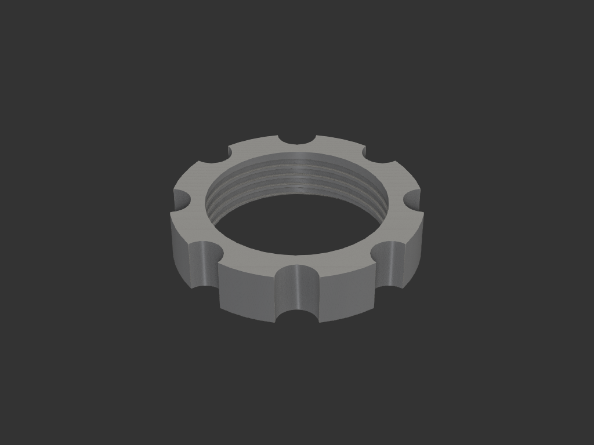

# 식기세척기관_싱크대커버 — 안 쓰는 스위치 구멍으로 급수/배수관 통과

싱크대 상판 금속에 **⌀31.5** 구멍이 있다. 원래 수전 터치 스위치 자리였고
지금은 안 쓴다. 여기로 테이블탑 식기세척기의 급수/배수관을 내리되,
**싱크대에서 쓰는 물이 구멍으로 흘러들지 않게** 막는 것이 목적이다.

| 커버 | 너트 |
|---|---|
|  |  |

## 알려진 조건 (사용자 실측/확인)

| 항목 | 값 |
|---|---|
| 구멍 지름 | **31.5** |
| 상판 두께 | **1** 안팎 (얕은 스테인리스) |
| 급수관 바깥지름 | 6.35 (1/4"), 전 구간 일정 |
| 배수관 바깥지름 | 22 — **주름관**. 한쪽 끝이 ⌀25.5 로 굵다 |
| 관 끝 통과 | 둘 다 통과 가능 → 일체형 |
| 오링 | 여러 치수 보유 → 설계에 맞춰 고른다 |

## 형상 제약 — 여유가 1.57mm 뿐이다

    두 관을 맞붙인 최소 외접원 = 22.00 + 6.35 = 28.35
    구멍 31.5 와의 차이 3.15  →  반지름 방향 1.57

이것이 설계 전체를 결정한다.

- **칼라 바깥벽이 1.25mm 뿐**이라 여기에 깊은 나사산도 오링 홈도 못 판다
- **구멍 안에서는 관을 기울일 수 없다.** 비스듬히 자르면 단면이
  28.5/cos θ 로 커져 10도만 기울여도 31.4 가 된다
- 그래서 조임과 실링은 **전부 상판 위아래에서** 해결한다

## 구조 — 2 파츠

| | 파츠 | 역할 | 무게 |
|---|---|---|---|
| ① | `cover` | 상판 위 플랜지(아랫면 오링 홈) + 엘보 + 구멍을 지나는 칼라 | 17.4 g |
| ② | `nut` | 아래에서 칼라에 끼워 올려 조인다. 상판을 물고 오링을 누른다 | 5.7 g |

조립:

1. 커버에 관을 꿴다 — **굵은 쪽(⌀25.5)을 먼저**, 그다음 급수관(6.35)
2. 칼라를 구멍에 넣는다 (칼라 ⌀31.0, 구멍 31.5)
3. 상판 밑에서 너트를 올려 조인다. 오링이 눌리며 밀봉된다

## 통로는 **큰 원 하나**다

8 자로 딱 맞게 파지 않는다. 배수 호스 한쪽 끝이 ⌀25.5 로 굵어서 두 관을
동시에 통과시킬 수 없기 때문이다. 근거 세 가지가 모두 맞는다:

- ⌀22 와 ⌀6.35 를 함께 담는 **최소 원이 28.35** → 보어 28.5 면 둘 다 들어간다
- 굵은 부분 25.5 가 여유 3.0 으로 통과한다
- 칼라 바깥 31.0 기준 벽 1.25 가 남는다

### 엘보 보어는 더 크다 (⌀33)

엘보는 **상판 위라 구멍 31.5 제약을 안 받는다.** 그래서 칼라만 28.5 로 두고
엘보는 33 으로 벌렸고, 플랜지 안에서 깔때기로 잇는다. 깔때기는 호스를 아래로
유도하는 역할도 한다.

이유는 **휜 보어를 단단한 부분이 지나가야** 하기 때문이다:

    필요한 보어 ≈ 25.5 + L² / (8R)      (L = 굵은 부분 길이)

보어 33 / R 22 면 L 이 **36mm 까지** 통과한다. 28.5 로 뒀으면 21mm 가 한계였다.

## 엘보 — 꺾으려면 반드시 올라가야 한다

사용자 피드백으로 구스넥 형태로 바꿨다. 효과가 둘이다 — 호스가 **받쳐진 채**
꺾여 자유 굽힘보다 덜 꺾이고, 출구가 옆을 보므로 위에서 떨어지는 물이 입으로
안 들어간다.

    상판 위 높이 = 플랜지 + (R + 바깥반지름) x sin(꺾임각)
    옆으로      = R − (R − 바깥반지름) x cos(꺾임각)

**가장 높은 점은 중심선이 아니라 바깥쪽 벽이다.** 엘보는 토러스이므로
바깥 벽이 축에서 R + ro 만큼 떨어져 있고, 그것이 꺾인 만큼 올라간다.

| R | 꺾임 | 상판 위 | 옆으로 | R/D |
|---|---|---|---|---|
| 28 | 75° | 48.9 | 25.5 | 1.27 |
| 28 | 60° | 44.3 | 23.2 | 1.27 |
| **22** | **60°** | **38.8** | 23.0 | **1.00** ← 채택 |
| 22 | 45° | 32.6 | 19.5 | 1.00 |
| 18 | 40° | 27.5 | 18.4 | 0.82 |

**주름관이라 R/D = 1.0 이 가능하다.** 매끈한 PVC 호스였으면 R ≥ 45 가 필요해
높이가 54mm 가 됐을 것이다.

## 치수

| 항목 | 값 | 근거 |
|---|---|---|
| 칼라 바깥 | ⌀**31.0** | 구멍 31.5 에 한쪽 0.25 |
| 칼라 보어 | ⌀**28.5** | 22+6.35 최소원 28.35, 굵은부분 25.5 |
| 칼라 벽 | **1.25** | 여기가 전부다 |
| 칼라 길이 | 13 (파일럿 2 + 빈 1 + 나사 9) | 파일럿 ⌀31.0 이 구멍 안에서 중심을 잡는다 |
| 나사 | 피치 **2.5**, 깊이 **0.6**, 골 ⌀29.8 | 물림 0.45. 남는 살 0.65. **3.6 바퀴** |
| 나사 여유 | 0.15 (반지름) | |
| 플랜지 | ⌀**54** × **6** | 오링 굵기 3.5 에 맞춰 커졌다 |
| 이음 모따기 | ⌀31 → ⌀34, **45°** | 가장 빠듯한 곳. 집중계수 3 → 1.8 |
| 오링 홈 | **⌀38.0 ~ ⌀46.4**, 깊이 2.66 | **내경 38 × 굵기 3.5** (보유품). 눌림 24%, 채움 86% |
| 엘보 | R 22, 60°, 보어 ⌀33, 벽 2 | |
| 출구 나팔 | R 2.5 | 꺾이는 지점의 날카로운 모서리를 없앤다 |
| 너트 | ⌀42 × 9, 홈 8 개 | 손으로 돌린다 |
| 상판 위 높이 | **38.8** | |

오링 홈 안쪽 가장자리가 ⌀38.0 이라 구멍(31.5) 바깥 **단단한 상판 위에** 온전히
앉는다. 홈 안쪽 벽 2.00mm, 바깥 테두리 3.80mm.

### 홈 여유를 **바깥으로만** 몬다

폭의 여유는 "넉넉하게 넣으려고"가 아니라 **눌린 고무가 퍼질 자리**다.
폭을 굵기와 같게(3.5) 하면 채움률이 **103%** 가 되어 조일 때 홈 밖으로
밀려 나온다.

다만 그 여유를 안팎으로 반씩 나누면 오링이 떠다닌다. 처음엔 홈이
⌀36.95~⌀46.05 라 안쪽 0.53 / 바깥 0.53 씩 놀았다.

→ **홈 안쪽 벽을 오링 내경 ⌀38 에 일치**시키고 여유는 전부 바깥에 둔다.

| | 안쪽 여유 | 바깥 여유 | 채움 |
|---|---|---|---|
| 이전 (중심 기준, 폭 ×1.3) | 0.53 | 0.53 | 79% |
| **지금 (안쪽 ⌀38 고정, 폭 ×1.20)** | **0.00** | 0.70 | 86% |

오링이 안쪽 벽에 딱 걸려 앉고, 퍼질 자리는 바깥에만 남는다. 조임은 나사라서 상판 두께 편차를 그대로 흡수한다.

## 계산

### 조였을 때 어디가 먼저 상하나

⌀42 너트를 손으로 조이면 축력이 이만큼 걸린다 (피치 2.0, 마찰 0.3):

| 토크 | 축력 |
|---|---|
| 0.5 N·m | 101 N |
| 1.0 N·m | 202 N |
| 2.0 N·m (손으로 세게) | **405 N** |
| 3.0 N·m | 607 N |

축력 400N 에서:

| 부위 | 응력 | 여유 |
|---|---|---|
| 나사산 전단 (3.6 바퀴, 253 mm²) | 1.6 MPa | 19 배 |
| 플랜지 굽힘 (유효 두께 3.34 = 6 − 홈 2.66) | 8.3 MPa | 6.1 배 |
| 칼라 인장 (골에서 살 0.65mm) | 6.7 MPa | 4.5 배 |
| **칼라–플랜지 이음** (모따기 Kt 1.8) | **9.2 MPa** | **3.3 배** ← 여기 |

칼라 인장은 **층을 가로지르는 방향**이라 층간 강도 ~30 MPa 로 본다.
이음이 유일하게 한 자릿수 여유인 곳이다.

**직각 턱이면 집중계수가 3 이라 15 MPa, 여유 2 배로 떨어진다.**
그래서 ⌀31 → ⌀35 **45° 모따기**를 넣어 1.8 로 낮췄다. 45° 라 칼라를
아래로 두고 뽑을 때 **자기지지**이기도 하다.

필렛을 쓰려 했으나 실패했다 — 릴리프 안쪽이 칼라와 정확히 접해 모서리가
생기지 않아 필렛이 안 걸렸고, 깔때기와 겹쳐 살을 0.6mm 로 깎기까지 했다.

### 나사 깊이 — 0.4 는 모자랐다

처음에 깊이 0.4 / 여유 0.2 로 잡았다. **실제로 물리는 깊이가 0.2mm 뿐**이고,
0.4 는 0.4 노즐 한 압출폭이라 출력에서 뭉개진다. 출력해 보니 너트가 아예
안 끼워졌다.

더 큰 문제는 **너트 쪽 나사산이 모델에 아예 없었다**는 것이다.
너트용 짝은 칼라 나사산을 여유만큼 키운 것인데, 축 방향 반폭이
0.35×2.0 + 0.2 = 0.90 이 되어 이웃 산까지 1.00 중 **틈이 0.10mm** 밖에
안 남았다. 스윕이 자기교차했고, 불린이 **조용히 실패해** 부피가 전혀 안
줄어든 채로 넘어갔다.

고친 값:

| | 이전 | 지금 |
|---|---|---|
| 피치 | 2.0 | **2.5** |
| 깊이 | 0.4 | **0.6** |
| 여유 | 0.2 | **0.15** |
| 프로파일 반폭 비율 | 0.35 | **0.30** |
| **실제 물림** | 0.20 | **0.45** |
| 이웃 산 사이 틈 | 0.10 | **0.35** |
| 칼라 골에서 남는 살 | 0.85 | 0.65 |

살이 0.65mm 로 줄지만 조임 400N 에서 인장 6.7 MPa, 층간 30 대비 **4.5 배**다.
**관을 먼저 끼우면 호스가 칼라를 안에서 받쳐준다.**

너트에서 실제로 252 mm³ 가 깎여 나간 것을 부피 차이로 확인했다
(점 분류는 형상이 복잡해 너무 느려서 부피로 검증했다).

조일 때 칼라가 안으로 찌그러져 나사가 넘어갈까 걱정할 수 있는데,
**관을 먼저 끼우면 호스가 칼라를 안에서 받쳐준다.**

### 물이 어디서 막히는가

- 상판 위 물 → 플랜지 아래 **오링**이 막는다
- 위에서 떨어지는 물 → 출구가 **옆을 보므로** 입으로 안 들어간다
- 관을 타고 흐르는 물 → 막지 못한다. 보어가 큰 원이라 관과 틈이 있다.
  호스를 출구보다 높은 곳으로 올려 걸면 생기지 않는다

## 출력

**우선순위: ① 조였을 때 안 상하기 ② 모양. 서포트 최소화는 그다음.**

| 파츠 | 방향 | 이유 |
|---|---|---|
| `cover` | **칼라를 아래로** (조립 자세 그대로) | 아래 참고 |
| `nut` | 바닥을 bed 에 | 나사산이 수직이라 오버행 없음 |

### 왜 칼라를 아래로인가

이 부품은 **칼라와 엘보가 반대 방향으로 뻗어** 어느 면을 bed 에 붙여도
반대쪽이 뜬다. 완벽한 방향이 없다.

눕혀 뽑으면 조임 인장이 층 **안**이 되어 강도는 유리하다. 그러나
⌀33 엘보 보어와 ⌀28.5 칼라 보어가 수평이 되어 처지고 나사산에 계단이
진다. **나사가 뭉개지면 조일 수가 없으므로 우선순위 ①에도 역행한다.**

세워 뽑으면 인장이 층을 가로지르지만, **모따기를 넣어 여유 3.3 배**를
확보했다. 방향을 바꾸는 것보다 모따기가 훨씬 효과적이다 (15 → 9.2 MPa).

보이는 면(플랜지 윗면, 엘보 바깥)에는 서포트가 안 닿는다.

### 서포트가 필요한 곳

| 위치 | 내용 |
|---|---|
| 플랜지 아랫면 | ⌀34 → ⌀54 턱, **10mm 수평 오버행**. 피할 방법이 없다 — 구멍이 ⌀31 로 묶고 오링이 ⌀54 를 요구한다 |
| 엘보 θ 45~60° | 호 길이 **5.8mm** 뿐 |
| 이음 모따기 | **불필요** — 45° 라 자기지지 |

**실링면은 서포트를 안 탄다.** 오링 홈은 폭 4.20mm 짜리 천장이라
슬라이서가 브리지로 넘어간다. 서포트는 홈 바깥 테두리(⌀46.4~54)에만
닿는데 거기는 그냥 상판에 얹히는 자리다.

슬라이서에서 **"서포트: 빌드플레이트 위에만"** 으로 두면 보어 안에도
안 들어간다. 엘보 보어 천장은 출구에서 손이 닿는다.

접지면이 칼라 끝 링 **78 mm²** 뿐이므로 **브림 8mm 이상**. 무게중심이
x≈6mm 이고 접지 폭이 30mm 라 쓰러지지는 않는다. 나사 아래 1mm 가 민짜
구간이라 **엘리펀트 풋 보정**을 넣어야 너트가 물린다.

### 슬라이서

| 항목 | 값 | 이유 |
|---|---|---|
| 벽(perimeter) | 3 이상 | 칼라 벽이 1.25mm |
| 레이어 | 0.2 | 나사 피치 2.0 에 10 층 |
| 서포트 | **커버만 켜기** | 엘보 45° 초과 구간 |

## 채택하지 않은 것

| 안 | 이유 |
|---|---|
| 8 자 통로 (22 / 6.35 각각) | 배수 호스 끝이 ⌀25.5 라 통과를 못 한다 |
| 두 통로 사이에 벽 | 1.0mm 만 넣어도 외접이 29.95 가 되어 바깥벽 자리가 없다 |
| 칼라에 오링 홈 | 벽이 1.25 라 홈(1.8 깊이)을 파면 뚫린다 |
| 이음에 필렛 | 릴리프 안쪽이 칼라와 정확히 접해 모서리가 안 생기고, 깔때기와 겹쳐 살을 0.6mm 로 깎는다. 45° 모따기로 대체 |
| 눕혀서 출력 | 조임 인장은 유리하지만 ⌀33 보어가 처지고 나사산에 계단이 진다 |
| 칼라 바깥 반지름 실링 | 홈 바닥이 ⌀28.3 이 되어 보어 28.5 를 침범한다 |
| 구멍 안에서 관 기울이기 | 단면이 28.5/cos θ 로 커져 10도에 31.4 |
| 스냅(미늘) 고정 | 상판이 1mm 안팎으로 불확실해 고정 위치를 못 정한다. 나사는 흡수한다 |

## 구현 메모

- **`Cone` 은 축까지 채우는 속찬 원뿔이다.** 이음 모따기를 보어를 판 **뒤에**
  더했더니 통로가 z 0~2 구간에서 도로 막혔다. 모따기는 보어보다 먼저 한다.
  그리고 **형상을 더한 뒤에는 통로가 끝까지 뚫렸는지 반드시 다시 잰다** —
  모따기와 오링 홈만 확인하고 보어는 안 봐서 놓쳤다
- **짝(암) 나사산은 축 방향으로도 부푼다.** 프로파일 반폭 + 여유가 피치의
  절반에 가까워지면 이웃 산과 맞닿아 자기교차하고, 불린이 조용히 실패해
  **나사산이 아예 안 파인다.** 틈을 0.25mm 이상 남긴다
- 헬릭스 스윕은 **짧게 끊어 이어 붙인다.** 한 번에 5 바퀴를 쓸면 프레네
  프레임이 비틀려 솔리드가 자기교차하고, 불린이 **조용히 망가진다** —
  합친 부피가 칼라 단품보다 작아지는 식으로 드러났다. `is_frenet=False` 로
  피할 수는 있지만 프로파일이 기울어 깊이가 0.2 → 0.38 로 틀어진다
- 나사산 뿌리를 **모재 속에 조금 묻는다**(0.2). 뿌리가 모재 표면과 정확히
  일치하면 접선 불린이 되어 OCC 가 Null 을 뱉는다
- 릴리프를 **원판으로 파면 안 된다.** 칼라가 플랜지에서 끊긴다. 고리로 판다
- **`revolve` 에 스케치를 명시적으로 넘겨도 pending 에서 안 빠진다.**
  뒤따르는 `loft` 가 그 면까지 집어 형상이 세 조각으로 끊겼다.
  프로파일은 **빌더 컨텍스트 밖에서** 만들어 넘긴다
- 엘보는 **회전체**다. 회전된 단면들을 로프트하면 꼬여서 뿔 모양이 된다
- 헬릭스 스윕으로 나사산을 만들 때 **프로파일 평면의 x 축을 반지름 방향으로
  고정**해야 한다. 자동으로 두면 축 방향이 반지름이 되어 깊이가 피치만큼 깊어진다
- `Edge.center()` 는 원호에서 **곡선 위의 점**을 준다. 출구 모서리를 그것으로
  고르면 엉뚱한 걸 잡는다 — 면의 **법선**으로 골랐다

## 상태

- **iter_011 — 현재.** 오링 홈 여유를 바깥으로만 몰아 안쪽 벽을 ⌀38 에
  맞췄다. 오링이 안쪽 벽에 딱 앉는다 (안쪽 여유 0.53 → 0.00)
- iter_010 — 출력 결과 반영. 너트 나사산이 모델에 없던 것을
  고치고(짝 프로파일 자기교차), 깊이 0.4 → 0.6 / 피치 2.0 → 2.5 로 물림을
  0.20 → 0.45mm 로 키웠다. 재출력 필요
- iter_009 — 보유 오링(내경 38 × **굵기 3.5**)에 맞춰 홈을 다시 팠다.
  홈이 깊고 넓어져 플랜지가 ⌀50×5 → **⌀54×6**, 이음 모따기 ⌀35 → ⌀34.
  얇아진 플랜지 유효 단면(두께−홈깊이)을 6mm 로 보완. 출력 대기
- iter_008 — 이음 모따기를 보어보다 **먼저** 하도록 순서 수정.
  Cone(ADD) 이 보어를 z 0~2 구간에서 막고 있었다. 출력 대기
- iter_007 — 이음 45° 모따기 + 플랜지 ⌀50×5 + 나사 4.5 바퀴로 조임 강도 보강
- 출력 후 확인할 것: 나사 0.4 깊이가 살아나는지, 굵은 부분(⌀25.5)이 엘보를
  지나는지, 오링 눌림이 충분한지
