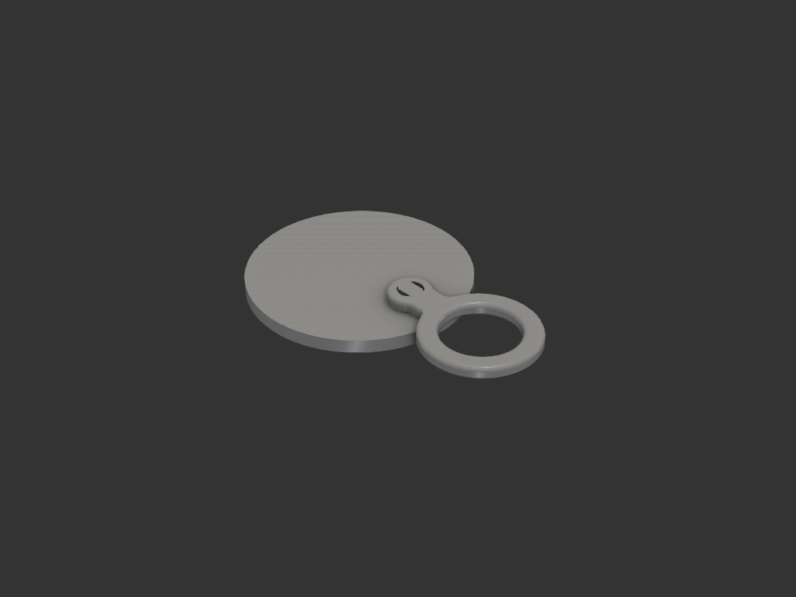
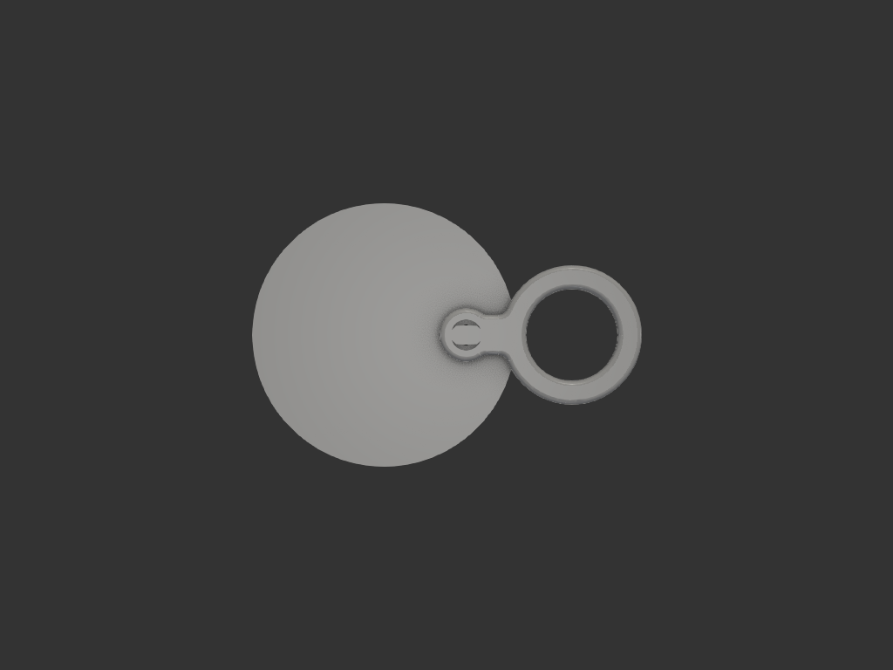
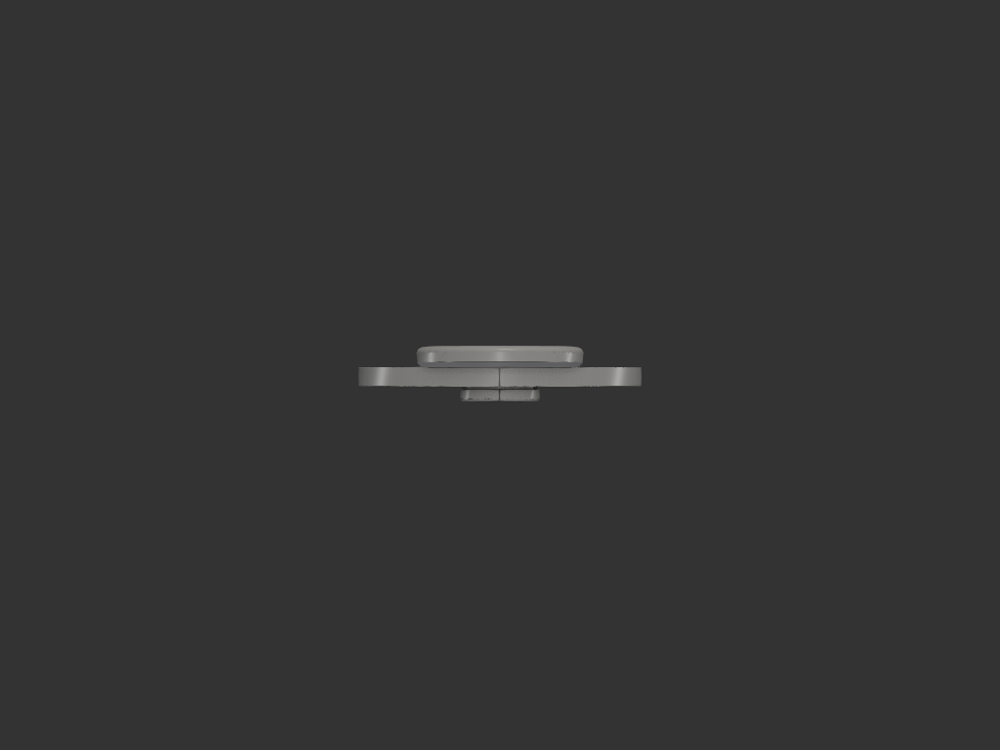
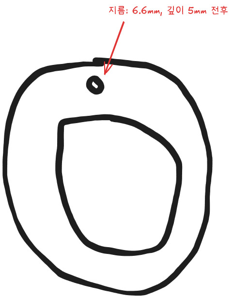
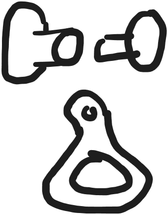
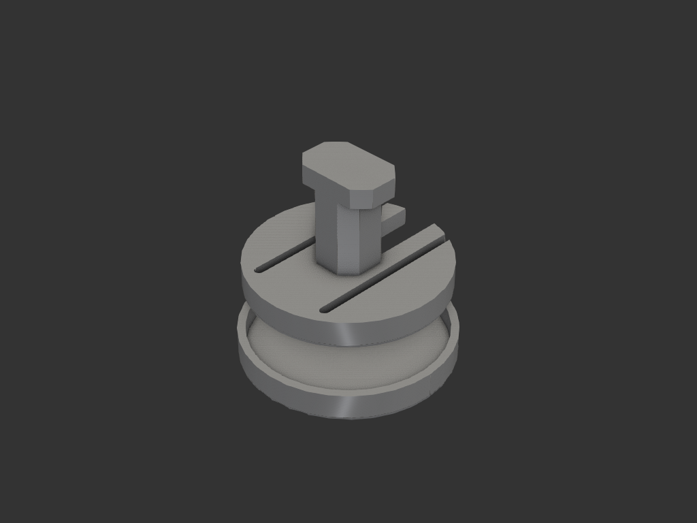
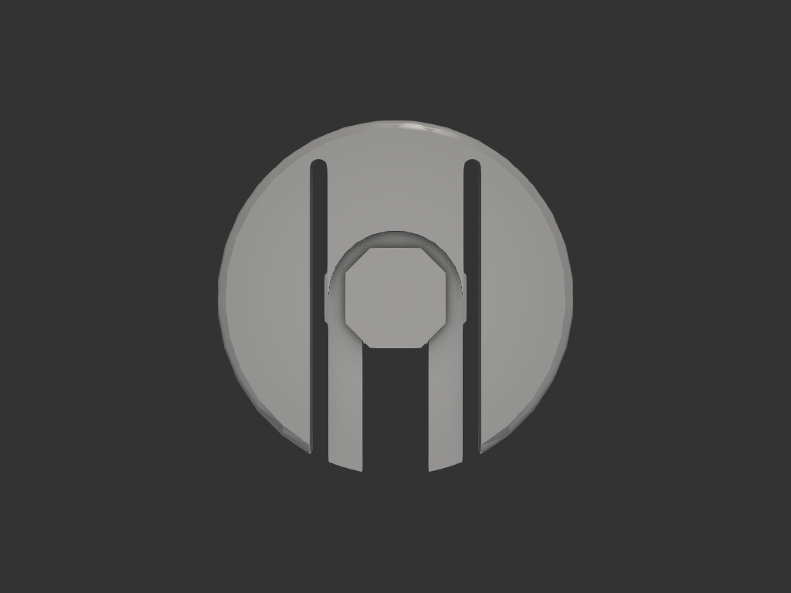
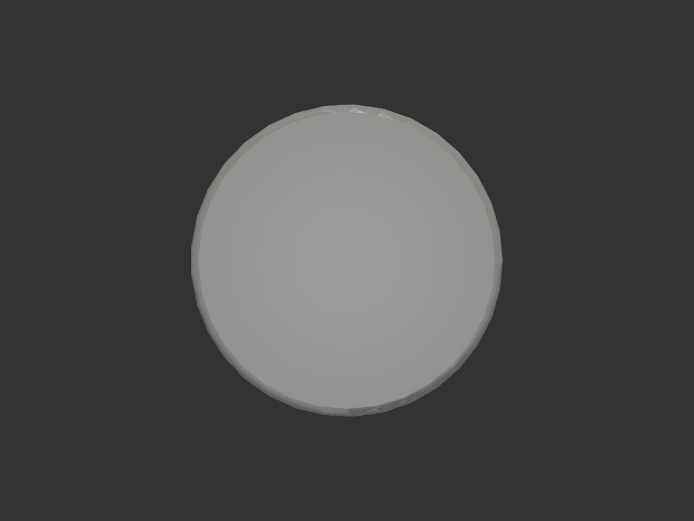

# 어린이변기커버_고리 — 작은 구멍에 물려 다는 큰 고리

어린이용 변기 커버를 벽 후크에 걸 때 쓰는 고리. 커버에 원래 있는 구멍이
**지름 6.6mm** 라 아이가 후크에 맞추기 어렵다. 여기에 **안지름 28mm** 고리를
물려 달아 겨누기 쉽게 만든다.

| 위 | 옆 |
|---|---|
|  |  |

초기 스케치와 파츠 제안:

## 알려진 조건 (사용자 실측/확인)

| 항목 | 값 |
|---|---|
| 기존 구멍 | 지름 6.6, **관통** |
| 구멍 자리 커버 두께 | 5 |
| 구멍 → 커버 바깥 가장자리 | 15 이하 |
| 구멍 자리 형상 | 살짝 솟은 굴곡 위에 있다 (아랫면에 여유가 있다) |
| 거는 대상 | 벽에 박은 가는 나사못/핀 (3~5) |
| 탈착 | 영구 부착 |

## 왜 고리가 커버와 **평행**한가

처음에는 고리를 커버에 **수직으로** 세웠다. 벽 후크만 생각한 판단이었고,
커버를 변기에 올려놓는 상태를 놓쳤다 — 43mm 가 등 뒤로 솟아 어른 변기나
앉은 아이와 부딪힌다.

평행하게 눕히면 커버 위로 **판 두께 5mm** 만 솟는다. 그리고 구멍에서
가장자리까지가 15 이하라, 고리 구멍을 **가장자리 밖**에 두면 후크가
커버에 걸리지 않고 그대로 통과한다.

## 구조 — 4 파츠

| | 파츠 | 역할 | 무게 |
|---|---|---|---|
| ① | `ring_plate` | 커버 윗면. 고리 + 목 + 원반 | 5.8 g |
| ② | `base_plate` | 커버 아랫면. 핀의 홈에 **옆에서 밀어 끼운다** | 0.8 g |
| ③ | `pin` | 머리 + 날 + **홈** + 아래 턱. 따로 **눕혀서** 출력 | 0.5 g |
| ④ | `lid` | ②의 슬롯 구조를 가리는 마감 뚜껑. **기능 없음** | 0.6 g |

조립:

1. ③을 ① 위에서 꽂아 커버 구멍(6.6)을 지나게 민다.
   맨 아래 턱의 팔각 외접이 6.26 이라 저항 없이 들어간다
2. ②를 커버 밑에서 **옆으로 밀어** 홈에 끼운다. 돌기를 넘으며 딸깍 걸린다
3. ④를 ② 위에 눌러 씌운다 (마찰 끼움)

커버 밑에서 올려다본 모습 — 뚜껑 전 / 뚜껑 후:

| 뚜껑 없이 | 뚜껑 덮고 |
|---|---|
|  |  |

**휘는 부품이 하중을 받지 않는다.** 당기는 힘은 ③의 아래 턱이 ②의 턱을
밀어 올리는 순수 형상 접촉이고, 스프링은 ②의 걸림 돌기에만 쓰인다.

## 치수

| 항목 | 값 | 근거 |
|---|---|---|
| 판 두께 | 5 | 3 은 면 밖 굽힘에 약하다 (아래 계산) |
| 원반 지름 | 16 | 핀 머리 둘레를 받친다 |
| 목 폭 | 12 | 최소 단면 |
| 고리 중심 | 핀에서 32 | 고리 구멍이 x 18~46 → 가장자리(최악 15) 밖 |
| 고리 안/바깥 지름 | 28 / 42 | 기존 6.6 의 4 배. 후크 3~5 에 넉넉 |
| 판 구멍 / 머리 자리 | 6.5 / ⌀9.6 × 2.0 | 머리가 윗면에 묻힌다 |
| **핀 날 단면** | 5.6 × 5.6, 모따기 1.4 (팔각) | 외접 **6.26** → 둥근 구멍 6.6 을 거의 채운다 |
| 핀 머리 | 8.8 × 5.6 × 2.0 | 팔각 외접 9.23 |
| **홈** | ⌀3.6, 높이 2.10 → 1.75 | 밀어 넣는 방향으로 좁아지는 **쐐기** |
| 받침판 | ⌀20 × 3, 슬롯 3.8, 턱 1.8, 통로 7.6 | |
| 걸림 돌기 | 한쪽 **0.5**, 경사 30° / 60° | |
| 스프링 핑거 | 1.9 × 1.8, 길이 8.5 | 릴리프 슬롯 1.0 으로 만든다 |
| 마감 뚜껑 | ⌀21.4, 바닥 1.0, 치마 2.2 × 0.75 | 간섭 **0.1** |
| 커버 **위** 높이 | **5.0** | 판 두께뿐 (머리는 묻힘) |
| 커버 **아래** 높이 | **4.0** | 받침판 3.0 + 뚜껑 바닥 1.0 |

## 출력해 보고 고친 것들

네 번 뽑았고 세 번 실패했다. 실패가 전부 같은 뿌리에서 나왔다.

### 1 차 — 갈래가 **부러졌다**

핀을 고리판에 붙여 한 몸으로 만들고 판을 bed 에, 핀을 위로 세워 뽑았다.
스냅이 걸리기 전에 갈래가 부러졌다.

갈래가 휠 때 생기는 인장은 핀 **축 방향**이다. 세워 뽑으면 층이 축에 수직으로
쌓이므로 그 인장이 **층을 가로지른다.** 층간 결합은 재료 자체보다 훨씬 약하고
연성 없이 깨진다. 당시 계산한 변형률 1.72% 는 **bulk 재료 기준**이라 이
상황에 적용되지 않는 값이었다 — 휘는 부품을 만들어 놓고 휘는 방향을 층에
맡긴 것이 잘못이다.

→ 핀을 떼어 따로 **눕혀서** 뽑기로. 단면도 원통이 아니라 **45° 모따기한
각기둥**으로 바꿨다. 눕힌 원통은 아랫배가 둥글어 서포트가 필요하지만,
각기둥은 옆면이 수직이고 바닥이 45° 라 서포트가 한 군데도 없다.

### 2 차 — **헐거워서 고정이 안 됐다**

| 방향 | 고리판이 커버에 대해 움직이는 양 |
|---|---|
| 좌우 (x) | ±0.58 |
| **앞뒤 (y)** | **±1.30** |
| 축 | 0.40 → 고리 바깥끝에서 **1.32** |

눕혀 뽑으려고 날을 **5.6 × 4.0 납작**하게 만들었는데 커버 구멍은 둥근 6.6
그대로였다. 얇은 쪽으로 한쪽 0.75 씩 비어 있었다. 출력 문제를 푸느라 단면을
바꿔 놓고, 그것이 둥근 구멍에 어떻게 앉는지를 확인하지 않은 것이다.

→ 단면을 **팔각(5.6 × 5.6, 모따기 1.4)** 으로. 외접 6.26 으로 커져 6.6 을
거의 채운다. 총 유격 ±1.30 → **±0.32**. 축 여유도 0.4 → 0.1 로.

### 3 차 — 스냅이 **"적당히"만** 걸렸다

    미늘 8.2 가 보어 6.5 를 지나려면 양쪽 합 1.70 오므라들어야 한다
    그런데 가운데 홈이 1.6 뿐이었다

갈래가 서로 맞닿은 시점에 미늘이 아직 0.10 크다. 더 휠 곳이 없으니 억지로
밀려 들어가며 항복점을 넘고, 통과 후 끝까지 펴지지 않는다.

> **규칙: `홈 폭 > 미늘 폭 − 보어`**
> 홈 폭이 곧 갈래가 오므라들 수 있는 전부다. 미늘만 키우면 오히려 나빠진다.

→ 홈 1.6 → 2.8, 미늘 8.2 → 8.8.

### 4 차 — 결국 **빠졌다.** 외팔보 스냅을 버렸다

여기서 천장이 보였다. 커버 구멍 6.6 이 날 폭을 5.6 으로 묶고,
**"홈 + 갈래 2 개 = 5.6"** 이라:

| 갈래 폭 | 홈 | 쉴 때 미늘 | 예압 | 갈래 인장 |
|---|---|---|---|---|
| 1.4 | 2.8 | 9.00 | **−0.40** | 31 MPa |
| 1.2 | 3.2 | 9.40 | 0.00 | 36 MPa |
| 1.0 | 3.6 | 9.80 | +0.40 | 44 MPa |
| 0.8 | 4.0 | 10.20 | +0.80 | **54 MPa (한계 초과)** |

갈래를 두껍게 하면 오므라들 거리가 없고, 거리를 주면 갈래가 인장 한계에
닿는다. 물림도 카운터보어가 천장이라 1.45 에서 안 올라간다. 그리고 쉴 때
**예압이 0** 이라, 끼울 때 생긴 영구 변형이 그대로 물림에서 깎여 나갔다.

→ **스프링으로 버티는 것을 그만두고 형상으로 건다.** 핀에 홈을 파고
받침판을 옆에서 밀어 끼운다. 크리프·영구변형과 무관해진다.

### 5 차 설계 — 받침판이 안 빠지게

처음엔 홈을 쐐기로만 만들고 "경사 3.6° < 마찰각 17° 라 자기잠김" 이라고 봤다.
**그 잠김의 실체는 마찰이고, PETG 가 크리프하면 같이 빠진다** — 스냅이 실패한
것과 똑같은 논리였다. 사용자 지적으로 걸림 돌기를 넣었다.

돌기만 넣으면 ⌀16 통원반이 안 휘어서 밀어 넣는 힘이 260N, 변형률 6.6% 였다.
**릴리프 슬롯**을 파서 양쪽 턱을 외팔보(스프링 핑거)로 만들고, 핑거를 길게
쓰려고 받침판을 ⌀20 으로 키웠다.

돌기를 0.2 로 뒀다가 **0.4 노즐의 압출폭보다 작아** 슬라이서가 뭉갠다는
지적을 받고 0.5 로 올렸다. 그리고 릴리프 안쪽 끝과 아래 통로 벽이 0.2 어긋나
**역할도 없고 출력도 안 되는 0.2mm 벽**이 남아 있던 것도 같이 잡았다
(`RELIEF_X` 를 `BASE_RECESS_W` 에서 유도하게 바꿔 다시 안 생기게 했다).

## 계산

### 쐐기 — 축 유격을 0 으로

홈 높이가 들어오는 쪽 2.10 → 안쪽 1.75. 기울기 0.0625 mm/mm = **3.6°**.

- 마찰각(atan 0.3 = 16.7°)보다 작아 저절로 풀리지 않는다
- 받침판 턱 두께가 **1.80~2.00** 어디로 나와도 쐐기 구간 안에서 물린다
- 느슨해지면 더 밀어 넣으면 된다

다만 이건 마찰이므로 **빠짐 방지는 돌기가 맡는다.** 역할이 나뉜다.

### 걸림 돌기 — 받침판이 옆으로 안 빠지게

핑거 1.9 × 1.8, 길이 8.5. 돌기 0.5 를 넘을 때:

| 항목 | 값 |
|---|---|
| 변형률 | **1.97%** (PETG 4~5%) |
| 핑거당 스프링 힘 | 5.0 N (합 10.1 N) |
| 밀어 넣기 (경사 30°) | **5.8 N** |
| 빠져나가기 (경사 60°) | **17.3 N** |

램프를 넘는 축방향 힘은 **`N·tan(경사각)`** 이다. 경사가 급할수록 커진다.
그래서 들어오는 쪽은 완만하게, 나가는 쪽은 급하게 뒀다 — 3 배 차이.
직각(90°)으로 두면 영구 고정이라 분해가 불가능해지므로 경사를 남겼다.

### 하중은 어디로 가나

커버 무게는 **핀의 아래 턱 → 받침판 턱 → 커버 아랫면** 으로 간다.
돌기와 핑거는 이 경로에 없다.

핑거도 수직으로는 물러나지만(강성 35 N/mm), 그러면 하중이 **슬롯 뒤쪽
통살 턱**으로 넘어간다. 릴리프를 안 판 자리라 뻣뻣하고, 면적 약 4mm² 에
50N 이면 12 MPa — PETG 의 1/4 이다.

### 목이 견디는가 — 그리고 층 방향

| 하중 | 응력 | 힘이 지나는 곳 |
|---|---|---|
| 면 안쪽 인장 (정상) | 0.8 MPa | **층 안** |
| 면 안쪽 굽힘 | 13.3 MPa | **층 안** |
| 면 밖 굽힘 (옆으로 비틂, 20N) | 9.6 MPa | 층 사이 |

PETG 는 층 안 ~50 MPa, 층 사이 ~30 MPa. 가장 불리한 경우도 3 배 여유다.
판 두께를 3 에서 5 로 올린 이유가 이것 — 3 이면 면 밖 굽힘이 27 MPa 로
층 사이 강도에 바짝 붙는다.

커버 구멍의 지압은 30N 에서 0.95 MPa. 커버 쪽도 문제없다.

## 출력

| 파츠 | 방향 | 이유 |
|---|---|---|
| `ring_plate` | 판 면을 bed 에 | 후크 → 고리 → 목 → 원반 으로 힘이 **판 면 안쪽**을 흐른다. 세워 뽑으면 목의 인장이 층 사이를 가로지른다 |
| `base_plate` | **아래 통로 쪽이 위로** (슬롯 난 평평한 면을 bed 에) | 구멍이 3.8 → 7.6 으로 **넓어지며** 올라가 오버행이 없다 |
| `pin` | **눕혀서** — `pin.step` 이 이미 그 방향이다 (13.0 × 8.8 × **5.6**) | 홈 주변 살이 얇은데, 눕히면 인장이 압출선을 따라 흐른다. 세워 뽑아 부러진 것이 1 차다 |
| `lid` | 바닥을 bed 에, 컵이 위로 | 오버행 없음 |

**서포트는 어디에도 필요 없다.**

- 고리판: 아랫 둘레를 라운드가 아닌 45° 모따기로 했다. 1.5 라운드를 bed 에
  놓으면 1 층에서 0.75mm 가 허공으로 나가 처진다
- 핀: 단면이 45° 모따기한 **팔각형**이다. 눕혔을 때 바닥 모서리가 구르지 않고,
  바닥과 윗면 윤곽이 축 전 구간에서 같은 것을 검증했다 (= 옆면이 전부 수직)

### 슬라이서

| 항목 | 값 | 이유 |
|---|---|---|
| 벽(perimeter) | **3 이상** | 스프링 핑거가 1.9mm — 3 벽이면 인필 없이 살이 꽉 찬다 |
| 레이어 | 0.2 | |
| 인필 | 40% 이상 (7.7g 이니 100% 도 무방) | 목의 면 밖 굽힘 |
| 서포트 | **끄기** | |
| 브림 | 불필요 | |

**재료 PETG.** 습한 화장실이고, 스프링 핑거가 휘었다 펴지는 부품이라 PLA 보다
낫다. 출력 합계 약 **7.7 g**.

## 채택하지 않은 것

| 안 | 이유 |
|---|---|
| 커버에 수직인 고리 | 변기에 올렸을 때 43mm 가 솟아 간섭 |
| 압입 + 순간접착제 | 접착제가 습기에 약하다 |
| 핀을 고리판과 한 몸으로 | 세워 뽑을 수밖에 없어 갈래가 층간으로 부러진다 — **실제로 부러졌다** |
| 핀을 원통으로 만들어 눕히기 | 아랫배가 둥글어 서포트가 필요하다 |
| 납작한 날 (5.6 × 4.0) | 둥근 구멍 6.6 안에서 앞뒤로 ±1.30 놀았다 — **실제로 헐거웠다** |
| 외팔보 스냅 (4 갈래 / 2 갈래) | 구멍 6.6 이 "홈 + 갈래" 를 5.6 으로 묶어, 갈래 두께와 이동거리를 동시에 못 얻는다 — **실제로 빠졌다** |
| 쐐기만으로 받침판 고정 | 잠김의 실체가 마찰이라 크리프하면 같이 빠진다 |
| 돌기 0.2mm | 0.4 노즐 압출폭보다 작아 슬라이서가 뭉갠다 |
| 돌기 나가는 쪽 90° | 영구 고정이라 분해가 불가능해진다 |
| 프린팅 나사 + 너트 | 구멍 6.6 이라 M6 급인데, 0.4 노즐로 골 깊이 0.8 은 형상이 무뎌지고 공차 맞추기가 까다롭다. 쐐기는 미는 깊이로 편차를 흡수한다 |
| C 링(열쇠고리형) | 5mm 판을 통과시키려면 틈이 커야 하고, 그 틈으로 다시 빠진다 |

## 구현 메모

- **휘는 부품을 설계하면 먼저 출력 방향을 정하고**, 굽힘 인장이 압출선을 따라
  흐르는지 확인한다. 변형률 계산을 근거로 쓸 때는 그 방향이 층 안인지 층
  사이인지 먼저 밝힌다. bulk 항복값은 층 사이에 적용되지 않는다
- 출력을 위해 단면을 바꿨으면 **그 단면이 상대 구멍에 어떻게 앉는지** 다시 본다
- 스냅 설계에서 **`홈 폭 > 미늘 폭 − 보어`** 를 먼저 확인한다
- 눕혀 뽑을 부품의 단면 모서리는 **라운드가 아니라 45° 모따기**
- 인접한 두 피처의 벽이 0.2mm 간격으로 어긋나면 출력 불가능한 조각이 남는다.
  한쪽을 다른 쪽에서 **유도**하게 적어 다시 안 생기게 한다
- 램프를 넘는 축방향 힘은 `N·tan(경사각)`. 경사가 급할수록 **커진다**

## 상태

- **iter_010 — 현재.** 4 파츠(고리판 / 받침판 / 핀 / 마감 뚜껑). 출력 대기
